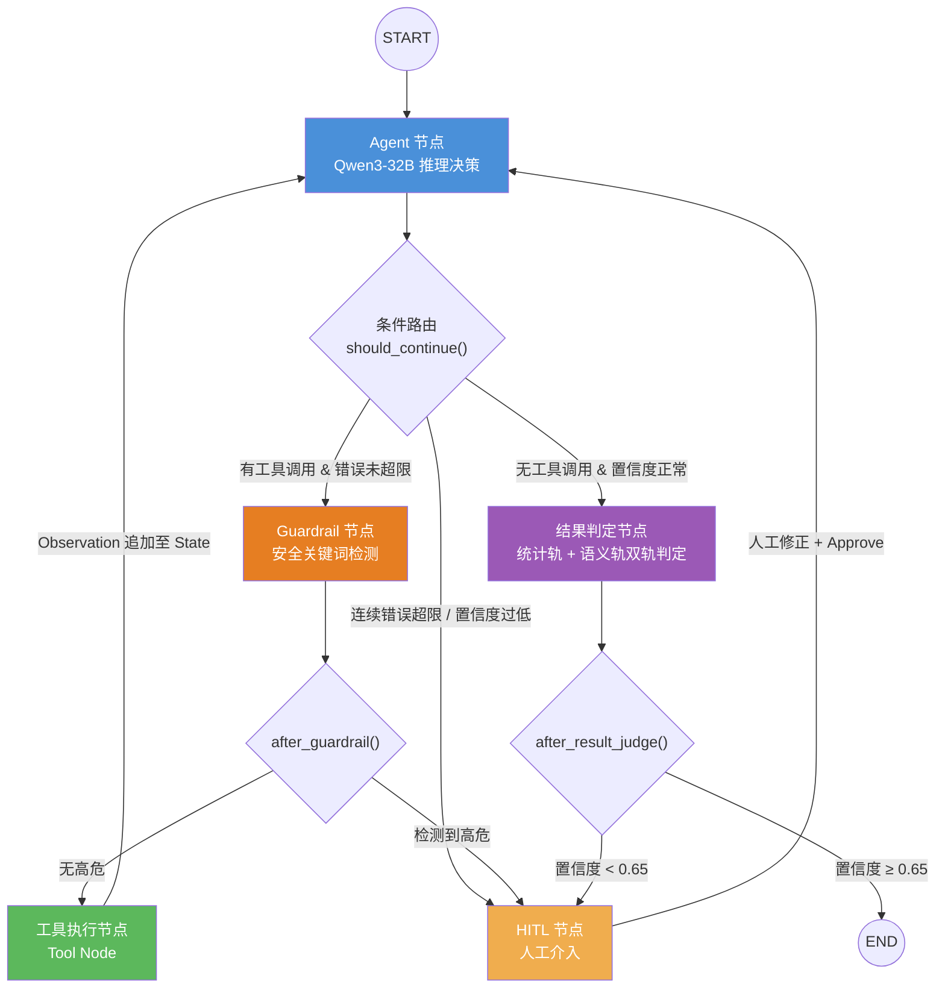

---
tags:
  - Agent
  - LLM
  - 5G
  - 系统设计
status: active
---

# 5G 无线网络智能测试验证 Agent 系统 — 全景报告

> 本文档是系统设计全景文档，涵盖概念框架、技术架构、关键模块、工程实现与业务成果。
> 评测体系详见 [[03_Agent评测体系设计]]，模型后训练详见 [[04_Agent模型后训练SFT_DPO]]。

---

## 一、理解系统的概念锚点：三个嵌套闭环

在深入任何技术细节之前，先建立整体视角。本系统的本质是**三个运行在不同时间尺度上的嵌套闭环**：

```
┌─────────────────────────────────────────────────────────┐
│  闭环 3：学习飞轮（离线，天/周级）                         │
│  HITL数据 → SFT/DPO → 模型更安全                        │
│  专家确认用例 → Embedding入库 → RAG更准确                 │
│                                                          │
│  ┌─────────────────────────────────────────────────┐    │
│  │  闭环 2：安全围栏（请求级，秒~小时）               │    │
│  │  置信度熔断 / 高危拦截 → HITL → 人工修正后恢复    │    │
│  │                                                  │    │
│  │  ┌─────────────────────────────────────────┐    │    │
│  │  │  闭环 1：ReAct 推理循环（毫秒级）          │    │    │
│  │  │  Agent → Guardrail → Tool → Observation  │    │    │
│  │  └─────────────────────────────────────────┘    │    │
│  └─────────────────────────────────────────────────┘    │
└─────────────────────────────────────────────────────────┘
```

| 闭环 | 解决的问题 | 时间尺度 |
|:---|:---|:---|
| **闭环 1：ReAct** | 怎么完成一次任务 | 毫秒到分钟 |
| **闭环 2：安全围栏** | 怎么保证任务安全可控 | 分钟到小时（含人工等待）|
| **闭环 3：学习飞轮** | 怎么让系统越用越聪明 | 天到周（持续微调）|

三个闭环的数据流也是串联的：闭环 1 产生的工具调用日志、闭环 2 拦截的 HITL 案例，全部汇入闭环 3 的训练数据池，驱动模型持续进化。

---

## 二、项目背景

### 业务痛点

5G 基站大规模商用后，网络验收与回归测试面临三个核心矛盾：

- **规模庞大**：测试用例超过 2 万条，覆盖信道、切换、干扰、容量等多维场景，人工全量执行单局点需要 3 天
- **标准化缺失**：测试结论高度依赖领域专家经验（日志分析、信令细节、KPI 趋势判断），难以形成标准闭环
- **漏测累积**：人工疲劳、经验差异导致的漏测问题在版本迭代中持续堆积，缺陷逃逸率居高不下

### 核心目标

研发一套 LLM 驱动的自主网络测试 Agent，实现**测试需求解析 → 用例生成 → 自动执行 → 结果智能判定**的端到端全自动闭环，并通过 HITL 机制保障工业级安全可靠性。

---

## 三、什么是 AI Agent

**定义**：AI Agent 是以 LLM 为大脑、具备规划、记忆、工具调用能力的自主决策系统。

> **Agent = LLM（大脑）+ Planning（规划）+ Memory（记忆）+ Tools（工具）**

**与普通 LLM 调用的本质区别**：普通调用是单次 `input → output` 的无状态变换；Agent 是一个能自主决策"下一步做什么"的持续性控制循环（Control Loop），在目标达成前反复调用工具、感知结果、调整策略。

### 规划范式

| 机制 | 核心思路 | 本系统应用 |
|:---|:---|:---|
| **ReAct** | `Thought → Action → Observation` 循环，边思考边执行 | 主干推理循环 |
| **CoT** | 引导模型逐步推理，减少跳跃性错误 | 嵌入 System Prompt |
| **Reflection** | Agent 对自身过去行为进行批判性反思 | 失败用例分析 |
| **Multi-Agent** | 不同角色并行协同（Map-Reduce） | 全网验收跑批场景 |

---

## 四、技术架构

### 4.1 技术栈总览

| 层次 | 组件 | 职责 |
|:---|:---|:---|
| **模型层** | Qwen3-32B（主干推理）/ Qwen3-4B（前置增强、Guardrail）| LLM 推理、安全检测 |
| **编排层** | LangGraph（状态机）/ LangChain（工具抽象）| Agent 图控制流 |
| **推理服务** | vLLM + PagedAttention | 高并发 KV Cache 优化，30+ tokens/s |
| **知识层** | Milvus（HNSW）+ Elasticsearch（BM25）+ Cross-Encoder Reranker | 三级混合检索 |
| **异步层** | Celery + Kafka | 长时任务解耦、HITL 告警推送 |
| **接口层** | FastAPI + SSE | 实时状态流推送至前端 |
| **持久化层** | Postgres（Checkpoint）/ Redis（缓存）| State 快照、断点恢复 |
| **可观测性** | LangSmith | 全链路 Trace：Prompt、Token、延迟、节点 I/O |

### 4.2 LangGraph 状态机图结构

LangGraph 将 Agent 流程抽象为**有向图 + 状态机**，而不是简单的 `while` 循环。这是与教科书式 ReAct 最核心的工程区别：**控制流显式可见、可审计、可在任意节点插入中断**。



**核心 State 设计**：

```python
class AgentState(TypedDict):
    messages: Annotated[list, add_messages]  # 对话历史（自动追加，不覆盖）
    current_step: str                        # 当前执行阶段
    tool_outputs: dict                       # 工具返回缓存，供结果判定节点使用
    error_count: int                         # 连续工具错误计数（软熔断判据）
    confidence_score: float                  # 当前决策置信度
    hitl_required: bool                      # 是否需要人工介入
    hitl_feedback: str                       # 人工审核后的反馈文本
    final_result: Optional[str]              # 最终判定结果（JSON 字符串）
```

### 4.3 完整系统架构

```
┌─────────────────────────────────────────────────────────────────────┐
│                    5G 智能测试验证 Agent 系统                        │
├─────────────────────────────────────────────────────────────────────┤
│                                                                     │
│   用户 / CI 系统                                                    │
│       │ 测试需求（自然语言 / YAML）                                  │
│       ▼                                                             │
│   FastAPI 接口层 ──SSE推流──► 前端实时状态展示                       │
│       │                                                             │
│       ▼                                                             │
│   ┌────────────────────────────────────────────────────────┐        │
│   │                 LangGraph 状态机引擎                    │        │
│   │                                                        │        │
│   │  [Agent节点] ──► [Guardrail节点] ──► [Tool节点]         │        │
│   │      ▲                │高危              │             │        │
│   │      │                ▼                 │ Observation  │        │
│   │      │           [HITL节点] ◄───────────┘             │        │
│   │      │                │ Approve                       │        │
│   │      └────────────────┘                               │        │
│   │                    置信度正常                          │        │
│   │      ──────────────────────────► [结果判定节点]        │        │
│   │                                  统计轨 + 语义轨        │        │
│   └────────────────────────────────────────────────────────┘        │
│                                                                     │
├──────────────────── 知识层（RAG）──────────────────────────────────-┤
│  Milvus（语义向量）  Elasticsearch（BM25）  Cross-Encoder Reranker   │
│  3GPP协议文档 | 历史Bugzilla缺陷库 | 专家确认Golden Cases           │
├──────────────────── 工具层（Tool Layer）───────────────────────────-┤
│  Test_Case_Query  Simulation_Runner  Metrics_Collector              │
│  Baseline_Comparator  Log_Analyzer  Fleet_Manager                   │
├──────────────────── 基础设施层 ─────────────────────────────────────┤
│  Postgres（Checkpoint）  Kafka（异步消息）  Redis（缓存）             │
│  Celery（任务队列）  vLLM（推理服务）  LangSmith（可观测性）          │
└─────────────────────────────────────────────────────────────────────┘
```

### 4.4 工具链

| 工具 | 职责 |
|:---|:---|
| `Test_Case_Query` | 按场景/频段/特性从知识库检索测试用例 |
| `Simulation_Runner` | 触发 5G 仿真平台执行测试，返回 session_id |
| `Metrics_Collector` | 通过 SSH/RPC 从网元实时拉取 KPI 日志 |
| `Baseline_Comparator` | 与历史安全版本做统计对比（T-Test / KS-Test）|
| `Log_Analyzer` | 解析 RRC/NAS/PDCP 信令日志，识别协议级异常 |
| `Fleet_Manager` | 多局点并发探针集群调度（全网验收场景）|

---

## 五、关键技术模块详解

### 5.1 RAG 赋能的 LLM 用例生成

通信领域存在严重的 OOV（Out-of-Vocabulary）问题：`PRACH`、`BWP`、`N2 interface` 等专有名词纯靠 Embedding 模型容易产生语义漂移。系统采用三级混合检索架构：

```
用户查询 / 用例生成需求
      │
      ├──► ES (BM25) ────────────── 精确命中通信专有名词、缩写
      │
      └──► Milvus (HNSW) ─────────── 语义向量捕捉长难句意图
                │
                ▼
      自研 RSF 融合算法（按问题长度自适应调权）
                │
                ▼
      Cross-Encoder Reranker + 动态阈值过滤噪声
                │
                ▼
         Top-K Context → 注入 LLM Prompt
```

**自适应调权逻辑**：短查询（精确名词匹配）偏向 BM25，长查询（语义意图理解）偏向向量检索，不是固定 50/50。

**检索前置增强**：
- Qwen3-4B 执行**指代消解**（将"它的切换成功率"解析为"基站A→B Xn接口切换成功率"）
- Qwen3-4B 执行**多路问题扩展**（将一个查询扩展为多个角度，提升召回覆盖率）
- AutoPhrase 构建专有分词词典，解决通信术语被错误切分的问题（如 `NR_PDCP` 被切成 `NR` + `PDCP`）

**知识库构成**：

| 知识源 | 检索方式 | 作用 |
|:---|:---|:---|
| 3GPP 协议文档 | BM25 精确匹配 | 保证用例有协议依据 |
| 历史 Bugzilla 缺陷库 | 向量语义检索 | 补全边界场景，防止重蹈历史漏测 |
| 专家确认的 Golden Cases | 向量 + BM25 混合 | 带背书的高质量参考样本 |

**数据飞轮**：专家确认后的用例自动 Embedding 入库，知识边界随系统使用持续自我拓展。

### 5.2 Guardrail 安全节点

Guardrail 节点是本系统与教科书式 ReAct 最关键的工程差异：**工具调用在执行前必须经过安全检测，而不是直接下发**。

**为什么不让主干模型自己判断危险与否**：生成幻觉的模型不能同时作为自己输出的安全裁判，这是"既当运动员又当裁判"的逻辑盲区。独立的轻量级 Guardrail 能规避这个问题。

**双缝检测机制**：
1. **规则层**：正则扫描工具参数，命中高危关键词白名单（`format_c`、`reset_all`、`force_reboot`、`wipe`、`delete_all` 等）
2. **分类层**：轻量级安全分类模型（基于 Qwen3-4B SFT 或参考 LlamaGuard 思想）二次确认，防止关键词被改写绕过

**触发后的处置**：路由至 HITL 节点，State 快照序列化，释放 GPU 资源，Celery 异步推送钉钉告警。

### 5.3 双重熔断机制

| 层级 | 触发条件 | 实现方式 | 处置 |
|:---|:---|:---|:---|
| **硬熔断** | 图迭代深度 > 阈值（如 15 跳）| LangGraph `recursion_limit` | 强制挂起，上报异常 |
| **软熔断** | 连续工具错误 ≥ 3 次，或 `confidence_score` < 0.65 | State 字段路由判断 | 路由至 HITL |

**置信度阈值 0.65 的来源**：通过大量压测找到相变点——低于此值时 Agent 自主执行错误率急剧上升，不是拍脑袋定的。阈值需要随领域数据积累持续校准。

**两层的必要性**：硬熔断防死循环（递归爆炸），软熔断防幻觉递推（模型自信但错误的连续决策）。二者解决的是不同类型的失控场景。

### 5.4 Human-in-the-Loop（HITL）工程实现

**核心工程难点**：如何在不阻塞服务器线程的前提下等待人工审批（可能长达数小时）？

```
错误的方式（传统 while 循环）：
while not approved:
    time.sleep(60)   # 线程持续阻塞，内存泄漏，HTTP 504 超时

正确的方式（LangGraph Checkpoint）：
触发高危 / 低置信度
  │
  ▼  interrupt_before 钩子
State 快照序列化 → Postgres（Thread_ID 作为主键）
  │
  ▼
释放计算资源（进程终止，GPU 显存释放）
  │
  ▼
Celery 异步触发钉钉 Webhook 告警（含用例详情、拦截原因）
  │
  ▼
专家 Web 前端：Review 参数 → 修改异常值 → 点击 Approve
  │
  ▼
/resume API → 从 Postgres 拉取 Thread_ID 对应 State → .resume()
  │
  ▼
Agent 从断点继续执行，携带人工修正后的参数
```

**HITL 解决的三类业务问题**：

| 场景 | 问题 | HITL 作用 |
|:---|:---|:---|
| **高危操作** | 幻觉生成含 `reset_all` 等破坏性参数的用例 | 最后一道物理安全隔离墙 |
| **灰度边界** | 置信度 0.60~0.65，机器自己也不确定 | 交由专家会诊 |
| **Novel Case** | 与知识库相似度极低的新奇用例，无历史背书 | 专家确权后 Golden Case 回流知识库 |

**HITL 的战略价值**：它不只是安全机制，同时是闭环 3（学习飞轮）的数据采集入口——被打回的高危用例成为 DPO 负样本，专家修正后的版本成为正样本，系统在安全拦截的同时持续收集微调数据。

### 5.5 结果判定双轨机制

```
测试执行完成
  │
  ├──► 统计轨（硬规则）                ├──► 语义轨（LLM）
  │    KPI 均值/方差                   │    PCAP 信令序列解析
  │    T-Test / KS-Test               │    RRC/NAS/PDCP 日志语义理解
  │    阈值包络对比基线                 │    根因关联推理与溯源
  │    → 明显违规直接 FAIL             │    → 隐性协议异常深度诊断
  │                                   │
  └──────────────── 综合判定 ──────────┘
                        │
               ┌────────▼────────┐
               │  置信度评分输出  │
               │ ≥0.65 → 自动结论 │
               │ <0.65 → HITL   │
               └─────────────────┘
```

**统计轨的典型判定**：
- KPI 均值（下行吞吐量、切换成功率）与 Baseline 做 T-Test，p < 0.05 且均值下降 > 5% 判 FAIL
- P99 延迟、丢包率等超出阈值包络直接判 FAIL

**语义轨的典型价值**：
- 统计 KPI 不明显，但信令层有异常——如 `SN Status Transfer` 超时（Xn 回传丢包），纯统计轨看不出来
- 根因输出："FAIL，根因：Xn 回传链路拥塞导致序列号同步失败，非空口问题，建议排查承载网络"

### 5.6 Tool Call 异常处理

模型返回的 tool call 可能在三个层面出问题，需要分层处置而不是统一抛异常。

#### 异常类型分类

| 层次 | 具体问题 | 典型表现 |
|:---|:---|:---|
| **格式层** | 输出不是合法 JSON | `{"tool": "Sim` 截断，或混入自然语言 |
| **Schema 层** | JSON 合法但字段错误 | 缺少 `required` 字段、参数类型不符 |
| **语义层** | 格式正确但逻辑错误 | 工具选错、参数值幻觉（如虚构 session_id）|

#### 格式层：解析容错

模型在高负载或长上下文时可能输出截断或夹杂文本的 JSON，不能直接 `json.loads`：

```python
import re, json

def safe_parse_tool_call(raw: str) -> dict | None:
    # 1. 尝试直接解析
    try:
        return json.loads(raw)
    except json.JSONDecodeError:
        pass
    # 2. 提取第一个 {...} 块（应对前后混杂文字）
    match = re.search(r'\{.*\}', raw, re.DOTALL)
    if match:
        try:
            return json.loads(match.group())
        except json.JSONDecodeError:
            pass
    # 3. 解析失败，返回 None 触发重试
    return None
```

解析失败后，在 State 中追加一条 `role=tool` 的错误消息（而不是抛异常终止图），让 LLM 感知到失败并重新生成：

```python
# LangGraph tool_node 内
result = safe_parse_tool_call(llm_output)
if result is None:
    return {"messages": [ToolMessage(
        content="[FORMAT_ERROR] 工具调用格式无法解析，请重新生成合法 JSON",
        tool_call_id=tool_call_id
    )], "error_count": state["error_count"] + 1}
```

#### Schema 层：Pydantic 校验

工具参数统一用 Pydantic 模型定义，在 tool_node 执行前做校验，错误信息结构化返回给 LLM：

```python
from pydantic import BaseModel, ValidationError

class SimulationRunnerInput(BaseModel):
    scenario_id: str
    frequency_band: str
    iteration_count: int = 10

def tool_node(state: AgentState):
    call = state["messages"][-1]
    try:
        params = SimulationRunnerInput(**call.args)
    except ValidationError as e:
        # 把 Pydantic 错误摘要直接返回给 LLM，让它知道哪个字段有问题
        return {"messages": [ToolMessage(
            content=f"[SCHEMA_ERROR] 参数校验失败: {e.errors()}",
            tool_call_id=call.id
        )], "error_count": state["error_count"] + 1}
    # 校验通过后才真正执行
    result = simulation_runner(params)
    ...
```

**关键原则**：错误信息要让 LLM 能看懂并自我修正（字段名 + 期望类型 + 收到的值），而不是只返回 `"invalid params"`。

#### 语义层：工具选错与参数幻觉

这层最难防，依赖系统级手段而不是局部校验：

- **工具描述即防护**：`description` 写清楚工具的**前置条件**和**不适用场景**，让 LLM 在选工具时就能排除错误选项
- **参数来源溯源**：关键 ID 类参数（如 `session_id`、`baseline_version`）只允许来自已知工具返回值，不允许模型凭空生成。可在 Guardrail 节点做白名单校验
- **Guardrail 二次确认**：对高危工具的参数（见 5.2），由独立分类模型再做一次语义合理性判断
- **错误计数熔断**：连续 3 次工具调用错误（无论哪一层）触发软熔断，路由至 HITL，防止模型在错误路径上循环（见 5.3）

#### 错误处理完整流转

```
LLM 输出 tool call
      │
      ▼
格式解析 ──失败──► 追加 FORMAT_ERROR → error_count+1
      │成功
      ▼
Schema 校验 ──失败──► 追加 SCHEMA_ERROR → error_count+1
      │通过
      ▼
Guardrail 检测 ──高危──► HITL
      │安全
      ▼
工具执行 ──运行异常──► 追加 EXECUTION_ERROR → error_count+1
      │成功
      ▼
Observation 追加至 State → Agent 节点继续推理

（任意路径 error_count ≥ 3 → 软熔断 → HITL）
```

---

### 5.7 系统降级策略

Agent 系统的降级不是简单的"报错返回"，而是一套**分层、可恢复**的容错体系，核心思想是：**能自动恢复的自动恢复，不能自动恢复的保住数据等人工介入，极端情况下降为确定性规则兜底**。

#### 五层降级体系

```
┌──────────────────────────────────────────────────────────┐
│  L1: 本次 tool call 重试（格式/Schema 错误自动重试）         │
│       ↓ 失败 3 次                                          │
│  L2: 软熔断 → HITL（人工修正参数，断点恢复）                │
│       ↓ 人工不可用 / SLA 超时                               │
│  L3: 模型降级（32B → 4B Fallback）                         │
│       ↓ 4B 也无法完成                                       │
│  L4: 确定性规则引擎兜底（放弃 LLM，走规则判定）              │
│       ↓ 规则也无法覆盖                                      │
│  L5: 安全失败（挂起任务，保留 State，通知人工全量接管）       │
└──────────────────────────────────────────────────────────┘
```

#### L1：本次调用重试（毫秒~秒级）

适用于格式错误、Schema 错误、工具临时网络超时：

- 错误信息结构化追加至 `messages`，不重置上下文，让 LLM 感知历史错误自我修正
- 单次任务最多重试 3 次（由 `error_count` 计数）
- **不适用**：语义幻觉错误不应重试，重试只会让模型换一个错误答案

#### L2：HITL 软熔断（分钟~小时级）

适用于连续错误超限、置信度低、高危操作（见 5.3、5.4）：

- State 持久化，GPU 资源释放，异步告警
- 人工修正参数后从断点精确恢复，不丢失任何已完成步骤
- SLA 超时阈值（如 2 小时无人响应）触发向下降级到 L3/L4

#### L3：模型降级（秒~分钟级切换）

主干模型（Qwen3-32B）不可用时的应急方案：

```python
MODEL_FALLBACK_CHAIN = [
    "Qwen3-32B",   # 主干，最强推理
    "Qwen3-7B",    # 次级，覆盖大多数简单任务
    "Qwen3-4B",    # 保底，只能完成结构化程度高的任务
]

async def call_with_fallback(prompt, tools):
    for model in MODEL_FALLBACK_CHAIN:
        try:
            return await llm_call(model, prompt, tools, timeout=30)
        except (TimeoutError, ServiceUnavailableError):
            log.warning(f"{model} unavailable, falling back")
    raise AllModelsUnavailableError()
```

**降级代价要透明**：小模型 tool call 稳定性差，降级时应收窄工具集（只开放低风险工具），同时降低置信度阈值触发更多 HITL。

#### L4：规则引擎兜底

LLM 完全不可用时，关键业务路径不能中断：

- **测试判定**：退化为纯统计轨（T-Test + 阈值包络），关闭语义轨，接受判定准确率下降
- **用例生成**：退化为模板库匹配（按场景类型直接检索预置 YAML 模板，不生成新用例）
- **Log 分析**：退化为关键词匹配（`error`/`timeout`/`reject` 等正则规则），输出关键词命中报告

规则引擎是**降维打击**：覆盖率不如 LLM，但确定性 100%，适合关键路径兜底。

#### L5：安全失败（Fail Safe）

以上所有层级都无法处理时的最终兜底：

```python
def fail_safe(state: AgentState, reason: str):
    # 1. 序列化当前 State 快照，保留所有已执行步骤
    checkpoint_store.save(state.thread_id, state)
    # 2. 标记任务状态为 SUSPENDED，不标记 FAILED
    task_store.update_status(state.task_id, "SUSPENDED")
    # 3. 发送高优告警，携带完整上下文
    alert_system.send_critical(
        title=f"Agent 系统全层降级失败: {reason}",
        context=state.dict(),
        resume_url=f"/api/tasks/{state.task_id}/resume"
    )
    # 4. 不抛异常，不删数据，等待人工全量接管
```

**关键设计原则**：`SUSPENDED` 而不是 `FAILED`——任务没有被放弃，State 完整保留，人工可以从任意节点恢复或手动修正后重跑。

#### 降级触发与监控

| 降级层 | 触发条件 | 监控指标 |
|:---|:---|:---|
| L1 重试 | FORMAT/SCHEMA 错误 | `tool_call_error_rate`（>5% 告警）|
| L2 HITL | `error_count≥3` 或 `confidence<0.65` | `hitl_queue_depth`（积压监控）|
| L3 模型切换 | 主模型超时/不可用 | `model_fallback_rate`（>1% 需排查）|
| L4 规则引擎 | 所有模型不可用 | `rule_engine_activation_count` |
| L5 安全失败 | L4 也无法覆盖 | `suspended_task_count`（SLA 红线）|

---

## 六、典型场景实战

### 场景一：5G 切换失败综合诊断

**用户输入**："近期配置变更后，怀疑基站 A 向基站 B 的 Xn 接口切换有问题，请验证并给出结论。"

**Step 1 — 意图解析与用例生成（Planning）**
- RAG 检索《3GPP TS 38.331 Xn 切换信令流程规范》及历史切换失败缺陷库
- Qwen3-32B 生成 JSON 仿真控制脚本：终端移动速度、A3 事件触发阈值、并发 100 次切换

**Step 2 — Guardrail 拦截（Safety）**
- 扫描生成的 JSON，发现频段参数错误配置为受限频段（幻觉）
- State 序列化至 Postgres，Celery 推送钉钉告警
- 专家修改为合法实验频段后 Approve，Agent 从断点恢复

**Step 3 — 自动化执行（Acting）**
- `Simulation_Runner` 触发仿真平台执行 100 次切换
- 长时任务异步监控，主线程挂起等待回调

**Step 4 — 双轨判定（Reasoning）**
- **统计轨**：切换成功率 85%，低于基线 99%，直接判 FAIL
- **语义轨**：`Log_Analyzer` 分析 15 次失败的 PCAP，发现 `SN Status Transfer` 丢包超时——根因在 Xn 回传链路而非空口

**Step 5 — 结论与知识回流（Reflection）**
- 报告输出："FAIL。根因：基站 A→B Xn 回传链路拥塞丢包，建议排查承载网络，非空口问题。"
- 专家标记 Golden Case，自动 Embedding 入库，完成认知进化内闭环

### 场景二：新局点 5G SA 全网验收跑批（Multi-Agent 自动驾驶模式）

**业务痛点**：新 5G 基站开通，工程师需赴现场人工执行 100+ 验收项目，耗时以天计。

**Agent 工作流**：

1. **任务规划（Planning）**：通过网管北向接口获取基站配置，按局点类型（室分/高铁宏站）在 1 分钟内生成包含 100+ 验收项的 YAML 执行编排图

2. **多集群并发执行（Parallel Acting）**：`Fleet_Manager` 工具下发并激活现场无人测试探针集群，同步执行 VoNR 呼叫、FTP 大包拉测、信号干扰边界构造

3. **Map-Reduce 流式推演（Streaming Reasoning）**：GB 级 NAS/RRC 信令日志并行分发给多个 Worker Agent，各自提炼握手时延、寻呼成功率等核心 KPI，主控 Agent 汇总研判

4. **自动签发验收报告（Reflection）**：所有 KPI 核心项 PASS 后，自动生成 PDF 验收报告，最终由人员一次鉴权点击，Agent 调用 `Network_Config_Write` 工具完成基站割接入网

---

## 七、工程化部署

### 高并发推理（vLLM）

基于 vLLM 部署 Qwen3-32B，PagedAttention 动态显存分页调度，KV Cache 重用率大幅提升，在线判定模块稳定在 30+ tokens/s。多路并发请求下无显存碎片问题。

### 长时任务异步解耦（FastAPI + Celery）

测试执行耗时从分钟到数小时不等。FastAPI 接收请求后将"长图执行逻辑"打包至 Celery 异步队列，用户不被阻塞，节点状态（"正在执行仿真..." / "正在分析日志..."）通过 SSE 长连接实时推送至前端。

### 可观测性（LangSmith）

每次 LLM 调用的 Prompt、Completion、Token 用量、延迟，每个节点的 I/O，工具调用的入参和返回值，全部自动 Trace，在 LangSmith UI 可查看完整节点调用树。这是定位幻觉和工具误用的关键基础设施。

---

## 八、模型后训练概述（SFT + DPO）

通用基座模型在 5G 测试领域面临三个核心问题：**领域术语理解不足**、**结构化格式输出不稳定**、**危险逻辑幻觉**。

- **SFT**：用约 5 万条 Golden Dataset 微调，将通信术语映射和严格 JSON 格式的"肌肉记忆"烙印到模型权重，DeepSpeed ZeRO-3 + QLoRA 在 8×A100 上约 14 小时完成
- **DPO**：HITL 是天然的偏好数据采集器，被打回的高危用例为负样本，专家修正后为正样本，绕过复杂 Reward Model 直接做偏好对齐

> 详细数据生成、训练配置、方案选型逻辑见 [[04_Agent模型后训练SFT_DPO]]

---

## 九、评测体系概述

Agent 评估不能用单一 Accuracy，需要**四维矩阵式评估**：

| 维度 | 核心指标 |
|:---|:---|
| 格式合规 | JSON Schema 指令遵从率 |
| 工具调用 | 工具选择准确率 + 参数 F1-Score |
| 轨迹效率 | 任务完成率 + 步数效率比（Agent步数/专家步数）|
| 安全合规 | 高危场景阻断率（生产网必须 100%）|

**三层评估技术栈**：静态断言（pytest + Pydantic）→ LLM-as-Judge（报告语义评分）→ 沙盒执行（以结果而非描述为最终判据）

> 详细数据集构建、指标计算、框架使用见 [[03_Agent评测体系设计]]

---

## 十、业务成果

基于覆盖信道、切换、干扰、容量等典型 5G 场景的 **1258 题标准评测集**：

| 指标 | 结果 |
|:---|:---|
| 任务完成率 | **88%** |
| 判定准确率 | **94%** |
| 单局点回归测试周期 | **3 天 → 4 小时** |
| 缺陷漏检率下降 | **60%**（防呆机制 + RAG 历史缺陷库补全）|
| 高危场景阻断率 | **100%**（生产网硬性要求）|

系统已在多个局点试点运行，成为部门自动化流水线的基础设施引擎。

---

## 十一、面试高频考点

### Q1：为什么选 LangGraph 而不是 LangChain AgentExecutor？

`AgentExecutor` 本质是死循环黑盒，对"出错可能连锁崩溃"的通信测试任务太不可控。

LangGraph 的三个核心优势：
1. **容错性**：可明确定义异常重试路径，在任意节点挂载 HITL 断点
2. **多分支并发**：统计基线比对与 LLM 语义分析可作为并行节点同时激活
3. **长期记忆持久化**：原生 Checkpoint，数小时长线任务意外中断后可从断点恢复

### Q2：Qwen3-32B 在通信领域的幻觉问题怎么解决？

三层递进方案：
- **RAG 约束**：Prompt 注入协议规范字典，提供有依据的上下文
- **SFT**：约 5 万条 Golden Dataset 微调，将格式和术语烙印到权重
- **DPO**：用 HITL 沉淀的偏好数据对齐安全边界，抑制危险幻觉

### Q3：混合检索中 BM25 和向量检索怎么权衡？

不是固定比重，而是**按问题长度自适应调权**（自研 RSF 算法）：短查询偏向 BM25（精确名词），长查询偏向向量（语义意图）。最终统一经 Cross-Encoder Reranker 交叉打分取最精准 Top-K。

### Q4：置信度阈值 0.65 怎么来的？

通过压测找到**相变点**——低于 0.65 时 Agent 自主执行错误率急剧上升，不是主观设定。阈值需随领域数据积累持续校准。

### Q5：HITL 在工程上如何不阻塞线程？

LangGraph `interrupt_before` + Postgres Checkpoint：触发时 State 序列化写入 Postgres，进程终止释放 GPU；Celery 异步推送告警；专家 Approve 后调 API，从 Postgres 重建 State 调用 `.resume()`，整个等待期无任何资源占用。

### Q6：系统需要后训练吗？怎么做的？

必须做。通用模型是"学识渊博但缺乏领域经验的实习生"。

- **SFT**：解决格式和术语，DeepSpeed ZeRO-3 + QLoRA 微调，约 14 小时
- **DPO**：HITL 天然产生偏好数据（拦截=负样本，修正=正样本），比 RLHF 工程轻量很多

### Q7：如何客观评估长链路 Agent 系统？

四维矩阵（格式/工具/轨迹/安全）+ 三层技术栈（静态断言 → LLM-as-Judge → 沙盒执行）。最关键的是**沙盒执行**：Agent 生成的用例不看说得多好，直接在 Docker 隔离环境中跑，以执行结果为最终判据。还需重视**步数效率比**——绕弯子成功也是失败。

### Q8：模型返回的 tool call 格式有问题怎么办？

三层分类处理，不能一律报错终止：
1. **格式层**（JSON 截断/混杂文字）：`safe_parse_tool_call` 正则容错提取，失败则追加 `FORMAT_ERROR` 消息让 LLM 重试
2. **Schema 层**（字段缺失/类型错误）：Pydantic 校验，把具体字段错误结构化返回给 LLM，让它能精确修正
3. **语义层**（工具选错/参数幻觉）：靠工具 description 的前置条件说明、Guardrail 参数白名单校验、以及错误计数熔断

核心原则：错误信息要"LLM 可读"，让模型知道哪里错了、如何修正，而不是只返回 `"error"`。连续 3 次错误（任意层）触发软熔断走 HITL，防止在错误路径上循环。

### Q9：整个 Agent 系统的降级策略是什么？

五层渐进式降级，核心思想是**能自恢复则自恢复，不能则保数据等人工，极端情况规则兜底**：

- **L1（秒级）**：tool call 错误原路重试 ≤3 次，靠错误消息引导 LLM 自我修正
- **L2（小时级）**：连续错误/低置信度触发 HITL，State 持久化后 GPU 资源释放，断点精确恢复
- **L3（秒级切换）**：主干 32B 不可用时，Fallback 链 32B→7B→4B，同步收窄工具集降低风险
- **L4（规则兜底）**：全模型不可用时，测试判定退化为纯统计轨（T-Test），用例生成退化为模板匹配
- **L5（安全失败）**：所有层都覆盖不了时，标记任务为 `SUSPENDED`（非 FAILED），State 完整保留，发送高优告警，等待人工全量接管

关键设计：`SUSPENDED` 而不是 `FAILED`，不丢数据；监控每层降级率（`tool_call_error_rate`、`model_fallback_rate`、`suspended_task_count`）是 SLA 健康度的核心指标。

---

### Q10：你们的系统有没有必要引入 MCP 或 Agent Skill？

**结论：当前阶段两者都不必要，但各有明确的引入时机。**

#### MCP：现阶段不引入，核心原因是 Guardrail 安全边界

本系统最关键的工程约束是：**所有工具调用必须先过 Guardrail 节点，才能真正执行**。Guardrail 和 Tool 是同一 LangGraph 图中的相邻节点，状态共享、控制流显式可见。

MCP 的本质是把工具变成独立进程（JSON-RPC over stdio/SSE），调用路径变成：

```
Agent → MCP Client → [进程/网络边界] → MCP Server → 实际执行
```

这会破坏安全架构：Guardrail 只能拦截 Agent 侧发出的请求，无法阻止绕过 Agent 直接调用 MCP Server，防护边界出现缺口。对于生产网高危操作（`reset_all`/`force_reboot`），这不可接受。

此外，本系统 6 个工具全是内部 5G 测试基础设施专用工具，无跨团队/跨框架复用需求，LangChain `@tool` 已提供等价的 Schema 定义和调用标准化。

**何时值得引入 MCP：**
- 工具需要被多个不同框架的 Agent 共享（如另一个团队用 AutoGen 也需要 `Simulation_Runner`）
- 工具需要暴露给 IDE 插件、Claude Desktop 等 MCP 生态客户端
- 工具由独立团队维护，需要标准化的服务发现和版本管理

引入时，Guardrail 逻辑必须同步迁移到 MCP Server 内部，或在 Agent 侧保留双重校验，不能因为解耦而丢失安全层。

#### Agent Skill：当前 LangChain Tool 已是等价抽象

本系统的 6 个 LangChain Tool 本质上已经就是 Agent Skill——有 Schema 定义、有 description 引导 LLM 选择、有完整实现。再额外建一个 "Skill 层" 是重复抽象，维护成本增加而无实质收益。

**何时 Skill 抽象值得引入：**

当出现**多工具组合的高频复合动作、且 LLM 规划偶尔出错**时，固化为 Skill 可减少规划步骤，提升稳定性：

```python
# 将"切换专项验收"固化为 Skill：内部编排固定，LLM 只需调用一次
class HandoverValidationSkill:
    def run(self, scenario: str, baseline_version: str) -> dict:
        cases   = test_case_query(scenario)
        session = simulation_runner(cases)
        logs    = log_analyzer(session)
        return  baseline_comparator(logs, baseline_version)
```

当前系统这 6 个工具的组合逻辑由 Qwen3-32B 每次动态规划，灵活性更高；只有当某个固定组合的调用频率极高且 LLM 规划出错率可见时，才值得固化。

#### 一句话总结

| 组件 | 当前必要性 | 核心原因 | 引入时机 |
|:---|:---|:---|:---|
| **MCP** | 不必要 | 引入后 Guardrail 防护边界出现缺口；无跨框架复用需求 | 工具需跨团队/框架共享时 |
| **Agent Skill** | 不必要 | LangChain Tool 已是等价抽象；LLM 动态规划更灵活 | 高频复合动作且 LLM 规划不稳定时 |

---

## 十二、相关文档索引

- [[03_Agent评测体系设计]]：评测数据集构建、指标计算、框架使用完整细节
- [[04_Agent模型后训练SFT_DPO]]：数据生成、SFT 训练、DPO 对齐完整细节
- [[LangGraph]]：LangGraph 状态机、Checkpoint、HITL 技术细节
- [[主流Agent框架对比]]：LlamaIndex / MetaGPT / AutoGen / CrewAI 选型对比
