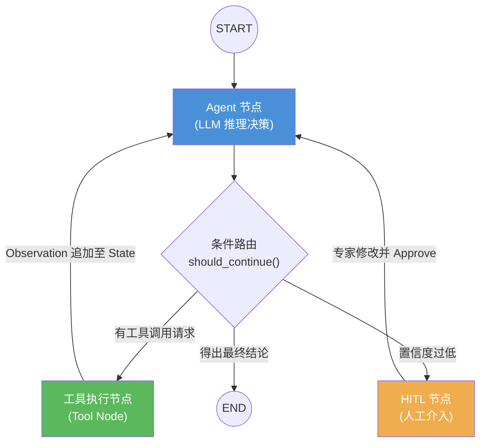

---
tags:
  - Agent
  - LLM
  - AI架构
status: active
---
# Agent 系统概要

## 一、什么是 AI Agent

**定义**: AI Agent 是能够感知输入、在特定环境中自主采取行动以实现预期目标的系统。在大语言模型背景下，Agent 演变为**以 LLM 为大脑，具备规划、记忆、工具调用能力的自主决策系统**。

根据 Andrej Karpathy 等专家的总结：

> **Agent = LLM (大脑) + Planning (规划) + Memory (记忆) + Tools (工具)**

**Agent 与普通 LLM 调用的本质区别**：普通调用是单次 input → output 的无状态变换；Agent 是一个能自主决策"下一步做什么"的持续性控制循环（Control Loop），它能在目标达成前反复调用工具、感知结果、调整策略。

---

## 二、核心组成部分

### 1. 大脑（LLM）

LLM 担任系统的控制器，负责：
- 自然语言理解与意图解析
- 推理与逻辑规划
- 工具调用决策（什么时候、调用哪个工具、传什么参数）
- 最终答案生成

**模型选型思考**：在工业落地中，不同任务节点对模型能力要求差异悬殊。主干规划推理节点需要强大的 32B/72B 级模型（如 Qwen3-32B）；而意图分类、格式校验等单一子任务可以用经过 SFT 的 4B/7B 小模型替代，大幅降低延迟和成本。

### 2. 规划（Planning）

| 机制 | 描述 | 适用场景 |
|:---|:---|:---|
| **CoT（链式思考）** | 引导模型逐步推理，减少跳跃性错误 | 数学、逻辑推理 |
| **ReAct（推理+行动）** | `Thought → Action → Observation` 循环，边思考边执行 | 工具调用、多步骤任务 |
| **ToT（思维树）** | 在每步探索多个分支并评估优劣，支持回溯 | 复杂规划、游戏决策 |
| **Reflexion（反思）** | Agent 对自身过去行为进行批判性反思，生成改进计划 | 需要自我纠错的长任务 |

**ReAct 循环示意**：
```
用户输入
   ↓
[Thought] 我需要先查询测试用例，然后执行仿真
   ↓
[Action] 调用 Test_Case_Query 工具
   ↓
[Observation] 返回 42 条用例
   ↓
[Thought] 用例已获取，现在启动仿真环境
   ↓
[Action] 调用 Simulation_Runner 工具
   ↓
...直到得出最终答案
```

### 3. 记忆（Memory）

```
记忆分类
├── 短期记忆（Short-term Memory）
│   └── 当前对话的上下文窗口（Context Window）
│       受限于 LLM 最大 Token 数（如 128K/1M）
│
└── 长期记忆（Long-term Memory）
    ├── 向量数据库（Milvus / Chroma）
    │   └── 语义相似度检索，适合模糊知识回忆
    └── 结构化数据库（Postgres / Redis）
        └── 精确键值检索，适合状态存档（Checkpoint）
```

**记忆过载问题（Lost in the Middle）**：当上下文过长时，LLM 倾向于忽略中间段内容，导致关键信息丢失。工程解法：滑动窗口截断 + 定期 Summary 摘要压缩 + 长期记忆分片存入向量库。

### 4. 工具（Tools）

工具赋予 Agent 与真实世界交互的能力，弥补 LLM 的两大天然缺陷：**时效性不足**（训练数据截止）和**无法执行副作用**（数据库写入、API 调用）。

工具调用的实现方式演进：
- **早期**：Prompt 中描述工具，让 LLM 输出文本，再用正则解析
- **现代**：Function Calling（OpenAI）/ Tool Use（Anthropic）原生支持，模型直接输出结构化 JSON，稳定性大幅提升

---

## 三、核心设计模式与架构图

### 3.1 ReAct 单体 Agent 架构

```
┌─────────────────────────────────────────────────┐
│                   ReAct Agent                    │
│                                                  │
│  用户请求  ──►  ┌──────────┐                    │
│                │  LLM 推理  │ ◄── System Prompt  │
│                │  (Thought) │     + 工具描述      │
│                └─────┬─────┘                    │
│                      │                          │
│              ┌───────▼───────┐                  │
│              │ 是否需要工具?  │                  │
│              └───────────────┘                  │
│                 /           \                   │
│               是              否                │
│               ↓              ↓                  │
│        ┌──────────┐    最终输出给用户            │
│        │ 工具执行  │                             │
│        │(Action)  │                             │
│        └────┬─────┘                             │
│             │ Observation                       │
│             └──── 反馈给 LLM 继续推理 ──────►   │
└─────────────────────────────────────────────────┘
```

### 3.2 LangGraph 状态机架构（企业级）

LangGraph 将 Agent 流程抽象为**有向图 + 状态机**，是目前工业落地最可控的方案。



**核心 State 设计（5G 测试 Agent 实例）**：
```python
class AgentState(TypedDict):
    messages: Annotated[list, add_messages]  # 对话历史（自动追加）
    current_step: str                         # 当前执行阶段
    tool_outputs: dict                        # 工具返回缓存
    error_count: int                          # 连续错误计数（熔断用）
    confidence_score: float                   # 当前决策置信度
    hitl_required: bool                       # 是否需要人工接管
```

### 3.3 5G 测试验证 Agent 完整系统架构

```
┌─────────────────────────────────────────────────────────────────────┐
│                    5G 智能测试验证 Agent 系统                        │
├─────────────────────────────────────────────────────────────────────┤
│                                                                     │
│   用户/CI 系统                                                       │
│       │ 测试需求（自然语言 / YAML）                                   │
│       ▼                                                             │
│   FastAPI 接口层  ──SSE推流──► 前端实时状态展示                       │
│       │                                                             │
│       ▼                                                             │
│   ┌─────────────────────────────────────────┐                      │
│   │           LangGraph 状态机引擎           │                      │
│   │                                         │                      │
│   │  ┌──────────┐    ┌──────────────────┐  │                      │
│   │  │ 意图解析  │───►│   用例生成节点    │  │                      │
│   │  │  节点     │    │  (Qwen3-32B)    │  │                      │
│   │  └──────────┘    └────────┬─────────┘  │                      │
│   │                           │             │                      │
│   │                  ┌────────▼─────────┐  │                      │
│   │                  │  Guardrail 安全   │  │                      │
│   │                  │  护栏检测         │  │                      │
│   │                  └────────┬─────────┘  │                      │
│   │                     /         \        │                      │
│   │                  安全          高危     │                      │
│   │                    ↓            ↓      │                      │
│   │           ┌──────────┐   ┌──────────┐ │                      │
│   │           │ 执行节点  │   │  HITL    │ │                      │
│   │           │(仿真环境) │   │  节点    │ │                      │
│   │           └────┬─────┘   └────┬─────┘ │                      │
│   │                │              │       │                      │
│   │                │         人工审批/修改  │                      │
│   │                ▼              ▼       │                      │
│   │           ┌─────────────────────────┐ │                      │
│   │           │     结果判定节点         │ │                      │
│   │           │  统计轨 + LLM语义轨      │ │                      │
│   │           └────────────────────────┘ │                      │
│   └─────────────────────────────────────────┘                      │
│                                                                     │
├──────────────────── 工具层（Tool Layer）────────────────────────────┤
│                                                                     │
│  Test_Case_Query  Simulation_Runner  Metrics_Collector              │
│  Baseline_Comparator  Log_Analyzer  Fleet_Manager                   │
│                                                                     │
├──────────────────── 基础设施层 ─────────────────────────────────────┤
│                                                                     │
│  Milvus（向量检索）  Elasticsearch（BM25）  Postgres（Checkpoint）   │
│  Redis（缓存）  Kafka（异步消息）  Celery（任务队列）                 │
│  vLLM（高性能推理）  Qwen3-32B（主干模型）                           │
│                                                                     │
└─────────────────────────────────────────────────────────────────────┘
```

---

## 四、关键工程问题与解决方案

### 4.1 双重熔断机制（防死循环 + 防幻觉）

Agent 在复杂任务中极易陷入无效循环或产生幻觉递归，需要两层防护：

| 熔断层级         | 触发条件              | 机制                             | 处理方式         |
| :----------- | :---------------- | :----------------------------- | :----------- |
| **硬熔断（第一层）** | 图迭代深度超过阈值（如 15 跳） | LangGraph `recursion_limit`    | 强制挂起，上报异常    |
| **软熔断（第二层）** | 连续两次决策置信度 < 0.6   | Prompt 强制输出 `confidence_score` | 触发 HITL 人工介入 |

**置信度阈值的确定方式**：不是拍脑袋，而是通过大量压测实验找到相变点。在 5G 测试项目中，经验表明 0.65 是关键阈值：低于此值时 Agent 自主执行的错误率急剧上升。

### 4.2 Human-in-the-Loop（HITL）工程实现

HITL 是 Agent 从"玩具"走向"工业生产力"的核心桥梁。工程落地需解决一个关键问题：**如何在不阻塞服务器线程的前提下等待人工审批**？

```
传统方式（有问题）：
While 循环等待  ──► 线程持续阻塞 ──► 内存泄漏 / HTTP 504 超时

LangGraph 方式（正确）：
触发高危预警
   │
   ▼
LangGraph 将 State 快照序列化至 Postgres（Checkpoint）
   │
   ▼
释放计算资源（进程终止，显存释放）
   │
   ▼
Celery 异步触发钉钉告警 Webhook
   │
   ▼
专家在 Web 前端 Review 并修改参数，点击 Approve
   │
   ▼
API 唤醒 → 从 Postgres 拉取 Thread_ID 对应的 State
   │
   ▼
将修改后的参数注入 State，调用 .resume() 恢复执行
```

**HITL 解决的三类业务问题**：
1. **灾难性环境摧毁防护**：拦截包含高危写权限信令的用例（如 `format_c`, `reset_all`）
2. **模糊边界判定**：置信度处于灰度区间（0.60~0.65）时交由专家会诊
3. **新奇用例确权**：LLM"灵光一闪"生成的 Novel Case（与知识库相似度极低），需要专家鉴别价值后决定是否执行

### 4.3 RAG 与 Agent 的结合（知识增强）

Agent 中的 RAG 不仅是检索问答，更是**用例生成的背景知识供给**和**历史缺陷的防覆辙机制**。

```
知识库构成：
├── 3GPP 协议文档（通信规范，BM25 精确匹配专有名词）
├── 历史 Bugzilla 缺陷库（向量语义检索，补全边界场景）
└── 人工确认的 Golden Cases（经过专家背书的高质量用例）

检索策略：
ES(BM25) 精确匹配  ──┐
                      ├──► 自研融合算法 ──► Cross-Encoder Rerank ──► Top-K Context
Milvus 语义检索    ──┘

数据飞轮（Data Flywheel）：
新用例生成 → HITL 专家审核 → 通过后自动 Embedding 入库
         → 系统越用越聪明，知识边界自我拓展
```

### 4.4 结果判定双轨机制

单纯依赖 LLM 判定测试结果存在幻觉风险，单纯依赖统计规则又无法处理复杂信令异常：

```
测试执行完成
      │
      ▼
┌─────────────────────────────────┐
│           双轨并行判定           │
├─────────────────┬───────────────┤
│   统计轨（硬规则）│   语义轨（LLM）│
│                 │               │
│ KPI 均值/方差   │ PCAP 信令解析  │
│ T-Test / KS-Test│ 日志语义理解   │
│ 阈值包络策略    │ 根因关联推理   │
└────────┬────────┴───────┬───────┘
         │                │
         ▼                ▼
    明显违规: FAIL    隐性异常: 详细诊断
         │                │
         └───── 综合判定 ──┘
                  │
         ┌────────▼────────┐
         │  置信度评分输出  │
         │ ≥ 0.85: 自动结论 │
         │ 0.65-0.85: 待审 │
         │ < 0.65: HITL    │
         └─────────────────┘
```

---

## 五、常见挑战与系统性对策

| 挑战 | 具体表现 | 工程对策 |
|:---|:---|:---|
| **无限循环与死锁** | `Action A → Obs A → Action A` 死循环 | 双重熔断（硬迭代上限 + 置信度软熔断）|
| **幻觉与工具误用** | 捏造工具参数，使用不存在的工具 | Guardrail 护栏（正则 + 轻量分类器）+ Function Calling 结构化约束 |
| **记忆过载** | 超出 Context Window，中间信息丢失 | 滑动窗口 + Summary 摘要压缩 + 长期记忆向量化 |
| **高延迟高成本** | 多轮 LLM 调用 + 超长 Prompt | 并行节点执行 + 小模型替代非核心节点 + 流式推送 |
| **幻觉生成危险指令** | 生成带高危参数的测试用例 | Guardrail 双缝检测 + HITL 人工拦截 + DPO 安全对齐 |
| **评估难** | 长链路无单一准确率指标 | 四维评估矩阵（格式/工具/轨迹/安全）+ LLM-as-Judge + 沙盒执行 |

---

## 六、主流架构分类

### 6.1 单智能体（Single-Agent）

适用于流程相对固定、任务类型单一的场景。

```
用户 → [单一 LLM Agent] → 工具调用 → 结果输出
```

### 6.2 多智能体协同（Multi-Agent System）

系统中包含多个扮演不同角色的 Agent，互相协作解决复杂问题。

```
                    ┌────────────────────────┐
                    │   Supervisor Agent      │
                    │   （任务分配与协调）     │
                    └────────────────────────┘
                        /        |        \
                       ↓         ↓         ↓
              ┌─────────┐ ┌─────────┐ ┌─────────┐
              │ 研究员   │ │ 程序员  │ │ 审查员  │
              │ Agent   │ │ Agent   │ │ Agent   │
              └─────────┘ └─────────┘ └─────────┘
                 │              │           │
                 └──────────────┴───────────┘
                         共享 State（全局黑板）
```

**多 Agent 的核心价值**：缓解单模型注意力分散和幻觉问题；不同节点可以使用不同大小的专用模型；复杂任务可并行处理。

**5G 测试中的多 Agent 应用（Map-Reduce 模式）**：
```
主控 Agent
   │
   ├──► Worker Agent 1（分析 RRC 信令日志）
   ├──► Worker Agent 2（分析 NAS 信令日志）
   └──► Worker Agent 3（分析 KPI 指标流）
             │
             └──► 汇总节点（Reduce）→ 综合诊断报告
```

### 6.3 Agentic Workflow（工作流思维）

Andrew Ng 提出的重要理念：**不要迷信单一指令的零样本回答，而应建立四大工作流设计模式**：

1. **Reflection（反思）**：让 Agent 对自身输出进行批评和改进
2. **Tool Use（工具调用）**：赋予模型与外部系统交互的能力
3. **Planning（规划）**：将复杂任务分解为可执行的子步骤序列
4. **Multi-Agent Collaboration（多智能体协作）**：不同角色并行协同

> 在当前工业落地实践中，**Workflow 思维往往比完全自主的 Agent 更具实效性**——明确的状态流转比让模型自由发挥更可控、更稳定。

---

## 七、模型后训练闭环（SFT + DPO）

通用基座模型在垂直领域落地面临三个核心问题：**领域术语理解不足**、**结构化格式输出不稳定**、**危险逻辑幻觉**。后训练是从"可用"走向"高可靠"的必经之路。

### 7.1 SFT 监督微调（解决格式与术语）

```
数据来源：
├── Self-Instruct / Magpie 合成数据流水线
├── HITL 沉淀的 Golden Dataset（专家确认的高质量样本）
└── 3GPP 协议注入的领域知识对话

技术方案（32B 量级）：
DeepSpeed ZeRO-3 + QLoRA (nf4 量化)
LoRA 插入位置：q_proj, v_proj, o_proj, gate_proj, up_proj
超参数：r=64, α=128, dropout=0.05, lr=5e-5 (Cosine 退火)
硬件：8×A100 80G，FlashAttention-2 + Gradient Checkpointing
```

### 7.2 DPO 偏好对齐（抑制危险幻觉）

HITL 组件天然是 DPO 数据采集器：

```
HITL 拦截流程        →   DPO 数据生成
────────────────────────────────────────
高危用例被专家打回    →   Y_rejected（负样本）
专家修改后通过       →   Y_chosen（正样本）

三元组: (Prompt, Y_chosen, Y_rejected)
           ↓
        DPO 训练
           ↓
      合法信令↑概率，危险词汇↓权重
```

**DPO 相比 RLHF 的优势**：省去独立 Reward Model 的训练复杂度，直接通过偏好对数据进行梯度对齐，工程实现更轻量。

---

## 八、Agent 系统评测体系

Agent 评估不能简单用准确率衡量，需要**四维矩阵式评估**：

| 维度 | 指标 | 评估方法 |
|:---|:---|:---|
| **格式合规** | 指令遵从率（JSON Schema 合法性） | pytest + Pydantic Validators |
| **工具调用** | 工具选择准确率 + 参数 F1-Score | 与 Ground Truth 轨迹对比 |
| **轨迹效率** | 成功率 + 步数效率比（Agent步数/专家步数） | Golden Trajectories 对比 |
| **安全合规** | 高危场景阻断率（生产网必须 100%） | 毒药测试集压测 |

**三层评估技术栈**：
1. **静态断言层**：pytest + Ragas/DeepEval 量化检索精度（Context Precision, Answer Relevance）
2. **LLM-as-Judge 层**：Prometheus-Eval 或 GPT-4o 对长文本报告进行自动语义评分
3. **沙盒执行层**（最关键）：Agent 生成的用例直接在 Docker 隔离环境中运行，以执行结果而非文本描述为最终判定依据

---

## 九、进阶知识体系

- [[LangChain]]：掌握工具抽象、AgentExecutor 机制、LCEL 链式组合
- [[LangGraph]]：复杂控制流的核心，State Machine + Checkpoint + HITL 完整实现
- [[主流Agent框架对比]]：LlamaIndex / MetaGPT / AutoGen / CrewAI / Dify 选型思路
- [[Function_Calling与工具箱]]：结构化工具调用的底层实现细节
- [[Memory机制与向量库接入]]：短期/长期记忆的工程化接入方案
- [[02_Agent技术报告]]：5G 测试验证 Agent 完整技术深度报告（面试专用）
