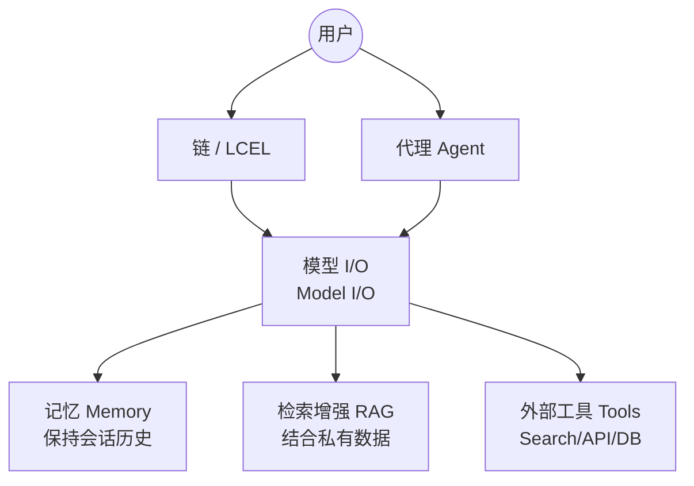

---
tags:
  - Agent
  - LLM框架
  - LangChain
status: in_progress
---
# LangChain

## 1. 简介
**LangChain** 是当今最流行、使用者最多的大语言模型（LLM）应用程序开发框架之一，尤其在于它是搭建 AI Agent 的基础架构。它提供了一套标准接口（API）和丰富的工具抽象组件，能够帮助开发者将大型语言模型与其他计算资源或知识源结合，从而打造“感知上下文并且具有逻辑推理能力”的应用。

其核心价值在于它扮演了**“大模型与现实世界之间的胶水层”**。它极大地降低了接入各种LLM、向量数据库（Vector DB）、第三方工具（Google Search, Wikipedia）的门槛，并提供了数据处理（Document Loaders, Text Splitters）的标准化管道。

### LangChain 解决的核心痛点
在没有 LangChain 之前，开发者直接调用 LLM 的 API 往往面临以下问题，而 LangChain 完美解决了这些痛点：
1. **模型切换成本高**：直接调用 OpenAI 的 API，如果想要换成 Anthropic 或开源本地大模型（如 Llama 3），需要重写大量 API 请求代码。LangChain 提供了统一的抽象接口，切换模型只需修改一两行代码。
2. **大模型缺乏“状态（记忆）”**：LLM 本质上是无状态的（Stateless），不记得上一轮的对话。LangChain 的 Memory 模块封装了上下文管理的逻辑，使多轮对话成为可能。
3. **大模型缺乏“实时信息与现实交互能力”**：基础模型只能基于预训练数据生成文本。通过 LangChain 的 Tools 和 Agents 功能，模型能够“联网搜索”、“查询数据库”甚至“执行外部代码”。
4. **Prompt 管理混乱**：当项目变大时，硬编码的 Prompt 会极难维护。LangChain 提供了模板化（Prompt Templates）能力，实现业务变量和 Prompt 分离。

## 2. 核心架构与组件 (Core Modules)

在 LangChain 架构设计中，主要包含以下几大核心模块：



- **模型 I/O (Model I/O)**: 提供了统一接口调用来自 OpenAI, Anthropic, HuggingFace 等多个不同供应商的高级或开源 LLM；提供了提示词模板 (Prompt Templates) 方便动态构建和传递参数；以及输出解析器 (Output Parsers)，能够将语言模型返回的非结构化纯文本字符串强制转换为 JSON、Pydantic 对象等。
- **检索增强生成 (Retrieval / RAG)**: 使大模型能读取私有数据。包含 Document loaders (加载器，如从 PDF, Notion 导入数据), Text Splitters (文档拆分工具), Text Embedding models (文本特征向量化), Vectorstores (向量存储数据库，如 Chroma, FAISS, Milvus), 以及 Retrievers (检索器抽象接口)。
- **链 (Chains) 与 LCEL**: 针对线性和确定的工作流（例如：翻译 -> 提取关键信息 -> 总结）。过去通过硬编码的 Chain 类实现，**目前极力推荐使用 LCEL (LangChain Expression Language)** 这套声明式管道语法将其流式串在一起：`chain = prompt | model | parser`。LCEL 原生支持流式输出(Streaming)、异步调用(Async)和追踪(Tracing)。
- **代理 (Agents)**: 赋予 LLM **自主决策权**。相比于 Chains 这种“按部就班”的执行顺序，Agent 让语言模型作为大脑，利用“思维链(CoT)”根据用户的任意输入自主决定**“需要用什么工具、采取哪些步骤、何时结束”**。包含工具库（`tools`）和运行全流程的 `AgentExecutor`。
- **记忆 (Memory)**: 为 Agent 或 Chain 提供保存历史会话记录（Context）的能力。例如 `ConversationBufferMemory`（原样保留所有对话）和 `ConversationSummaryMemory`（利用 LLM 自动将过往对话压缩为摘要以节省 Token）。

## 3. 典型应用场景 (Use Cases)

LangChain 的上述组件通常组合起来用于以下高频业务场景：
1. **基于文档的问答系统 (RAG)**：将企业知识库构建为向量数据库，用户提问时，先检索相关文档段落，再拼接成 Prompt 交给大模型生成回答。
2. **多轮对话机器人 (Chatbots)**：结合 `Memory` 和 `Model I/O`，打造具有人设并能记住用户历史上下文的客服助手。
3. **数据提取与信息结构化 (Extraction)**：输入长篇散乱的文本或网页，通过设定 `Output Parsers` 和明确的 Prompt，让 LLM 提取出格式化的高质量 JSON 数据结构。
4. **自主执行任务的智能体 (Autonomous Agents)**：为应用分配一系列内部数据库查询工具和外部搜索工具，接收“帮我生成一份竞品分析报告”这样的宽泛指令，Agent 会自行规划、搜索、聚合数据并生成最终结果。

## 4. LangChain 在 Agent 开发中的特点与瓶颈

### 4.1 优势特点
- **生态庞大, 极强的集成能力**: 官方与社区维护的第三方集成难以计数（如 `langchain-community`, `langchain-openai`），几乎涵盖所有的主流大模型、向量数据库、数据源（PDF, Word, Excel, GitHub, Notion），真正做到“万物皆可接”。
- **开箱即用**: 给初学者提供极简的高级封装接口。只需引入 `create_openai_tools_agent` 即可快速拉起一个具备 Function Calling 能力的 Agent。预置了诸如 `TavilySearchResults`, `WikipediaQueryRun` 等多种拿来即用的实用工具。

### 4.2 瓶颈与陷阱 (为何目前有时受到诟病？)
- **过度封装带来的“黑盒”问题**: LangChain 内部高度复杂的面向对象抽象和多层继承结构，导致调试时一旦报错，堆栈信息极长，难以溯源（"充满 Magic"）。
- **控制反转严重与 Prompt 不透明**: 框架通常会在用户毫无察觉的情况下，在底层拼接大量其自认为“最佳实践”的预设 Prompt 指令串。当遇到高定要求、或者模型不太理解它的预设 Prompt 时，开发者很难灵活干预。
- **缺乏对复杂 Agent 循环的细粒度控制**: 在传统 `AgentExecutor` 设计中，处理复杂的多节点非线性循环结构（如需要人工审批环节、复杂的状态机轮转）非常困难。这也正是官方后续推出 **LangGraph**（专注于通过图结构构建复杂、可控多Agent流）的核心原因。 `AgentExecutor` 模式在面对复杂任务时显得力不从心。
- **版本迭代激进**: 接口改版极其频繁，很多网上的旧教程代码在最新版本中已经提示弃用（DeprecationWarning），学习和维护成本不低。

## 5. 必备代码概念与示例（核心语法糖）

### LCEL (声明式语法)
利用由 `|` 管道符连接的语言，最大化简化流式的调用：
```python
from langchain_core.prompts import ChatPromptTemplate
from langchain_openai import ChatOpenAI
from langchain_core.output_parsers import StrOutputParser

# 1. 配置 Prompt 模板
prompt = ChatPromptTemplate.from_template("讲一个关于 {topic} 的笑话")
# 2. 实例化模型对象
model = ChatOpenAI(model="gpt-4o")
# 3. 指定输出提取器 (将模型返回值强转为纯字符串)
output_parser = StrOutputParser()

# 4. 组成 Pipeline (这就是 LCEL，极大降低了链式调用的代码量)
chain = prompt | model | output_parser

# 5. 触发执行 invoke 
response = chain.invoke({"topic": "AI程序员"})
print(response)
```

### Agent 基本定义 (工具调用)
```python
from langchain.agents import AgentExecutor, create_tool_calling_agent
from langchain_core.tools import tool
from langchain_openai import ChatOpenAI
from langchain_core.prompts import ChatPromptTemplate

# 1. 定义具有功能描述的工具（LLM依靠这段 Docstring 理解何时使用该工具）
@tool
def get_weather(location: str):
    """获取指定位置的当前天气情况。"""
    return f"{location} 晴天，25度"

tools = [get_weather]
model = ChatOpenAI(model="gpt-4o", temperature=0)
prompt = ChatPromptTemplate.from_messages([
    ("system", "你是一个得力的助手。"),
    ("placeholder", "{chat_history}"),
    ("human", "{input}"),
    ("placeholder", "{agent_scratchpad}"), # Agent 存放思考和工具调用的“草稿本”
])

# 2. 绑定工具与模型，创建 Agent 引擎
agent = create_tool_calling_agent(model, tools, prompt)

# 3. 创建执行器循环 (负责实际调用函数并在遇到错误时重试)
agent_executor = AgentExecutor(agent=agent, tools=tools, verbose=True)

# 4. 执行 Agent 任务
agent_executor.invoke({"input": "今天北京天气如何？适合穿什么？"})
```

## 6. 进阶核心机制与原理解析 (流式、回调、记忆)

除了基础的调用，LangChain 提供了一系列高级机制来应对真实生产环境的需求，形成如下知识提纲：

### 6.1 流式传输 (Streaming)
**机制与原理**：
在 LLM 逐字生成（打字机效果）的场景中，流式传输能极大地降低用户的等待焦虑（First Token Latency）。LangChain 的 LCEL 架构原生且统一地支持了流式接口。只要底层的模型（如 `ChatOpenAI`）支持，直接对 `Chain` 调用 `.stream()` 即可，无需对管道内的各个组件做特殊改造。

**代码片段**：
```python
from langchain_openai import ChatOpenAI
from langchain_core.prompts import ChatPromptTemplate
from langchain_core.output_parsers import StrOutputParser

prompt = ChatPromptTemplate.from_template("写一首关于{topic}的四行诗。")
chain = prompt | ChatOpenAI(model="gpt-4o") | StrOutputParser()

# 使用 .stream() 返回一个生成器（如果是异步环境使用 .astream()）
for chunk in chain.stream({"topic": "星空"}):
    # chunk 已经是被 StrOutputParser 解析出的字符串片段
    print(chunk, end="", flush=True)
```

### 6.2 回调系统与中间件 (Callbacks)
**机制与原理**：
LangChain 中没有传统 Web 框架里那种阻断式的“中间件”，而是通过 **回调系统 (Callbacks)** 来实现面向切面编程 (AOP)。你可以将其理解为**生命周期钩子引擎**。它允许你在大模型运行的各个阶段（如：开始跑 prompt 时、LLM 吐出第一个 token 时、工具报错时、完整运行结束时）注入自定义逻辑。最常见的用途是：**日志记录与追踪、Token 计费监控、流式传输路由到特定终端。**

**代码片段**：
```python
from langchain_core.callbacks import BaseCallbackHandler
from langchain_openai import ChatOpenAI

# 1. 继承 BaseCallbackHandler 打造自己的生命周期钩子
class MyCustomHandler(BaseCallbackHandler):
    def on_llm_new_token(self, token: str, **kwargs) -> None:
        print(f"✅ 截获Token: {token}")
        
    def on_llm_end(self, response, **kwargs) -> None:
        print("\n🏁 模型回答完毕，准备落表或者统一计算扣费！")

# 2. 在实例化模型或者调用 invoke/stream 时传入回调列表
model = ChatOpenAI(
    model="gpt-4o", 
    streaming=True, 
    callbacks=[MyCustomHandler()]
)

model.invoke("你好")
```

### 6.3 记忆管理 (Memory Management)
**机制与原理**：
大模型接口本身是无状态的（Stateless）。要让机器人“记住”上下文，必须在每次发送请求时带上之前的历史聊天记录。LangChain 提供了管理这部分历史（截断、压缩、持久化存储）的机制。
*   **Buffer Memory**: 全量保存对白，最消耗 Token。通过截断（只保留近 N 轮）可控制开销。
*   **Summary Memory**: 当对话变长时，由 LLM 异步在后台把前面的冗长对话总结成一小段摘要注入，大幅节省 Token 开销。
*   *【重要变更】*：在现代的 LCEL 架构中，旧版黑盒封装的 `ConversationBufferMemory` 渐渐淘汰，官方强推使用 `RunnableWithMessageHistory` 包装器来**显式注入与提取**特定 `session_id` 的记录。

**代码片段 (现代理念)**：
```python
from langchain_core.runnables.history import RunnableWithMessageHistory
from langchain_community.chat_message_histories import ChatMessageHistory
from langchain_core.prompts import ChatPromptTemplate, MessagesPlaceholder

# 1. 准备一个全局数据源（生产环境应替换为 Redis 或数据库）来存放多用户对话记录
store = {}
def get_session_history(session_id: str):
    if session_id not in store:
        store[session_id] = ChatMessageHistory()
    return store[session_id]

# 2. 编写 Prompt，使用 MessagesPlaceholder 为历史对话"留坑"
prompt = ChatPromptTemplate.from_messages([
    ("system", "你是个聪明的私人管家。"),
    MessagesPlaceholder(variable_name="history"), 
    ("human", "{question}"),
])
chain = prompt | ChatOpenAI(model="gpt-4o")

# 3. 使用 RunnableWithMessageHistory 对其进行增强包裹，实现黑魔法的自动注入与追加
chain_with_history = RunnableWithMessageHistory(
    chain,
    get_session_history, # 告知框架去哪里拉取/存入历史
    input_messages_key="question",     # 告诉框架用户的新消息存在哪个变量
    history_messages_key="history",    # 告诉框架历史记录填取到哪个坑位
)

# 4. 调用时传入 config 参数指定当前的用户身份隔离 (session_id)
chain_with_history.invoke(
    {"question": "记住哦，我叫张三"},
    config={"configurable": {"session_id": "user_123"}}
)
```

## 7. 学习与选型建议
如果你需要快速接入大模型、做多模型适配的工具箱集成，或者搭建基础的 RAG 系统，**LangChain 依然是最强大和省事的框架**。

但在深入 Agent 领域时，建议：
1. **拥抱 LCEL**，它是 LangChain 现在的精髓，尽量避免使用老旧的 `LLMChain` 或各种特定的封装 Chain 对象。
2. 随着业务复杂度提升，**应当逐渐摆脱 LangChain 高度封装 Agent API 的桎梏**，转向使用粒度更细、控制力更强的 **LangGraph** 来编排复杂的 Agent 工作流。或者直接只保留 LangChain 的接口抽象能力，自己编写控制论和循环调度逻辑。

## 8. 面试高频 FAQ (八股)

**Q1：什么是 LangChain？它的核心组件有哪些？**
**标准回答：**
LangChain 是开发大模型（LLM）驱动应用的开源框架，它充当了**“大模型与现实世界之间的胶水层”**。其架构核心包含五块：
1. **Model I/O (模型输入输出)**：负责各家大模型的底层 API 统一抽象。包含 Prompts（提示词模板）、Language Models（模型封装）、Output Parsers（输出解析器，如将纯文本转为 JSON/Pydantic 对象）。
2. **Retrieval (检索增强/RAG)**：打通外部私有数据的管道，包含 Document Loaders（加载数据）、Text Splitters（分块）、Embeddings（特征向量化）、VectorStores（向量库）、Retrievers（检索策略抽象）。
3. **Chains (链)**：针对确定性、线性的流水线工作流。目前主推使用 **LCEL (LangChain 表达式)** 声明式拼装：`prompt | model | parser`。
4. **Agents (智能体)**：赋予模型决策权。不写死执行流程，而是给模型一套“工具箱（Tools）”，让 LLM 作为大脑自主思考（Thought），决定按什么顺序使用何种工具（Action）达成最终目标。
5. **Memory (记忆)**：由于大模型 API 是无状态单次调用的，Memory 负责在后端截获并存储历史会话，动态拼接回最新 Prompt 中实现上下文感知。

**Q2：请解释一下 Chain（链）和 Agent（智能体）的本质区别？**
**标准回答：**
核心区别在于**确定性**与**自主性**。
- **Chain 是硬编码的、确定性的（Deterministic）**。在代码里写死了“先查向量库、再扔给模型翻译、最后提取摘要”。程序每次运行都严格遵守这条死板路线，毫无变通。
- **Agent 是动态的、非确定性的（Nondeterministic）**。开局仅提供环境前提和若干 Tools（如查天气、搜网页、读数据库的函数）。Agent 运行时依靠大模型的逻辑推理机制引发“思维链”，自主决定当前需要首先拆解什么子任务、优先使用什么工具，并根据工具返回的结果动态决定下一步走向。

**Q3：什么是 LCEL (LangChain Expression Language)？有什么实际优势？**
**标准回答：**
LCEL 是 LangChain 在新版主力推广的**声明式工作流编排语法**。它重载了 Python 原生的管道操作符 `|`，将各个组件首尾相连拼接。
三大落地优势：
1. **原生支持异步与流式**：只要是用 `|` 拼出来的实例结构，统一免费获得了同步流式输出（Streaming打字机效果）、异步调用（Async）以及高并发批处理（Batch）接口的能力。
2. **天然便于追踪与熔断降级（Fallback）**：自带对 LangSmith 的插桩监控。且极其方便地一行代码实现 API 抛异常时的回退分支与重试机制。
3. **消除冗余黑盒逻辑**：淘汰了原来笨重的 `LLMChain` 类体系，使每一步的数据转化流向高度透明解耦。

**Q4：LangChain 在企业级开发中的局限性与主要痛点是什么？**
**标准回答：**
1. **过度封装引发的严重黑盒化**：为了追求极致通用性，底层类的继承结构极深，一旦遇上执行报错或特殊的模型返回拒接，报错堆栈极其绵长繁杂，逆向排查与改写底层逻辑异常抓狂。
2. **控制反转与 Prompt 隐蔽**：许多高阶模块（如传统 Agent 构建类）会在底层拼写大量隐式的强制预设 Prompt 说明。对特定垂直场景进行改造优化（比如加入人设防幻觉要求）时处处碰壁。
3. **对负责循环与强干预流程能力极其薄弱**：在面对非常庞大的非线性长周期任务、多步骤特定的容错重试、或者是不可逆的业务刚需“中途拦截进入人工审核确认（审批风控）”等机制时，传统的 `AgentExecutor` 只能望洋兴叹（这也是企业转向 `LangGraph` 状态图架构的最核心原因）。
