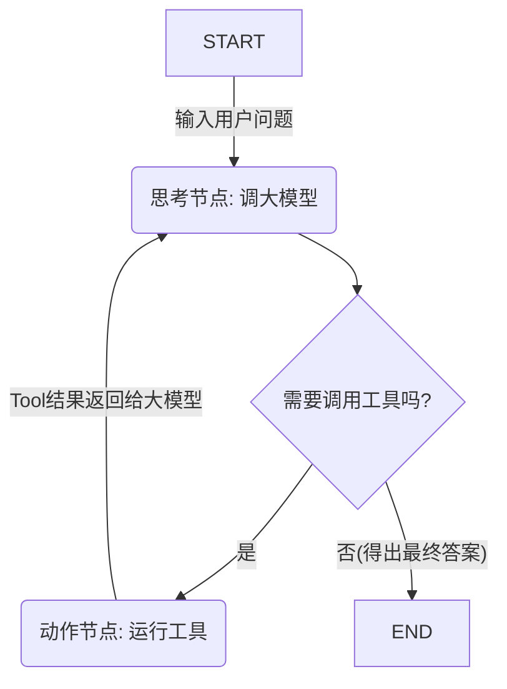

---
tags:
  - Agent
  - LLM框架
  - LangGraph
status: draft
---
# LangGraph: 基于图/状态机的Agent框架

## 1. 简介
**LangGraph** 是 LangChain 官方推出的扩展库，专为解决**创建周期性（循环，Cyclic）、更复杂的单 Agent 及多 Agent 流程**而设计。
普通的 LangChain 采用的是有向无环图（DAG）结构（即从一端输入，一步步流到另一端输出）。而真正的 Agent 是需要“思考-行动-观察-再思考”的，它是**循环的**且需要保留**中间状态（State）**。LangGraph 将整个 AI 流水线抽象为**图（Graph）**结构，更接近状态机的概念。

开发复杂的 Agent 系统，不再是仅仅把 API 拼在一起，更像是**系统工程设计**。LangGraph 在定制性、调试能力以及人机协同（Human-in-the-loop）方面拥有巨大优势，因此正迅速成为生产级 Agent 开发的**首选底层框架**之一。

## 2. 核心架构与概念

所有的工作流在 LangGraph 中都被定义为 `StateGraph` 或更高级的图结构实例。你需要了解以下核心组成部分：

- **状态 (State / StateSchema)**: 
  - 是整个图中流转的“黑板（Shared Memory）”。定义了各个节点（Node）所共享的数据结构（可以使用 `typing.TypedDict` 或 `pydantic.BaseModel`）。
  - 每个节点运行完毕后，会返回新数据去更新这个原始的 State（覆盖或者合并累加，例如消息列表通常是 `add_messages` 进行累加追加）。
- **节点 (Nodes)**: 
  - 图中实实在在干活的地方。每个节点对应一个 Python 函数。
  - 函数的输入是当前 `State` 字典，函数内部执行业务逻辑（比如调用 LLM、调用 Tool、查询数据库），然后返回需要更新到 `State` 中的改动部分。
- **边 (Edges)**:
  - 规定了节点之间的流转方向（从 Node A 流向 Node B）。
- **条件边 (Conditional Edges)**:
  - 这是 LangGraph 具有生命力的关键：它是实现**分支判断（if/else）**与**循环（while）**的重要机制。
  - 它也是一个 Python 函数，接收 `State`，运行一段轻量级的判定逻辑，返回下一步应该走向哪个特定节点的名称。比如：“如果判定大模型调用了工具，则走向 Tool 节点；如果判定大模型给出了最终答案，则走向结束节点 `END`。”

## 3. 为什么选择 LangGraph？（相比于原版 LangChain AgentExecutor）

1. **更高的可控性与透明度（No Black Box）**: 
   - 你不再局限于 LangChain 内置的不透明的循环逻辑，整个流程在图的定义上清晰可见。
   - 每一步的状态变更都能轻易调试和捕获。
2. **极佳的状态连续与持久化支持 (Checkpoints & Persistence)**: 
   - LangGraph 支持内置的断点存档。无论是保存在内存 `MemorySaver()`, 还是 Postgres 等数据库中，如果发生报错，或流程中断，之后可以在之前失败状态的基础上一键恢复或重试。
3. **完美支持人机协同 (Human-in-the-Loop)**:
   - 企业级应用中非常重要的一环：“当 Agent 决定执行某些不可逆操作（比如转账、发邮件、删库）时，它在执行这一特定节点前**暂停工作流（interrupt_before/after）**，等待人类审批或人类修改部分 State 数据后再继续往下执行。” LangGraph 实现了这一原生支持。
4. **多 Agent (Multi-Agent) 编排**:
   - 可以在图中定义多种不同的角色节点，利用统一的共享消息（State）完成彼此交接控制权。

## 4. 基础工作流示例 (概念化)

将一个具备工具调用（Function Calling）的 Agent 设计为 LangGraph，通常只有两个主节点和一个条件边：

1. **Agent 节点 (模型思考)**: 接收当前消息记录，调用 LLM 推理。
2. **Action 节点 (工具执行)**: 接收模型下发的工具参数，实际运行 Python 脚本或调 API，并将结果封装为 ToolMessage。
3. **条件边界 (Should Continue)**: 判断步骤上一个输出，如果需要调用工具，则 `-> Action 节点`；如果是最终作答，则结束任务 `-> END 节点`。从 Action 节点执行完毕后，总是流回 `-> Agent 节点`。

## 5. 进阶学习：LangGraph 生态系统
- **LangSmith**: 当配合图表运行时，结合官方的监控平台 LangSmith（基于 Trace 技术）能可视化每一层输入、输出和耗时，并直接在平台上重新运行某一步进行 Debug。
- **LangGraph Studio**: 官方出的桌面级调试工作流的可视化前端页面，能够帮助直观审查和改写节点状态变量。

对于想深入 Agent 开发的工程师，**LangGraph** 应该是当前（截至 2024~2026年领域内）必须掌握的核心护城河级别技能。
