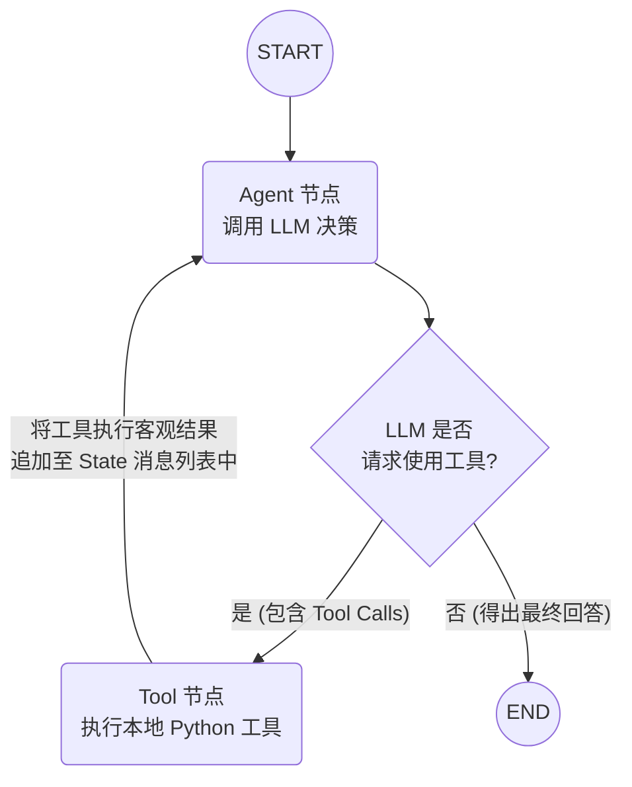

---
tags:
  - Agent
  - LLM框架
  - LangGraph
status: in_progress
---
# LangGraph: 基于图与状态机的复杂 Agent 编排框架

## 1. 简介
**LangGraph** 是 LangChain 生态系统中的一个独立扩展库（目前已成为 LangChain 推荐的核心底层框架），专为解决**创建周期性（循环，Cyclic）、高可控的单 Agent 及多 Agent 复杂工作流**而设计。

传统的 LangChain 链（Chains 或 LCEL）采用的是有向无环图（DAG）结构，数据像流水线一样从一端输入，单向流到另一端输出。然而，真正的 AI Agent（如 ReAct 架构）需要“思考-行动-观察-再思考”的迭代过程。它必须是**循环的**，且需要极其可靠的机制来维护运行时的**中间状态（State）**。

LangGraph 将整个 Agent 运行过程抽象为**图（Graph）和状态机（State Machine）**。它赋予了开发者微操 Agent 每一步走向的能力，是构建生产级、企业级可控 Agent 系统的不二之选。它不再是简单的 API 拼接，而是严谨的**系统工程设计**。

### LangGraph 解决的核心痛点
在 LangGraph 出现之前，使用传统的 `AgentExecutor` 存在以下巨大瓶颈：
1. **黑盒化严重，难以干预**：框架内部决定何时调用工具、何时结束，开发者想在中间插手（比如加入人工审批）极其困难。
2. **缺乏状态持久化**：一旦运行崩溃，只能从头重来。无法在中途保存“检查点（Checkpoints）”。
3. **复杂非线性逻辑难以实现**：应对多分支、长周期任务，或是需要多个特化 Agent 相互协作配合（Multi-Agent）时，传统的单体执行器显得力不从心。

## 2. 核心架构与底层概念

在 LangGraph 中，一切工作流都被定义为 `StateGraph` 的实例。你需要掌握以下四大核心概念：

- **状态 (State / StateSchema)**: 
  - 图中流转的**“共享内存（Shared Memory）”**或“黑板”。通常使用 `typing.TypedDict` 或 `Pydantic` 定义。
  - 图中的每个步骤都会接收当前的 State，并在执行后返回一个增量信息。LangGraph 会根据定义的归约（Reducer）规则（例如 `add_messages` 用于自动累加消息，或是直接覆盖局部变量）更新全局 State。
- **节点 (Nodes)**: 
  - 图中真正执行业务逻辑的工作单元。
  - 在代码层面，节点通常就是一个标准的 Python 函数。它的输入是当前的全局 `State`，运算（调大模型、查数据库）结束后，返回需要更新到状态里的字典结构。
- **普通边 (Edges)**:
  - 规定了节点之间的确定性先后流转方向。例如 `graph.add_edge("node_a", "node_b")`，意味着节点 A 执行完毕后，控制权无条件地交给节点 B。
- **条件边 (Conditional Edges)**:
  - LangGraph 的**灵魂所在**，它是实现**分支判断（if/else）**与**循环控制（while）**的核心机制。
  - 它也是一个 Python 函数，接收 `State` 评估轻量级判定逻辑，返回下一个目的节点的名称。大模型在这里扮演了“路由器决策中心”的角色。

## 3. LangGraph 的核心优势与特性

1. **极致的可控性与透明度 (Controllability)**: 
   - 彻底打破黑盒，整个 AI 工作流被明确地拆解为一个个可插拔的函数节点。你可以清晰看到数据流向，并随时在特定节点拦截并检查状态。
2. **原生支持持久化与“时间旅行” (Persistence & Time Travel)**: 
   - LangGraph 支持通过 `Checkpointer` (如 `MemorySaver` 或 Postgres/Sqlite) 进行每个步骤的断点存档。
   - 这意味着你可以像打游戏一样随时保存进度；如果模型中途出错，你甚至可以将整个流图的状态回滚（Time Travel）到前几步，手动修正 State 中的错乱消息，然后让程序在修正后的状态上继续执行。
3. **完美支持人机协同 (Human-in-the-Loop, HITL)**:
   - 商业级落地的刚需特性！例如，当 Agent 准备执行“转账”或“群发邮件”等不可逆高危操作前，可以通过在图中配置 `interrupt_before=["send_email_node"]` 直接挂起系统。程序进入等待状态，直至人类审查确认（甚至人工修改邮件内容参数）并在前端放行后，再恢复流转。
4. **灵活的多智能体架构支持 (Multi-Agent)**:
   - 允许开发者定义丰富的多角色节点。让具有不同 System Prompt、外挂不同特定领域知识库的 Agent（比如 调研员、程序员、代码审查员）作为各自的节点，它们通过读写全局公共 State 互相交替控制权，协作完成复杂的超长任务。

## 4. 典型设计模式与工作流图

最基础的带工具调用能力的单体 Agent（Tool-Calling Agent / ReAct Agent）的 Graph 结构如下：

1. **Agent Node (思考与决策节点)**: 接收当前积累的消息，交给带有绑定工具的 LLM。模型如果觉得需要使用工具，会返回 Tool Calls 请求；如果觉得可以作答，则输出最终文字解答。
2. **Action/Tool Node (工具执行节点)**: 当发生条件跳转时拦截调用。剥离模型下发的请求参数并真正在本地运行工具函数，将运行的客观结果记录在 State 的消息列表中。
3. **条件边界 (Should Continue 函数)**: 判断 Agent 节点的输出包含什么内容。若带工具请求则 `-> 走向 Tool 节点`；若无，则 `-> 走向最终节点 END`。而 Tool Node 运行完毕后，总是必然流回 `-> Agent Node` 让模型根据结果再次进行决策。


```mermaid
graph TD;
    START((START)) --> AgentNode(Agent 节点\n调用 LLM 决策);
    
    AgentNode --> 条件判定{LLM 是否\n请求使用工具?};
    
    条件判定 -- 是 (包含 Tool Calls) --> ToolNode(Tool 节点\n执行本地 Python 工具);
    ToolNode -->|将工具执行客观结果\n追加至 State 消息列表中| AgentNode;
    
    条件判定 -- 否 (得出最终回答) --> END((END));
```

## 5. 核心代码样板 (构建 ReAct Agent)

下面是一套构建单体反思执行 Agent 的缩略版代码底座模板：

```python
from typing import TypedDict, Annotated
from langgraph.graph import StateGraph, START, END
from langgraph.graph.message import add_messages
from langchain_openai import ChatOpenAI
from langchain_core.tools import tool

# 1. 定义全局共享的 State 结构
# 使用 add_messages reducer 来保证新的消息总是被追加(append)而不是覆盖
class AgentState(TypedDict):
    messages: Annotated[list, add_messages]

# 2. 准备可以被模型调用的工具
@tool
def get_weather(location: str):
    """获取指定城市的天气状况"""
    return f"{location}目前天气晴朗，气温25摄氏度。"

tools = [get_weather]
model = ChatOpenAI(model="gpt-4o").bind_tools(tools)

# 3. 编写业务节点函数
def agent_node(state: AgentState):
    # 用所有的上下文信息询问大模型
    response = model.invoke(state["messages"])
    # 图框架会自动使用上面的 add_messages 更新逻辑把此结果追加进全局消息池
    return {"messages": [response]}

def tool_node(state: AgentState):
    # 实战中会使用内置的 ToolNode 处理，此处展示底层逻辑。
    # 提取最后一条 AI 的响应，检索其 tool_calls 要求，运行对应的本地函数执行并返回结果
    # ... mock 执行逻辑
    return {"messages": [/* 返回包含结果的 ToolMessage 数据 */]}

# 4. 判定函数（条件边的路由中心）
def should_continue(state: AgentState) -> str:
    last_message = state["messages"][-1]
    # 如果判断最后的信息是模型希望使用工具，则放行至工具节点
    if last_message.tool_calls:
        return "tools"
    # 否则直接终结整个事务流
    return END

# 5. 组装工作流编排网图 (Graph Construction)
workflow = StateGraph(AgentState)

# 注册节点声明
workflow.add_node("agent", agent_node)
workflow.add_node("tools", tool_node)

# 设置逻辑连线
workflow.add_edge(START, "agent")  # 启动后硬编码必定进入思考环节
workflow.add_conditional_edges("agent", should_continue)  # 智能体抉择后交由路由判决下个站去向
workflow.add_edge("tools", "agent")  # 工具跑完必须要再回抛给大模型分析结果

# 6. 将蓝图编译为实体应用引擎 (此时可传入 checkpointer 提供暂停与持久化记忆能力)
app = workflow.compile()

# 7. 投入生产与发起调用
inputs = {"messages": [("user", "北京今天天气咋样？适合不适合打高尔夫？")]}
for step_output in app.stream(inputs):
    print(step_output)
```
*(注：对于此类极度标准的、仅仅拥有普通工具的智能体，官方提供了一个拿来即用的封装层 `from langgraph.prebuilt import create_react_agent`。但在生产实战开发中，为了满足私有化的精细控制逻辑，开发者全都会亲自用此原生层 API 去组建网图！)*

## 6. 生态配套与实战应用经验
- **监控与分析利器 LangSmith**: 提供开箱即用的兼容性。可以在官方数据看板上查看到工作图中每一次步进(Step)的过程，非常清晰地监控每一次 Token 消耗及延迟时间。甚至允许开发人员在服务端后台对一次特定的中途报错的状态树直接发起"重新播放 (Replay)" 和 Debug。
- **神级图形调试面板 LangGraph Studio**: 官方研发推出的一个本地桌面级可视化 IDE 工具，能够直接读取基于 `StateGraph` 的项目代码并渲染出动态三维工作线路图。不仅可以可视化观测消息流动走向，更支持热插拔并在页面端直接强制更改节点内的变量以观测后续不同的化学反应。这让多路调试不再只能单纯依靠控制台日志。

## 7. 总结指导大纲
- **纯粹的输入到一次性输出式任务 (Linear Tasks, 极少复杂的路由抉择)**：采用最原始的 **LangChain** 搭配 **LCEL** 已极为充足高效（例如普通 RAG 翻译抽取任务）。
- **一旦业务涉及了持续循环反思、过程中断（人工审批安全风控）、多步骤报错隔离乃至需要安排不同角角落特化模型之间的会战大兵团级别协作时**：抛弃原生 `AgentExecutor` 的陈旧设定。**LangGraph** 毫不客气地讲就是截止2025时代的必备最强选项，当今学会了使用状态机流图设计 Agent ，就是走通了落地可控型企业级生成式 AI 应用这道必答题。

## 8. 面试高频 FAQ (八股)

**Q1：有了 LangChain 为什么还要推出 LangGraph？（解决了什么业务痛点？）**
**标准回答：**
LangGraph 专为真正“生产级复杂的 Agent 工程”而生。基础 LangChain 的 `AgentExecutor` 在企业落地时遇到了难以逾越的瓶颈，LangGraph 解决了三大痛点：
1. **彻底解决黑盒运行机制**：将智能体的全部流转路线和底层死循环逻辑拆解为一张高度透明的**有向图（Graph）和状态机（State Machine）**。数据下一步去哪一目了然，开发者掌握绝对的微操控制权。
2. **原生支持持久化记忆与“时间旅行”（Persistence & Time Travel）**：提供 Checkpoints 存档机制支持。不但执行崩溃时能在一模一样的断点热恢复，甚至能够人为回放前几步（Time Travel），在内存里覆盖并修正出错的 Prompt 甚至工具返回值，再重跑接下来的走向。
3. **人类共管/人机协同（Human-in-the-loop, HITL）**：企业对齐核心安全（如群发邮件、系统转账、删库命令），LangGraph 支持特定节点进入挂起休眠态（interrupt），必须等待外部人工审查授权，乃至在前端页面人工更改了参数后，系统才能拿回权限继续向下执行。

**Q2：简述 LangGraph 的四大底层核心概念。**
**标准回答：**
1. **State（状态，图的核心游丝）**：贯穿整张图全局的通讯血液对象（通常用 pydantic 或 TypedDict 定义）。你可以配置其更新策略，如单纯覆盖已有变量，或者是通过 reducer 向数组合并累加（如不断的将新对话 `add_messages` 汇聚进库中）。
2. **Nodes（节点，实体车厢）**：承接实际业务流转动作的工作站。是标准的受控 Python 函数单元。它接收最新的当前 State，执行业务（比如查询数据库或向 LLM 发起请求），最终必定需要返回出用于修改这块共享 State 的增量或覆写参数。
3. **Edges（普通的确定性连接线，单向轨道）**：直接生硬宣告没有歧义的绝对下游走向。例如节点 A 函数无论抛出什么完工结果，底层控制权都无条件地转移给指定的下游节点 B。
4. **Conditional Edges（条件路由边缘，道岔）**：扮演智能体的“枢纽脑区”，它是实现图的 If-else 或循环流（While）的关键。本质也是一个由开发者编写的 Python 轻函数，它以上游最新的 State 为输入，做快速侦查研判后，向外界返回一个字符串告知下一步控制流去哪。（比如判断这一回合大模型到底有没有发起工具调用请求，决定去 Tool 节点还是走向结局 END 节点）。

**Q3：在 LangGraph 中如何实现 Multi-Agent（多智能体操作协作架构）？**
**标准回答：**
它的机制核心即“**自治节点微型化拆解**”与“**多流向路由分发通信**”。
把背着不同专业领域 System Prompt 设定的分立角色（例如：节点A为文献调研员，节点B为代码编写员，节点C为质检审核员），都变成同一个巨图 `StateGraph` 下的不同特化函数 Node。
所有智能体取消物理隔离隔阂，它们围绕着（读写）那个唯一的或者各自域专用的 Global State 数据字典协同。文献员完工就把笔记追加入 State，然后通过图事先设定好的条件边，把权限大棒传唤给代码编写员...这种图模型能够根据你的连线，派生出极度繁复的网状协作流或是自上而下的 Supervisor（监督者管理）大兵团作战体系，大大超出了传统串行链条的能力。
