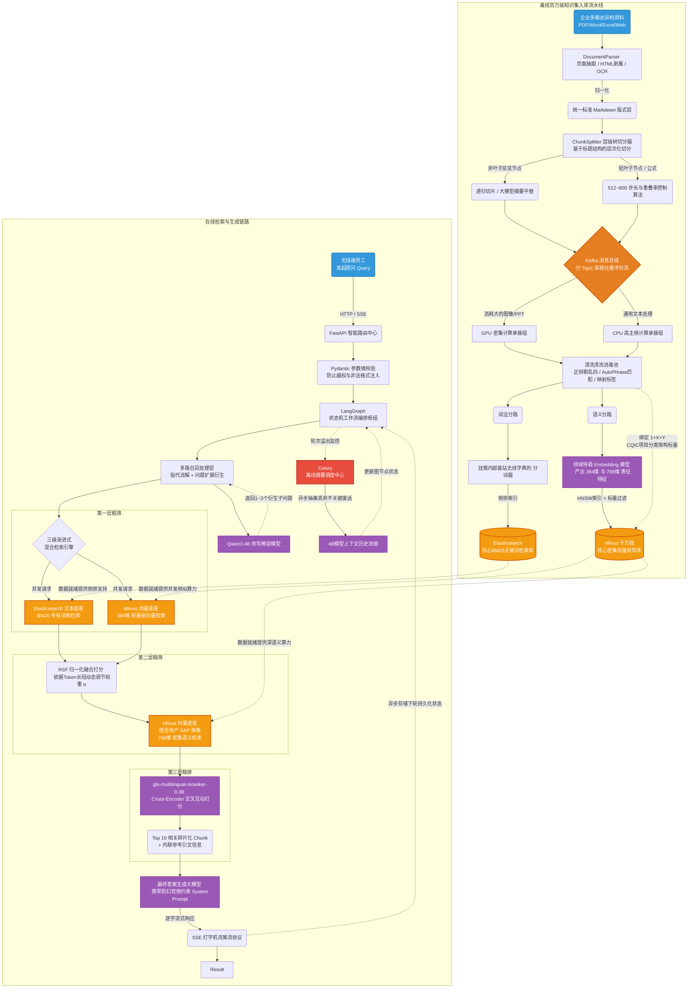

# 背景

无线豆包是 ICT AI 辅助工作的重点项目，对标秘塔搜索，核心理念为：**一个入口、报告式回答、答案可信**。

## 最终性能

在 TOP20 召回条件下，端到端（E2E）准确率达到 **93%**。

---

# 整体架构

系统整体分为**知识召回**、**知识库构建**、**知识预处理**三大核心模块。

为了让你一目了然本系统的全貌，以下是全局工程架构与算法流转路线图（包含在线问答链路与离线数据流送链路）：

```mermaid
graph TD
    %% 样式定义
    classDef user fill:#3498db,stroke:#2980b9,stroke-width:2px,color:#fff;
    classDef system fill:#2ecc71,stroke:#27ae60,stroke-width:2px,color:#fff;
    classDef db fill:#f39c12,stroke:#d35400,stroke-width:2px,color:#fff;
    classDef llm fill:#9b59b6,stroke:#8e44ad,stroke-width:2px,color:#fff;
    classDef kafka fill:#e67e22,stroke:#d35400,stroke-width:2px,color:#fff;
    classDef celery fill:#e74c3c,stroke:#c0392b,stroke-width:2px,color:#fff;
    classDef empty fill:none,stroke:none,color:#fff;
    
    %% ---------------- 在线检索链路 ----------------
    subgraph 在线检索与生成链路
        U("无线端员工 <br/> 发起提问 Query"):::user -->|"HTTP / SSE"| APIGateway("FastAPI 智能路由中心")
        APIGateway --> PydanticCheck["Pydantic 参数强校验 <br/> 防止越权与非法格式注入"]
        PydanticCheck --> LangGraph["LangGraph<br/>状态机工作流编排枢纽"]
        
        LangGraph --> Rewrite["多路召回处理层 <br/> 指代消解 + 问题扩展衍生"]
        Rewrite --> qwen4b["Qwen3-4B 改写微调模型"]:::llm
        qwen4b -. "返回1~3个衍生子问题" .-> Rewrite
        
        Rewrite --> Router{"三级渐进式 <br/> 混合检索引擎"}
        
        subgraph 第一层粗筛
            Router -->|"并发请求"| ES["Elasticsearch 文本底座 <br/> BM25 专有词频检索"]:::db
            Router -->|"并发请求"| Milvus1["Milvus 向量底座 <br/> 384维 轻量级向量检索"]:::db
        end
        
        subgraph 第二层精筛
            ES --> RSF("RSF 归一化融合打分 <br/> 依据Token长短动态调节权重 α")
            Milvus1 --> RSF
            RSF --> Milvus2["Milvus 向量底座 <br/> 结合用户 SAP 画像 <br/> 768维 密集语义检索"]:::db
        end
        
        subgraph 第三层精排
            Milvus2 --> Reranker["gte-multilingual-reranker-0.3B <br/> Cross-Encoder 交叉互动打分"]:::llm
            Reranker --> DocList("Top 10 相关碎片化 Chunk <br/> + 内联参考引文信息")
        end
        
        DocList --> Generator["最终答案生成大模型 <br/> 携带防幻觉强约束 System Prompt"]:::llm
        Generator -- "逐字流式响应" --> SSE("SSE 打字机流推流协议")
        SSE --> Result
        SSE -. "异步存储下轮持久化状态" .-> LangGraph
        
        %% 背景离线异步任务
        LangGraph -. "轮次溢出监控" .-> CeleryTask["Celery <br/> 离线摘要调度中心"]:::celery
        CeleryTask -->|"异步抽离丢弃不关键废话"| Summarizer["4B模型上下文历史浓缩"]:::llm
        Summarizer -. "更新图节点状态" .-> LangGraph
    end

    %% ---------------- 离线知识摄入与预处理流水线 ----------------
    subgraph 离线百万级知识集入库流水线
        Docs("企业多模态异构资料 <br/> PDF/Word/Excel/Web"):::user --> Parser["DocumentParser <br/> 页面抽取 / HTML剥离 /  OCR"]
        Parser -->|"归一化"| Markdown("统一标准 Markdown 版式层")
        
        Markdown --> Splitter["ChunkSplitter 层级树切分器 <br/> 基于标题结构的层次化切分"]
        
        Splitter -->|"非叶子总览节点"| Chunk1("递归切片 / 大模型摘要平替")
        Splitter -->|"短叶子节点 / 公式"| Chunk2("512~800 步长与重叠率控制算法")
        
        Chunk1 & Chunk2 --> KafkaBus{"Kafka 消息总线 <br/> 分 Topic 高吞吐缓冲分流"}:::kafka
        
        KafkaBus -->|"消耗大的图像/PPT"| GPU_Worker["GPU 密集计算承接组"]
        KafkaBus -->|"通用文本处理"| CPU_Worker["CPU 高主频计算承接组"]
        
        GPU_Worker & CPU_Worker --> DataWrangler["清洗清洗消毒池 <br/> 正则剔乱码 / AutoPhrase匹配 / 映射标签"]
        
        DataWrangler --> SemanticBranch("语义分路")
        DataWrangler --> LexicalBranch("词法分路")
        
        SemanticBranch --> Embedder["领域特调 Embedding 模型 <br/> 产出 384维 与 768维 表征特征"]:::llm
        LexicalBranch --> IKAnalyzer["挂载内部基站无线字典的 分词器"]
        
        Embedder -->|"HNSW索引 + 标量过滤"| VectorDB[("Milvus 千万级 <br/> 核心密集向量矩阵库")]:::db
        IKAnalyzer -->|"倒排索引"| KeywordDB[("Elasticsearch <br/> 核心BM25关键词检索库")]:::db
        
        %% 维护架构映射逻辑
        DataWrangler -. "绑定 1+X+Y <br/> CQIC项目分类架构标量" .-> VectorDB
    end

    %% ---------------- 虚线连接在线离线核心资产底座 ----------------
    KeywordDB -. "数据就绪提供倒排支持" .-> ES
    VectorDB -. "数据就绪提供并发相似算力" .-> Milvus1
    VectorDB -. "数据就绪提供深语义算力" .-> Milvus2
```

**上述流程图将系统切分为两大核心战场**：
1. 上方为**在线高并发链路**，它以 FastAPI 承载网络层请求，然后在 **LangGraph 状态机**的节点网络调度下，依次流转并经过多路大模型改写及三级逐层过滤，在极限的几秒钟内拼合最切题的文档结论。
2. 下方为**重载长周期数据摄入链路**，它被 Kafka 这个异步总线完美隔断。无论后台一天吐入十万本手册，也能闲庭信步地交给重型计算节点处理，安静灌入两座核心大数据库（Elasticsearch 和 Milvus），绝不波及在线实时问答的丝滑体验。

---

**知识召回：**
- **多路召回**：将原始问题改写为多个子问题，基于多问题并行检索，提升召回覆盖率
- **三级召回**：初筛 → 二筛 → 精排，逐层缩小候选集并提升精度
- **混合召回**：融合 BM25 关键字检索与向量语义检索，兼顾精确匹配与语义理解

**知识库构建：**
- **向量知识库**：基于微调后的 Embedding 模型构建
- **BM25 词频库**：基于无线领域专有词表，保证独立语义的词语在分词时不被拆分

**知识预处理：**
- **知识标签**：采用 1+X+Y 架构设计，保证知识有序存储与分类管理（**关键设计**）
- **知识切片**：针对不同知识类型采用差异化切片策略
- **知识清洗**：根据知识来源和格式，定制相应的清洗方式

---

## 多路召回

### 目的

将与用户 Query 相关的全部知识尽可能**召回完整**，避免因单一检索路径遗漏关键信息。

### 主要内容

多路召回包含两个核心步骤：

1. **指代消解**：还原多轮对话中的指代内容。例如：多轮问答中，"随机接入是什么" → "它有什么关键技术" ⇒ 改写为 "随机接入有什么关键技术"。
2. **问题扩展**：将原始问题扩展为 1~3 个语义等价或相关的检索问题，以提高 RAG 检索的命中率。例如："CA 是什么" → 扩展为 "载波聚合是什么"。

#### 实现流程

采用 **Prompt + LLM** 的方案：在用户输入的基础上进行属性识别与提取，将识别结果作为上下文提供给 LLM。使用 **Qwen3-4B** 执行 Query 改写，该模型在准确度与推理时延之间取得了较好的平衡，当前单次改写耗时可控制在 **1s** 以内。

#### Prompt 设计

##### User Prompt
- **目标**：明确改写的任务目标
- **受众**：定义目标用户角色
- **规则**：
	- 多轮问题解析规则
		- 指代词推断
		- 主语切换但意图延续的场景合理改写
		- 时间描述的推断
		- 人称指代的替换（如结合用户信息）
		- 相关示例
	- 术语和关键词提取
	- 问题改写策略
	- 相关性排序逻辑
	- 最终输出格式

##### System Prompt
- **目标**：定义模型角色与任务边界
- **输出格式**：JSON 结构约束描述
- **输出示例**：标准化的输出样例

---

## 三级召回

系统架构以 **[[01_技术栈/Milvus]]** 向量引擎与独立 **[[01_技术栈/Elasticsearch]]** (支持 BM25) 全文检索引擎组合底座。为保证检索的稳定性与准确性，融合二者优势采用**三层渐进式召回**策略：

1. **第一层（粗筛）**：BM25 + 384 维向量库检索，各召回 1500 条，合并后共 3000 条（实验验证该层准确率达 **99% 以上**）。输入为无线统一知识库，输出 3000 篇候选文档。
2. **第二层（精筛）**：BM25 + 768 维向量库检索，基于用户 SAP 画像动态调整两种召回方式的权重配比。输入 3000 篇文档 + 员工画像信息，输出 80 篇文档。
3. **第三层（精排）**：使用 Rerank 模型进行精排，模型选择 [gte-multilingual-reranker-0.3B](https://huggingface.co/Alibaba-NLP/gte-multilingual-reranker-base)。输入 80 篇文档，输出最终 **10 篇**高相关文档。

**耗时分布**：三级召回整体耗时约 **2s**（第一层 0.5s，第二层 0.5s，第三层 1s）。

> [!question] 为什么要用两个维度的向量库？
> 384 维向量在第一层大规模粗筛中计算效率更高，适合从海量文档中快速缩小候选集；768 维向量语义表达能力更强，在第二层较小候选集上可提供更精准的语义排序。两者配合实现了效率与精度的平衡。

---

## 混合召回

混合召回是三级召回中**第二层**的核心策略：向量匹配侧重**语义相似度**，BM25 侧重**关键字精确匹配**，两者互补。

### 1. BM25 算法计算方法简析

BM25 并不是单一的词频统计，而是一种基于概率检索模型的变体，主要通过词频（TF）和逆文档频率（IDF）结合文档长度约束来进行相关度打分。其核心计算公式如下：

$$Score(Q, D) = \sum_{i=1}^{n} IDF(q_i) \cdot \frac{TF(q_i, D) \cdot (k_1 + 1)}{TF(q_i, D) + k_1 \cdot (1 - b + b \cdot \frac{|D|}{avgdl})}$$

- **$IDF(q_i)$**：查询词 $q_i$ 的逆文档频率。表示词汇的语料库稀有程度。
- **$TF(q_i, D)$**：查询词 $q_i$ 在文档 $D$ 中的本页命中词频。
- **$|D|$ 与 $avgdl$**：分别是当前被计算文档的长度和整体知识库的平均文档长度。通过引入这两个变量的比值，BM25 有效惩罚了过长的文档（避免内容庞杂的噪声烂文档由于涵盖废话词太多而占据优势）。
- **$k_1$ 与 $b$**：人工可干预的手工经验调节参数。$k_1$（通常在 1.2~2.0 之间）用于限制词频的无脑叠加增加影响权重；$b$（通常为 0.75）用于控制文档长度对得分归一化的施加力度。

### 2. 混合召回具体实现

采用 **RSF（Rank Score Fusion）** 算法：

1. 向量召回 160 篇文档，BM25 召回 160 篇文档
2. 分别对两路召回的得分进行**归一化**处理
3. 将归一化后的得分**加权求和**，计算综合得分
4. 按综合得分排序，返回 **Top 80** 文档

**动态权重 $\alpha$ 的设置**：根据用户 Query 的 Token 数量动态调整权重——短问题偏向 BM25（关键字匹配优势），长问题偏向向量（语义理解优势）。权重计算公式如下：

$$\alpha = 0.4 + \frac{0.3}{1 + e^{-\frac{L - k}{s}}}$$

- **$L$**：用户查询的 Token 数量
- **$k$**：中心值，设为 8。当 $L = k$ 时，$\alpha = 0.55$（即 $0.4$ 与 $0.7$ 的中点）
- **$s$**：平滑系数，设为 1，控制权重从 $0.4$ 到 $0.7$ 过渡的坡度

---

## 知识库构建

### 向量知识库

**Embedding 模型选择**：基于 [gte-multilingual-base](https://huggingface.co/Alibaba-NLP/gte-multilingual-base) 进行领域微调。微调的核心在于**高质量训练语料的构建**。

**语料构建方式**：使用 **Qwen2.5-72B** 自动生成训练语料对。针对不同类型的数据内容，通过 Prompt 引导大模型生成 JSON 格式的 QA 对。共生成 **75 万** QA 对，经数据处理后 **48 万**条参与微调训练，在 **A30 × 2** 上训练两周。

**核心要点**：
- **问题丰富性**：分别从文档块内容、文档块标题、文档块生成的摘要等多角度出发；摘要可直接作为问题，也可基于文档块同时生成问题与答案
- **后处理的必要性**：异常字符剔除、MinHash 问题去重、Rerank 相关性筛选、去除指代性问题（含 "本文""这""那" 等模糊指代词）
- **长度配比平衡**：使用不同长度的语料进行训练，避免模型对特定长度的偏好
- **多维度联合微调**：同时微调 384 维和 768 维向量表示

**微调效果**：
- 自有数据集：Top10 召回率从 **62% → 88%**（提升 26 个百分点）
- 开源数据集 [DuRetrieval](https://huggingface.co/datasets/mteb/DuRetrieval)：98.8% → 97.8%（微降 1 个百分点，属于合理范围，表明模型在领域适配的同时未严重损失通用能力）

### BM25 词频库

BM25 词频库的构建有两个核心要点：

1. **单一知识库设计**：由于知识总量庞大，为降低维护复杂度和保障检索一致性，仅建立一个统一的 BM25 知识库
2. **分词准确性**：TF-IDF 的正确计算依赖于准确的文本分词，因此需要构建无线领域专有词表，确保领域术语不被错误切分

#### 词表构建流程

1. **语料汇集**：将 DTS 工单内容、Support 网站全部支持文档、全部 IDP 文档作为语料库
2. **语料清洗**：去重、去除目录页、去除特殊符号、剥离 HTML 标签等
3. **种子词表构建**：爬取华为术语库内容作为基础正标签（约 5000 词）；抽取维基百科高频词作为通用领域负样本
4. **新词发现**：使用 **AutoPhrase** 算法自动发现新词，强制保留 "名+名" 或 "形+名" 结构，大幅过滤无意义的动词性短语
5. **人工迭代校正**：将人工确认的正确词作为标签数据，重复执行 AutoPhrase 迭代。最终发现约 10000 词。人工校正时**优先挑选算法评分在 0.5 左右的边界样本**，以最大化每轮迭代的标注增益
6. **LLM 辅助过滤**：使用 **Qwen2.5-72B** 对候选词进行打分过滤，结合人工审核，最终得到 **6800** 个有效领域词

---

## 知识预处理

> **核心原则**：所有文本内容统一转换为 Markdown 格式；基于 Markdown 结构的切片策略以最大程度保留语义完整性。

### 知识格式处理

**不同文件格式的处理方式**：

| 格式 | 处理方式 |
|------|----------|
| Word | 转为 Markdown |
| HTML | 转为 Markdown |
| PPTX | 按页处理：转为图片 → OCR 提取文字 → 生成图片链接 |
| Excel / CSV | 转为纯文本 |
| PDF | 转为 Markdown |
| 图片 | 保留链接；链接不参与检索召回，仅参与最终总结生成 |

**不同数据源的针对性处理**：

| 数据源 | 处理策略 |
|--------|----------|
| Support 文档 | 增加目录结构信息；特定内容增加标签（如 gNodeB 增加 5G 标签） |
| Wiki | 增加目录层级信息 |
| iCase（反思案例） | 内容不做切片处理，标题增加产品信息 |
| 设计文档 | 仅保留最新版本，增加 PDU 信息 |
| 3GPP 协议 | 缩进格式适配；文件名与协议编号重映射 |
| 华为知道、华为案例 | 不切片，整篇入库 |

### 知识切片

采用**基于章节结构的层次化切分**策略，按节点类型分为三类：

- **非叶子节点**：包含子章节的文本段。若总长度 > 2K Token，则由 LLM 生成摘要作为替代 Chunk，同时继续向下递归切割；若 ≤ 2K Token，直接作为 Chunk
- **叶子节点**：文档末端的纯内容段落，按固定步长结合语义换行进行切割
- **无标题节点**：连续长文本、代码块或公式组，强制继承最近的有效标题

| 维度 | 非叶子节点（章节层级） | 叶子节点（最小语义单元） | 无标题 / 特殊节点（正文块） |
|------|------------------------|--------------------------|----------------------------|
| 判定标准 | 带有子标题的导航层级（如 `#` / `##`） | 文档末端的纯文本 / 细节描述段落 | 连续长文本、代码块、或数学公式组 |
| 切分规模 | 阈值：2K Tokens | 512 ~ 800 Tokens | 继承父级大小，按语义边界对齐 |
| 核心动作 | ≤2K：保留全文并打标；>2K：LLM 生成摘要作为替换块 | 固定步长 + 语义换行切割 | 强制关联：继承最近一个有效标题 |
| 重叠度（Overlap） | N/A（由摘要覆盖全局语义） | 10% ~ 15% | 保持上下文连贯，避免截断公式 / 代码 |
| 元数据注入 | 包含子节点 ID 列表、层级路径 | 回填父级摘要、层级路径、原始页码 | 标注 `is_continuation: true` |
| 检索价值 | 解决 "宏观 / 综述类" 问题召回 | 解决 "具体事实 / 数值" 问题召回 | 提供技术实现细节、代码片段 |

### 父子索引与文档层级检索 (Parent-Child Indexing)

在 RAG 系统的知识检索中，单纯依赖单一粒度的切片往往面临两难：切片过小会导致大模型生成时缺乏全局上下文，切片过大则会引入过多噪音、降低向量搜索的精确度。为了破解这一矛盾，系统引入了**父子索引 (Parent-Child Indexing)** 机制：

1. **精准命中（子切片索引）**：在文档摄入管道中，将知识拆分为极细粒度的“子切片”（如短叶子节点、单句、独立小段、具体公式等），并为其建立密集的向量索引库。这些子切片语义纯粹、主题聚焦，保障了相似度检索时的极高命中率。
2. **完整上下文提取（父文档召回）**：当用户提问命中某个“子切片”时，检索组件并不直接将孤立的碎片喂给大模型，而是顺着切片元数据中挂载的 `parent_id` 指针，向上回溯并取出包含了该子切片的“父层级文档”（即上层非叶子节点或合并后的完整章节内容）。
3. **核心作用与业务价值**：
   - **兼顾检索算力与大模型推理质量**：实现了“在极细维度下进行精确检索匹配，在较粗维度下提供详实丰富的上下文给 LLM”。
   - **弥补语义断层**：避免了传统固定步长切分导致的上下文割裂，降低了模型在综合推理跨段落指代关联时的幻觉概率。

---

## 知识更新

### 1+X+Y 知识集架构

从两个管理视角出发，形成 **1+X+Y** 的知识分类架构：

- **X（能力视角）**：从 CQIC 能力维度划分，共 7 个方向——设计、软件、硬件、测试、研究、产品管理、项目管理。涵盖产品技术规范、CQIC 建设课程、Wiki、社区文档、博客、案例、需求文档等
- **Y（组织视角）**：从 PDU 维度进行管理，共 8 个方向——基站产品、基站平台、解决方案、MAE、DIS、微波、GUC 等。涵盖 PDU 建设课程、交付大典、Wiki、文档、博客等
- **1（公共视角）**：通用性、跨领域的公共文档，如 IPD 流程、3GPP 协议、无线百科、技术连载、公共业务课程等

> **注意**：同一份文档允许在多个知识集中出现（即允许重复索引），但入库时仅保留一条物理记录，同时**合并所有知识集的标签**。

**知识集架构的设计考量**：
- 用户需要能**可见全部**的知识集
- 每个知识集的构建需要**独立看护**，不同团队优先管理和消费自己领域的知识

因此，知识集的构建过程分为三步：

1. **知识生产者**：将各自领域的知识接入 Athena 知识中心，统一看护与版本管理
2. **知识集构建者**：在 Athena 中选择本领域关注的数据源，组装形成知识集，触发向量库入库流程
3. **数据 IT**：将 1+X+Y 的知识集分别匹配对应的流水线进行知识处理（清洗 → 格式转换 → 切片 → 向量化 → 元数据标签注入），最终送入 RAG 知识库

### 元数据管理 & 标签管理

文档的元数据共分为**四类属性**：

| 属性类别 | 来源 | 内容说明 |
|----------|------|----------|
| **基础属性** | 产生于原作业系统，直接使用 | 文档唯一性标识：文档 ID、名称、作者、原链接、产生时间、创建时间、URL、密级等 |
| **管理属性** | 产生于原作业系统，映射适配 | 文档归属信息：产品、版本、部门、领域等。需屏蔽不同原系统的差异，统一管理 |
| **知识管理属性** | 知识管理作业过程中产生 | 分类标记：CQIC 方向、PDU 归属、适用产品线、数据类型（结构化数据、文档、代码、音频、视频） |
| **召回属性** | 入库时产生 | 检索支撑信息：向量表示、切片内容、权重、切片 ID |

**向量化过程**：支持通用流水线处理，如需特殊处理亦支持各产业自定义适配流水线；切片逻辑可定制；Embedding 模型可按需选择。

---

# 评估方式

## 自研召回评测数据集的背景

公司研发资产具有以下特性：

- **使用场景化**：遵循 IPD 研发流程，资产有特定的消费方式
- **信息复杂化**：包括非结构化文档、结构化数据库、代码仓等多种资产形态
- **高度专业化**：包含大量专业术语及内部流程用语，如 AR、IR 等
- **逻辑关系复杂**：包括增量/全量关系、设计-开发-测试分层挂接文档

因此需要构建**专用的评测集**，以贴合公司的实际应用场景。

## 召回评测集构建方案

从三个能力层级递进评测：

1. **单文档上下文获取**：重点评测 RAG 的基础能力，评估端到端检索链路是否合理
2. **多文档、多跳、复杂上下文获取**：评测进阶能力，如多文档比较、复杂推理等
3. **Agent 作业上下文获取**：评估 RAG 是否能支撑 Agent 精准获取上下文

### 单文档上下文获取能力

主要从以下几个维度出发：

- **多模态格式兼容性**：检索图、表、附件、代码块、文本的能力
- **结构感知与连贯性**：检索单句、长文、多个片段、各级标题的能力
- **语义与边界鲁棒性**：使用同义词、行业术语、特殊用词获取上下文的能力

**三种提问方式**：

| 提问方式 | 说明 |
|----------|------|
| 原文 | 针对检索目标，使用原文构造 Query |
| 总结 | 针对检索目标生成总结性需求 |
| 容错 | 编写具有部分表达错误的 Query |

**评测指标**：仅评价召回率，分为正确召回、部分召回、无召回三个等级。

**评估数据量**：2034 条用例。

---

# 核心算法与策略深潜

## 上下文与对话记忆管理

在多轮对话场景中，盲目拼接历史记录不仅会导致大模型的 Token 快速耗尽上限，还会导致“注意力稀释”。为此我们在记忆模块实现了**多级状态管理与动态修剪机制**：

### 1. 基于 LangGraph 的状态流转与记忆存储（Memory）

系统摒弃了早期的单一基于 Redis 的短时问答等命中拦截缓存机制，采用 **LangGraph** 对 RAG 过程进行有向状态循环图建模（State Graph）。所有的多轮问答对话历史均作为图节点状态的数据流被处理：

**① 统一结构化持久状态 (AgentState & Checkpoint)**
- 核心代码定义了包含 `messages`（历史消息序列）、`retrieved_docs`（召回文档候选池）、`rewrite_queries`（改写子问题）等成分的全局上下文数据状态类（State）。 
- 当前的重塑基于 LangGraph 原生的 `Saver` 体系（依托于持久化后端 Postgres Checkpoint 等）直接实现了用户问答交互历史的**会话级别硬隔离**。在并发多租户业务下发生追问时，系统会经由 `Thread ID` 全自动反序列化唤出状态上下文堆栈，逻辑图本身带来的阶段卡点特征天然封堵了并发串键或乱序响应引发的安全性隐患。

**② 摒弃 Query Cache（查询级拦截），强调强一致性即时倒排**
- 业内传统的基于 LLM 外框组装问答工具或者标准客服系统为削减极其夸张的流控与计费成本，在外沿必置缓存过滤（拦截相同的原始输入或是经 Embedding 距离相近后的 Semantic Cache 直接推送旧有文本响应）。
- 但在 **5G 企业通信与严格工业作业**环境中，“历史的权威解答”同样极大概率是一杯“现世毒药”。通信特征配置以及网关拓扑图结构每夜发生变更。一旦依赖旧态缓存而没有即时同步抓入变动的知识碎片块抛给工程师指导动作，就极易诱发致命参数回旋及通信重创。为此设计系统主动剥杀掉了任何直接用 Query 到问询层进行短视截断的代码链路。强制每一次看似平庸的查问均将穿越完整搜索链表路向（`过滤 -> BM25 + VDB双拼下钻检索 -> 汇聚 -> GPT重写评估 -> 剔除废票生成`）。确保大模型生成的系统决策全维度受最近一次基盘动态变迁掌控。

### 2. 动态滑动窗口与 Token 计费
- **事前 Token 估算**：并非机械地保留“最近 5 轮对话”，而是引入了与大模型严格对齐的本地 Tokenizer（如 tiktoken 或 Qwen 原生分词器）。在每次发起组合请求前，先计算历史队列的总体 Token 排量。
- **保底与剔除逻辑**：
  1. **System Prompt 永驻**：系统级人设指令必须占用前置固定 Token。
  2. **最新意图高优**：绝对保留当前次提问（Query）及紧邻的上一轮 Q&A 轮次。
  3. **中间轮次按需断尾**：当历史累计超过设定预算（例如 4000 Tokens 阈值），按照时间线从旧到新依次剔除闲聊或过渡轮次。

### 3. 超长对话的摘要压缩机制（Summarization）
当用户在一个 Session 中深度探讨复杂技术且轮次极长时，直接截断会导致关键线索丢失。此时系统会触发旁路异步能力：
- 后台任务（[[01_技术栈/Celery]] 调度）侦测到历史 Token 超过预算，会调用一个轻量级模型（如 Qwen3-4B）传入历史内容并指令：`“请总结上述用户与 AI 的交互核心技术点与已确认的客观事实，需以精简的要点呈现。”`
- 将总结出的精炼文本打包为一条 `{"role": "system", "content": "前情提要:..."}` 塞入新一轮对话顶部，极大释放了上下文窗口，同时保证了问答逻辑断层的无缝衔接。

---

## 防幻觉与系统兜底兜底策略

由于面向的是企业内部的严密研发体系，系统首要原则是“不知为不知”，从检索到生成层层阻断幻觉：

### 1. 防幻觉 Prompt 设计深度
- **事实性强约束**：通过精细构造大模型的 System Prompt 来强制约束输出范围。
  - **标准话术示例**：`“你是一个严谨的华为无线通信技术专家。请仅基于以下<context>和</context>标签内部的参考资料回答问题。如果不包含相关答案，请输出标准回复‘根据当前已知知识库，暂时无法回答该问题’，严禁捏造不存在的术语、协议编号与事实。”`
- **强制内联引用（Inline Citation）机制深潜**：
  强制要求模型在表述关键论点后添加引用标记，如 `...这种技术能使吞吐量提升20% [doc_id_1]。`。这并非单纯的前端展示优化，而是系统中遏制幻觉、构建业务信任的核心设计：
  - **外部化思维链（Externalized CoT）压制幻觉**：强迫模型在输出任何实质观点前，必须在其工作记忆中去“扫描”并锚定 `<context>` 块里的文档 ID。这种在生成论点前寻找“落地出处”的注意力强制对齐机制，让模型做到了“找不到依据就不生成”，从根本上抑制了凭空捏造。
  - **全链路元数据贯通（数据组装 -> Prompt 呈现）**：
    在组装给 LLM 的上下文中，必须进行结构化的 ID 标识（例如 `<doc id="doc_1" title="...">内容...</doc>`）。System Prompt 则需配合增加严厉指令约束：_“在每句话结尾必须使用方括号精确标注引用的 doc id。严禁引用上下文中未提供的 id。”_
  - **流式拦截与前端组件化渲染**：
    服务端在 SSE（Server-Sent Events）流式推送过程中，前端通过正则表达式（如 `/\[doc\_(\d+)\]/g`）实时捕获引文标签，并结合随路下发的文档元数据字典，动态将其转换为**上标超链接**（如 `[1]`）。用户悬浮交互（Hover）即可气泡查看摘要，点击则直达原始系统源文件。
  - **建立可防守的系统信任与快速错误归因**：
    一方面，业务线用户获得了独立验证事实的抓手，打破了 AI 黑盒的不确定性；另一方面，当碰到不良回答（Bad Case）被点踩反馈时，研发能通过引文**秒级定责定位**：若引用了大量噪音文档是“召回层或重排组件”背锅；若引对文档但结论牛头不对马嘴，则完全属于“LLM 生成层”的幻觉，极大降低了排查成本。

### 2. 失败边界归因与监控闭环
我们将不佳回答的定性细分为三类，便于对症下药：
- **第一类：召回失败（Retrieve Failure）**：排查日志发现最终填入 `<context>` 的 Top 10 片段中，根本没有任何包含答案的信息。此类往往触发重新调整分词词表、同义词库或切分 Chunk 的步长参数。
- **第二类：重排失败（Ranking Failure）**：答案存在于前 3000 的粗排候选池中，但在二筛或 Rerank 阶段得分过低被挤出。这通常说明 Cross-Encoder 对该领域独有词汇的语义交互判定不准，需补充领域数据进行微调（Fine-Tuning）。
- **第三类：幻觉生成（Generation Failure）**：即便 `<context>` 提供了满分答案，模型依然抓错了重点甚至凭空编造。这属于指令遵从度问题，处理时会倾向降温（`temperature` 调至 `0.1~0.2`）以及缩减单次传入供给的大模型上下文规模。

### 3. 系统降级搜索机制
如果在向量库检索阶段，最高相似度得分依旧**低于系统设定的双底线（bm25_score_threshold + vector_similarity_threshold）**，RAG 系统将不会发起耗时的大模型推理请求，而是直接执行 `Return Fast` 的降级策略，在界面回退为传统搜索引擎呈现形式：即直接挂载展示 BM25 命中的标题及局部关键字高亮，交回给员工人工阅读。

---

## 基于 LangChain 的权限控制与数据隔离 (RBAC)

企业级 RAG 系统面临的最严峻的安全合规挑战之一就是**数据越权访问**（例如：外部外包员工通过大模型越权套取核心架构源码，或普通员工查阅高管机密方案）。传统的应用层验权无法约束到向量检索与模型生成的深水区，因此我们在链路中深度定制了基于 LangChain 的细粒度权限管控。

### 1. 权限信息的端到端透传 (RunnableConfig)
大模型应用天然采用多并发、流式异步调用，直接依赖线程上下文或全局变量的鉴权极易发生并发串键。我们利用了 LangChain 核心架构体系中的 `RunnableConfig` 组件：
- 当应用网关 (FastAPI) 接收并验证用户的鉴权 Token 后，会向统一下游解析出用户的关键画像信息（包含其所属的 `PDU 部门`、`安全控制级别 (Level)` 以及参与的封闭 `安全项目组标签`）。
- 我们将这份画像对象化，并封装入 `RunnableConfig` 的 `configurable` 字典中。借由 LCEL (LangChain Expression Language) 的管道流转特性，这份安全签名能够自动且原汁原味地向后传递给**向量检索、工具调用、大模型生成**的每一个节点。

### 2. 深入底层的数据拦截 (自定义 BaseRetriever)
最安全的防泄密做法不是指望大模型去“懂事地闭嘴”，而是在**数据库拉取数据之前就执行强制的物理隔离过滤（Pre-Filtering）**。
- 我们摒弃了调用 `similarity_search` 等默认封装，而是继承并重写了 LangChain 的基类 `BaseRetriever`，打造了带有企业鉴权机制的自定义检索器 `RBAC_Milvus_Retriever`。
- 在内部拦截 `_get_relevant_documents` 与 `_aget_relevant_documents` 核心方法，动态提取出游走至此的权限 Config。
- 将用户的多维度权限拼接为一个符合底层检索引擎（ES 或 Milvus）语法的**强校验标量表达式（Boolean Expr）**。

### 3. 结合 "1+X+Y" 构建坚固防线
这一系列流转最终落地于我们的 1+X+Y 元数据分类架构上：
- 一份最高级的架构设计文档入库（Ingestion）时，早已被打上了诸如 `security_level: 4` 和 `project_tag: ["CQIC_Core_TopSecret"]` 等预制签。
- 被权限改写过后的 Milvus 检索请求将在原有向量距离计算的基础条件上，被强行附加上拦截算子，例如 `expr="(doc.security_level <= user.level) and (doc.project_tag in user.projects)"`。
- **业务收益与底线捍卫**：哪怕攻击者使用再花哨的“越狱提示词（Jailbreak Prompts）”去套话模型，由于底座查询层已经被硬隔离截断，传导至大模型 Prompt 上下文里的 `<context>` 池将是干干净净的合法资料。这种**“查不到就绝对编不准”**的特点，彻底掐断了 AI 数据泄露的恶链，使得无差别全员上线部署真正成为可能。

---

## 重排（Rerank）机制进阶实现细节

重排是精度提升的最后一道关卡。原先的双塔模型将文档与问题独立向量化后求内积，失去了细粒度语义交互；引入交叉编码器（Cross-Encoder）解决了上述痛点，但也带来了高昂的算力开销。

### 1. 耗时与开销对冲方案
- **GPU 批量预测优化**：我们将送入前端的粗排前 80 篇候选片段合并打包为 Batch 结构，一次性走 gte-multilingual-reranker 模型的推理管线。在 A30 GPU 加持下，通过并行计算强行将 80 次成对文本推理耗时极致压减在 1s 以内。这就是选取 80 这个数字的**“性能收益平衡点（Sweet Spot）”**。
- **动态截断（Threshold Cutoff）防御噪声**：大模型往往存在“中间迷失现象（Lost in the middle）”。为了不在上下文中填塞过多低质量的文档凑数，系统引入了断崖判定逻辑：对 Rerank 打完分的候选序列（按分数降序排列），通过求取相邻文档分差寻找拐点。如果 Top 4 与 Top 5 的间距激增 `diff > 0.8` 且绝对分数低下，则将 Top 5 及之后的文档全部剔除，保证送给 LLM 的都是精华。

---

# 数据处理与索引管道

## 深度数据预处理与多模态扩展

### 1. 复杂页面与结构化抽取
- **PDF 与图文排版还原**：针对带封皮、目录、侧边栏注解的研发协议 PDF 或 Word，如果强行切块会造成语义支离破碎。我们整合了基于位置视觉（如开源的 LayoutLMv3 等处理库）的技术，优先剥离无用的页眉/页脚；
- **表格高维清洗**：面对由于合并单元格构成的复杂表，传统转换 Markdown 非常不稳固。我们引入了一个“表格序列化”的前置 Pipeline：用轻量大模型或脚本预先把表格信息平展化为语义通顺的句子集合（如：`"在 5G 基站参数表中，配置项 x 的上行频点限制为 y..."`），再去参与切片灌库以便于向量能够精准捕获。

### 2. 清洗去噪的工业级实践
- **文本清洗防污染**：实践中曾发现历史系统的垃圾数据（不可见十六进制控制字符、`\r\n\t` 滥用、冗余的日志时间戳等）会导致分词器的 Token 无效率飙升。必须采用正则清洗池，运用 Unicode `NFKC` 强制标准化。
- **图文多模态处理引擎（现阶实践与未来演进）**：
  - **现阶段（图文抽位保存与链接下发）**：提取图片周边的上下文生成 Caption（说明文字）并向量化以参与检索，大模型最终匹配后返回包含独立图床 URL 的内容展示给用户。
  - **预研探索一（多模态联合嵌入 Multimodal Embedding）**：利用 CLIP / SigLIP 等纯视觉编码器直接抽取图片的视觉特征矩阵，与文本特征进行数学求和或拼接，投射到同一个混合特征空间中进行相似度计算。
  - **预研探索二（视觉大模型深度解析 VLM Captioning，落地更优解）**：利用当今顶尖的视觉大语言模型（如 Qwen-VL 甚至 GPT-4o）在入库时，直接对业务中极其复杂的通信网络拓扑图、时序信令图进行深度“审阅”，并重写为具有极高业务逻辑密度的 Markdown/JSON 结构化文字解析。这种方案完美复用了当前成熟的文本索引管线（ES+Milvus），且彻底解决了纯视觉特征对业务黑话术语不敏感的痛点。
  - **预研探索三（文档级原生视觉检索范式 Vision-Language Retrieval，前沿方向）**：借鉴行业最新技术（如 `ColPali` 架构体系），彻底抛弃容易出错的 OCR、排版还原与人工划定 Chunk 的过程。将整页 PDF 或 PPT 的页面直接作为图像 Patch 切片抛给多模态文档检索模型。借助视觉后期交互（Late-Interaction）计算机制，实现“用户输入文本 -> 直接在文档图像隐空间中进行注意力比对检索”。这是彻底解决图文混排丢失细节、走向零信息损失的“终极前沿路线”。

---

## 知识库索引更新机制与底座建设

### 1. [[01_技术栈/Milvus]] 十亿级向量引擎深度利用与优化
随着知识库规模的爆发式增长（达千万级 Chunk），系统全面引入企业级专属的高维度向量数据库 **[[01_技术栈/Milvus]]**，以支撑超高并发与更低延迟语义检索。彻底分离了原有 ES 集群中倒排与密集的算力争抢。

**核心技术细节与调优策略：**
- **索引类型选择与硬件调优（HNSW）**：
  应对大量高维向量检索，在 Milvus 底层建立基于图的 `HNSW` 索引：
  - `M` (每个节点允许最大连接边数) 压至 32，在内存占用及图搜素精度间取得甜点。
  - `efConstruction` 提至 256，充分调用内存吞吐换取建库阶段的最优图联通度。
  - 动态 `ef` 搜素配置：单机搜索调整在 128 上下，以微弱延迟获取 99% 精搜召回质量。

- **多标签标量混合搜索（Hybrid Search & Scalar Filtering）**：
  由于 Milvus 具有独特的 Collection 划分与 Schema 定义结构，内部利用其 Attribute Filtering 赋予预分类标签如：`pdu`、`cqic_tags`。实现毫秒级的段落前置截断过滤（Pre-filtering），不再向计算层抛喂无关数据。

### 2. 数据生命周期与平滑更新保障
面对线上随时可能发生的文档修正与淘汰：
- **软标重载（Soft Delete & Override）**：严禁直接采取物理覆盖。知识库中控系统收到文档变更事件（Webhook 订阅机制）后，会基于原文档对应的 `doc_id` 执行批量拉取操作。更新过程是先打入新的分片集合，随后将旧有记录对应的 flag 字段强置为 `deleted: true`，结合 ES 底层的 Filter 过滤以规避掉它们。
- **异步空间合并释放（Force Merge）**：对由于高频更新积压下的废弃向量块，由底层定时任务在业务低峰期（如周日凌晨）触发后台的索引合并重做，避免因并发锁表给当时的前台检索体验带去冲击。

---

# 工程架构与代码实现

## 基础设施与极简框架组件思路
在大语言模型应用刚起步时，大多数团队倾向全盘使用 `LangChain` 或 `LlamaIndex`。但为了应对百万级文档和定制重排链路，高度黑盒化的商业组件反而成了扩展的泥沼：
- **自研微型编排骨架**：团队摒弃臃肿框架，从 0 抽离了四大核心抽象类：`DocumentParser`, `ChunkSplitter`, `PipelineRetriever` 以及 `LLMGenerator`。整个链路上下文配置由 Python 原生的 **[[01_技术栈/Pydantic]]** 提供数据结构校验强力支撑，保障链路流转的参数绝对合规（如大模型超参限制等类型检查）。
- **灌水期（Ingestion）限流与削峰机制**：曾踩过最痛的坑就是在并行启动海量文档切分处理并调用大模型做摘要替换时，触发模型底座服务端 Rate Limit 导致大面积 HTTP 429 报错断流。后采取了**指数退避（Exponential Backoff）重试算法**与队列分发机制，构建出了拥有自我保护能力的稳健灌库车间。

## 服务端技术栈与实时交互链路

### 1. Python + [[01_技术栈/FastAPI]] 的微服务架构
- 在线系统选用了 **[[01_技术栈/FastAPI]]** 作为 web 骨架。其底座原生构建于 `asyncio` 事件循环之上，对于 RAG 这种需要并发长链接和网络 I/O 密集型操作（ES 搜索等待、RPC / HTTP 调用大模型）拥有极高的吞吐效率。
- **基于 [[01_技术栈/Kafka]] 消息中间件剥离离线高耗时计算**
  大体量的 PDF 解析、知识多模态归纳与向量组装入库不仅耗时长，且极易诱发尖刺性 OOM 资源耗尽。我们将处理层剥离解耦，服务端采用 **[[01_技术栈/Kafka]] 作为核心消息总线枢纽**。

**流水线机制与部署策略详情**：
1. **异步推投 (Producer 生产化发后即忘)**：FastAPI 线上节点接取工单后即作 Producer 推送 JSON 指令快速返回 200，绝不阻滞主协程。
2. **多态资源组隔离隔离 (Consumer Group 分区隔离)**：利用 Kafka Topic 特性拆解流水操作（如：`topic_pdf_ocr` 分发给装载 T4 GPU 集群专做图像，`topic_text_slice` 送去纯 CPU 高主频节点计算词性）。由 Kafka Broker 的 Consumer Group 调配偏移量，做到容错不重漏（At-Least / Exactly-Once）。
3. **弹性抗压**：业务繁忙知识库并发重建时，依托 Kafka 内置高吞吐写入持久化特性安全接纳全部洪峰指令。

### 2. 高效推流交互（Server-Sent Events）
这是“提升用户感知速度”体验的最重要手段。由于 Rerank + LLM 长文推断天然需要 2-5 秒以上的绝对用时：
- 系统抛弃了传统的“阻塞等待全文生成后再 HTTP 响应”的模式。转而用生成器（Generator）搭载 `StreamingResponse` 构造出 **SSE 长链接**推流协议。
- 前端无需等待全句返回，只要服务端接受到由于大模型自回归特性产生的第一枚新 Token，便即时刷入界面中形成“逐字敲打（Typewriter Effect）”的视觉效果，显著掩盖了整体实际耗时。

## 系统压测与工程可用性度量体系

为了支撑内部上千甚至上万人的全员日常使用，系统具有三项刚性压测基准（SLI指标库）：
1. **首字 TTFT（Time To First Token）**：全系统经历文本 Embedding（0.5s）-> 粗筛精排二连击（共 1s）-> 模型网络往返开销之后，规定用户从按下回车到见到首个字符蹦出的极限响应时延**不得超出 2.5 ~ 3 秒**。
2. **生成吞吐率 (TPS/Token-per-Second)**：借助模型后端的 vLLM 架构（PagedAttention 算子提速），大模型生成的字符呈现速度可稳定维持于 30 ~ 50 token/秒 的平滑速率，其略快于真实人类视觉阅读速度，达到了沉浸式的最佳体验区。
3. **并发容量**：通过 uvicorn 的 gunicorn 多 worker 横向拉升策略搭配 Nginx 转发，稳定承接百并发级别的瞬间穿透。

---

# 业务表现与评测闭环演进

## 1. 全链路在/离线双循环智能评测体系

RAG 系统的最大特征是“牵一发而动全身（改了词表可能导致分数全变）”，这要求必须有一套严谨的“端到端（E2E）评测引擎”代替人工肉眼验收。

### 离线研发层全量回归评估（E2E Eval Pipeline）
在更新底层底座库、调参切块（Chunk Size）或者重构 System Prompt 后，必须经由 CICD 准入触发包含 **2034 题金标准用例库（Golden Dataset）** 的自动化批量跑批。我们借鉴了开源 RAGAS 及 TruLens 框架的思想，并在内部重写了四大核心评估算子池：
1. **端到端生成准确率 (E2E Accuracy)**：目前录得 **93% 的通过率**，代表输出答案与预先专家撰写的 Ground Truth 在核心要点与意图上的高度重合。
2. **上下文精确度与召回率 (Context Precision & Recall)**：评价召回。**Recall** 测度“系统是否把所需的全部核心知识捞出来了”（防漏捞）；**Precision** 则判定“在这个 Top 10 片段库中，到底有多少比例是废话噪声文件”（防无关资料污染 Token）。
3. **事实忠实度 (Faithfulness/Hallucination Check)**：评价生成层抗幻觉。采用“逆向声明提取算法”（大模型提炼自己的回答为N句断言），然后再利用大模型核对这 N 个断言是否严丝合缝地源于被给予的 `<context>` 文本块。
4. **回答相关度 (Answer Relevance)**：用于过滤那些“啰嗦车轱辘话”或“答非所问”的情况，利用 Embedding 模型交叉对比生成答案与最初 Query 的语义距。

### 在线业务端数据反哺闭环（Flywheel Effect）
- **显性与隐性埋点追踪**：系统不仅包含明显的“有用 / 没用（点赞点踩）”及“意见反馈框”，更带有“直接点击并复制了某代码块”的隐性采纳追踪指标。
- **夜间 Auto-Diagnosis 巡检流水线**：被用户判负（踩了）或者 0 操作重新大幅度改写提问换词的 Bad Case（坏案），夜间会自动经由 Kafka 被消费抓入【智能诊断池】。
- **故障智能打分定责**：巡检模型会自动走一套归因树逻辑：先查 Elasticsearch 确认带答案的最优源文件是否在 Top 160 -> 如果不在就是【**BM25/向量粗排背锅**】；如果在却未挤入前 10 -> 是【**Rerank 模型背锅**】；如果在前 10 而模型没读懂 -> 【**生成组件（LLM）幻觉与理解不足背锅**】。最后输出统计汇聚报告给研发，指引下一周的优先级调优方向。

## 2. 运营核心业务价值与收益
该系统不仅是一个“Demo”，已实质性重塑了公司一线业务人员的作业习惯。
- **核心数据表现**：日均处理千次级别的深度且聚焦的技术协议查询以及跨代产品资料的汇总查阅。
- **工时降本提效**：以往一位开发工程师往往需要在庞杂零散的不同代际设计文档、DTS 维保老系统及内网维基网站中“扒拉式”找寻线索，耗时 20 分钟起步。这套 RAG 报告式回答框架（并携有直达参考链）将耗时压缩至秒级单次问询，估算下每年为企业变向节省出了令人咋舌的海量工时。

## 3. 面向未来的项目演进路线图 (Roadmap)
- **第一阶段（现状：坚实底座建设完毕）**：核心达成了高召回、查得准、具备良好多模态兼容解析的检索底座。
- **第二阶段（能力泛化：向 Agent 智能体系进军）**：单一被动应答的 RAG 将被升级封装为一个“企业大脑级工具模块”，受命于一个拥有规划能力的大智能体（Agent）。未来，比如工程师直接下达意图：“检查当前网管 5G 新增告警，按照相关基站参数配置文档提供修改建议并下发”，智能体不但自主调取 RAG 的解题能力获取配置规范，更通过外部工具链最终代理完成运维。
- **第三阶段（原生超纲长文本整合破局）**：探索跟随基础大语言模型的能力跃迁（如原生支持 128k ~ 1M 上下文窗口机制模型），在不依赖极其碎裂的 Chunk 切片前提下，用极少的信息破损将整个宏大完整章节（全书吞吐）硬喂入大模型理解主旨大意。通过传统精准 RAG 与全本长上下文混合检索架构（Hybrid Context Architecture）打造无死角的下一代 AI 引擎。

---

# 项目高频 FAQ (面试与汇报应对指南)

基于无线豆包 RAG 架构设计与工业落地经验，以下是核心高频问答汇总：

## Q1: 项目最大的工程难点与架构亮点是什么？
**解答**：
- **难点**：在于如何同时支撑“海量、多模态、脏数据的长周期离线摄入重建”与“C 端用户不可忍受的严苛在线时延（TTFT < 3秒）”。而且二者都在争抢昂贵的算力与内存（极易引发 OOM 导致全盘崩溃）。
- **亮点**：在核心架构上做了**绝对的物理与逻辑冷热解耦隔离**。在线实时并发交由异步事件循环底座 FastAPI 配合 Redis 多级短平快截流防击穿；离线长周期动作被 Kafka 消息大坝完全拦截剥离，交给 CPU/GPU 分流的专有 Worker 队列凭自身算力上限平滑消费。这套“推拉结合、算力解耦”的架构是可用性的底盘。

## Q2: 既然有先进的 768 维重语义特征了，为什么三级召回里第一层还要用 384 维向量去和 BM25 配合？这不是多此一举吗？
**解答**：
这是对**算力、内外网通信带宽、延迟以及精度**的完美折中策略。
- 知识库是千万级别（甚至十亿级）的汪洋大海。第一阶（粗筛）的任务是极速圈定 3000 篇高质量候选集兜底（验证 99% 不会漏掉最佳答案）。用减半的 384 维结合余弦算法能在不到 0.5s 的时间里打败 768 维两倍以上的内存与计算消耗。
- 在第二层（精筛），我们面对的基数只剩下 3000 篇。在这极小的盘子里，重磅的 768 维度的向量终于有用武之地，并且这几千次的相似计算消耗几乎可以忽略不计。两者相互成就达成了时延上的最优解。

## Q3: 在公司内部落地的 RAG 项目，如何向高管/业务方证明并保障大模型真的没有在发癫产生“幻觉”？
**解答**：
内部业务追求第一原则：“不知为不知，绝不胡编”。我们做了三层阻断：
1. **输入级物理阻断**：利用 Elasticsearch + Milvus 标量/向量联合返回如果相似度极差（低于双重系统阈值），直接切断对大模型的调用，系统降级为“传统高亮文字检索引擎”交回人为判别兜底。
2. **推理级强 Prompt 约束与行为溯源**：对生成采用近乎刻薄的指令：`必须严格、只能采用 <context> 标头里的线索` 并强制大模型每句话开启带有标注源文档 ID 的**内联引文（Inline Citation / CoT 溯源）**，有任何逻辑上的强行拼接都会被引用回溯直接拉爆暴露。
3. **输出闭环离线监控**：利用 E2E 评估流水线的 Faithfulness 核算因子每天深夜检测历史坏案。

## Q4: RAG 系统为什么用 LangGraph 架构进行全盘重构，且为什么决定放弃对 Query（用户问题）的命中缓存能力？
**解答**：
引入 LangGraph 赋予了业务“**测试工作流可控可中断**”与“**多路分支状态流转定责**”的核心重组能力。
1. **控制流演进**：如果用早期的 LangChain 黑盒流（比如简单的 LLMChain），其执行管线直筒且僵硬。换装 LangGraph 后，系统图谱剥离明确且可视出了 `Rewrite`, `Retrieval`, `Rerank`, `Generation` 等具体工序。这让各层逻辑高度清晰且可添加反向转移——譬如，当检索打分极差检测不到核心段落库时，系统能在生成前跳转回退到 `Rewrite` 层进一步深层次衍生成 5、6 句等价短语再次向底层检索库发起第二轮炮击冲击，这对提高难以捕捉业务的容错能力有革命性价值。
2. **为何斩断 Query 缓存**：早期系统为了减轻 Token 开销与并发压测，尝试在表层将问题摘要在 Redis 建立问答截断拦截。但不久通信行业知识发生更迭：昨日给专家输出的通信白名单协议地址和参数配置手册今夜遭技术布道重置更新。直接复用老问题带出的“过往回答”就是彻底的事故源。在工业测试和极其苛刻的业务验收中，**落后一天且未被校验的报告资料远比不知所云更加剧毒**。最终我们下决心砍断此投机设计，换用了在每一问环节，彻底将问题扎根于 LangGraph，由最新入群和被覆盖刷入大数据库的底层切块资料反向对 LLM 的陈述严控（强校验闭环）。并且借助 Graph 本身的持久态管理能力也平滑接管了往期的缓存作用圈。

## Q5: 除了用交叉模型（Cross-Encoder）重排外，我们在提高业务准确率上（召回层）还用了什么关键但容易被忽视的机制？
**解答**：
**元数据标量注入与大模型重写（Query Rewrite）**是一张底牌。
- 再厉害的语义捕捉也难以跨越业务上的硬性隔离：我们通过整理注入了 `1+X+Y` 的层级结构到大数据的预留栏段里。搜索的时候先经过布尔过滤（Pre-Filtering：仅允许 `CQIC标签` 在某某权限之内的被投出），直接用极其便宜的方式抹杀掉了千万候选集中海量的跨域噪音污染。
- 原生用户的提问有时连主体都没讲清，直接查向量等于白费大力气。我们在前置利用一个极快的 4B 量级模型，把诸如“它是什么”消解并重写成相关的“ABC 协议中核心点”。这一毫秒级别的探针探测对后面千层浪的检索质量起到了定海神针的作用。