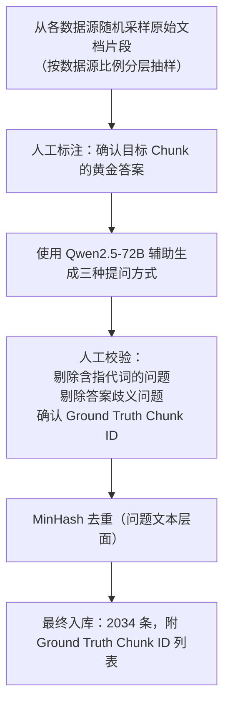
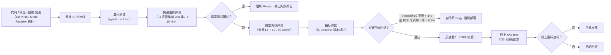

# RAG 评测系统构建全景

> 本笔记记录针对无线豆包 RAG 系统的完整评测体系，涵盖数据集构造、指标定义、框架选型、CI/CD 集成与问题定界方法。

---

## 为什么需要自建评测体系

通用 RAG 评测框架（如 RAGAS、TruLens）默认面向开放域问答，存在以下与本系统的根本性错配：

| 问题 | 说明 |
|------|------|
| **领域词汇缺失** | 5G 专有词汇（SIB、PDCP、gNodeB）在通用 NLP 模型的语义空间中没有有效表征，BERTScore 等指标失真严重 |
| **文档结构特殊** | 3GPP 协议、设计文档、iCase 各自有独特的引用与层次结构，标准评测集无法覆盖 |
| **语义相似陷阱** | SIB1 与 SIB2 这类仅差一字却语义截然不同的术语，会导致基于向量相似的自动评分器打出错误高分 |
| **权限维度缺失** | RBAC 与 1+X+Y 标签过滤是系统核心能力，通用评测集无法构造带权限约束的测试用例 |

因此，评测体系以**自建领域评测集 + 分层指标 + 自动化流水线**为核心。

---

## 评测集构建

### 整体分层框架

评测集按三个能力层级递进：

```
L1 单文档上下文获取     → 评测基础检索链路是否合理
L2 多文档 / 多跳推理     → 评测跨文档比较与复杂推理能力
L3 Agent 作业上下文获取  → 评测 RAG 是否能支撑 Agent 精准获取上下文
```

### L1 单文档评测集

**规模**：2034 条用例

**采样策略**：

```
数据源覆盖
├── Support 文档（含图、表、附件）
├── Wiki（目录层级结构）
├── iCase（反思案例，不切片整篇入库）
├── 设计文档（含版本管理与 PDU 信息）
├── 3GPP 协议（特殊缩进格式）
└── 华为知道 / 华为案例

格式覆盖
├── 纯文本段落
├── 表格内容
├── 代码块
├── 图片描述（OCR 结果）
└── 数学公式 / 协议规范文本
```

**提问方式**：每个评测目标按三种方式各构造一条问题

| 提问方式 | 构造规则 | 示例 |
|----------|----------|------|
| 原文 | 直接截取文档原文的关键句作为 Query | "随机接入过程中 Msg3 的最大重传次数是多少？" |
| 总结 | 针对检索目标生成总结性需求描述 | "介绍一下随机接入的 Msg3 重传机制" |
| 容错 | 引入部分表达错误（错别字、术语缩写混用） | "随机接入 msg3 最大重发次数" |

**构造流程**：



**标注格式**（JSONL）：

```json
{
  "qid": "L1_0001",
  "query": "随机接入过程中 Msg3 的最大重传次数是多少？",
  "query_type": "原文",
  "source_doc_id": "support_12345",
  "source_chunk_ids": ["chunk_support_12345_007"],
  "difficulty": "easy",
  "format_type": "text",
  "knowledge_set": ["1", "软件"],
  "expected_top_k": 10
}
```

### L2 多文档 / 多跳评测集

**规模**：约 300 条（持续扩充中）

**构造策略**：

- **比较类**：选取两份描述同一协议不同版本（如 LTE vs NR）的文档片段，构造"对比 A 和 B 的差异"类问题
- **推理链类**：选取存在逻辑依赖关系的多个 Chunk（如设计文档引用 3GPP 协议），构造"A 这么设计的依据是什么"类问题
- **聚合类**：选取同一主题分散在多个文档的内容，构造"列举所有 X 的场景"类问题

**难度分级**：

| 级别 | 跳数 | 涉及文档数 |
|------|------|-----------|
| Medium | 2 跳 | 2 篇 |
| Hard | 3+ 跳 | 3+ 篇 |

### L3 Agent 场景评测集

**规模**：约 100 条（与 Agent 团队协同构建）

**覆盖场景**：

- Agent 在执行多步作业时，需要先检索 A 文档中的参数，再检索 B 文档中的配置规则
- 需要 RAG 返回结构化的工具调用上下文（非散文式回答）
- 带有严格的权限约束（特定 PDU 内部文档）

---

## 评测指标体系

### 检索层指标

检索层指标独立于生成层评估，可精确定位是召回问题还是生成问题。

| 指标 | 计算方式 | 目标值 | 评测层级 |
|------|----------|--------|---------|
| **Recall@K** | 正确 Chunk 是否出现在 Top K 结果中 | Recall@10 ≥ 88%，Recall@20 ≥ 93% | 粗筛、精排各自测量 |
| **MRR（Mean Reciprocal Rank）** | $\frac{1}{N}\sum_{i=1}^{N}\frac{1}{rank_i}$ | ≥ 0.75 | 衡量正确结果的排名位置 |
| **NDCG@K** | 考虑位置权重的归一化折损累计增益 | NDCG@10 ≥ 0.80 | 衡量排序质量 |
| **Precision@K** | Top K 中正确 Chunk 的比例 | Precision@10 ≥ 0.60 | 衡量精度 |

**三级召回的分层指标**：

```
第一层（粗筛，BM25 + 384维向量）
  目标：Recall@3000 ≥ 99%（正确答案在候选集中的概率）

第二层（精筛，RSF 融合）
  目标：Recall@80 ≥ 95%

第三层（精排，Reranker）
  目标：Recall@10 ≥ 88%，Recall@20 ≥ 93%
```

**评分等级**（L1 评测集使用）：

| 等级 | 定义 |
|------|------|
| 正确召回 | Ground Truth Chunk 完整出现在 Top K 结果中 |
| 部分召回 | 仅召回了 Ground Truth 的部分 Chunk（适用于多 Chunk 答案） |
| 无召回 | Top K 结果中不含任何 Ground Truth Chunk |

### 端到端（E2E）指标

E2E 指标评估从用户提问到最终回答的完整链路质量。

| 指标 | 计算方式 | 目标值 |
|------|----------|--------|
| **E2E 准确率** | 人工判定回答是否正确（二分类） | ≥ 93%（当前线上水平） |
| **引文准确率** | 回答中引用的来源是否确实支持该论断 | ≥ 90% |
| **拒答率** | 对超出知识库范围的问题正确拒答的比例 | ≥ 85% |
| **幻觉率** | 回答包含知识库中不存在信息的比例 | ≤ 5% |

**E2E 评分细则**（人工评审标准）：

```
满分 5 分制：
5 分 - 完全正确，引文准确，覆盖全部关键事实
4 分 - 主体正确，存在轻微遗漏但无错误
3 分 - 部分正确，有明显遗漏但无明显错误
2 分 - 有错误，但错误非核心
1 分 - 主要内容错误或严重幻觉
0 分 - 完全错误、无法回答或越权回答
```

### 延迟与吞吐指标

| 指标                   | 目标值       | 说明                       |
| -------------------- | --------- | ------------------------ |
| **TTFT（首 Token 时延）** | ≤ 3s（P95） | 从用户发送到第一个 Token 返回       |
| **三级召回耗时**           | ≤ 2s      | 第一层 0.5s，第二层 0.5s，第三层 1s |
| **改写耗时**             | ≤ 1s      | Qwen3-4B 改写单次耗时          |
| **精确缓存命中率**          | 监控用，无硬性目标 | 关注是否命中错误（SIB1/SIB2 问题）   |

> [!warning] 注意：精确缓存命中率只监控，不以命中率高作为优化目标
> 系统主动关闭了语义缓存（Semantic Cache），因为 5G 专有术语（SIB1/SIB2）在向量空间距离极近，开启缓存会导致错误命中。因此任何命中率的异常升高都是需要排查的危险信号，而非正向指标。

---

## 评测框架

### 核心工具栈

| 组件     | 工具             | 用途                     |
| ------ | -------------- | ---------------------- |
| 离线批量评测 | 自研 Python 评测脚本 | 跑全量评测集，输出各层指标          |
| LLM 裁判 | Qwen2.5-72B    | 自动化评估 E2E 回答质量（替代人工初筛） |
| 人工评审   | 内部标注平台         | 对 LLM 裁判评分结果的 5% 抽样复核  |
| 指标追踪   | MLflow         | 记录每次实验的指标、超参与模型版本      |
| 可视化    | Grafana        | 线上指标实时监控（延迟、吞吐、错误率）    |
| 评测数据管理 | 内部 Git 仓库      | 版本化管理评测集（JSONL 格式）     |

### 开源评测框架的引入：RAGAS 与 DeepEval

#### 能不能用？

可以用，但要清楚**它们能覆盖哪一层，不能覆盖哪一层**。

这两个框架本质上都是**生成质量的 LLM-as-Judge 封装**，对检索层的评测支持有限，且默认使用 OpenAI API 作为 Judge 后端，需要替换为内部的 Qwen2.5-72B 才能在私有化部署场景中使用。

#### RAGAS

RAGAS 提供了一套面向 RAG 管道的标准化指标，其核心指标与本系统的适配情况如下：

| RAGAS 指标                  | 含义                                 | 本系统是否适用        | 备注                            |
| ------------------------- | ---------------------------------- | -------------- | ----------------------------- |
| **Faithfulness**          | 回答中的每个论断是否都能在召回的 Chunk 中找到依据       | **适用**         | 直接对应幻觉率，是最有价值的指标              |
| **Answer Relevancy**      | 回答是否切题（与 Query 相关）                 | 适用，但需关注        | 用向量相似度计算，5G 术语歧义可能导致虚高        |
| **Context Precision**     | 召回的 Chunk 中有多少是真正有用的（精度）           | **适用**         | 可补充 Precision@K               |
| **Context Recall**        | Ground Truth 答案所需的信息是否被 Chunk 完整覆盖 | **适用，需提供参考答案** | 需要评测集中有 `reference_answer` 字段 |
| **Context Entity Recall** | 参考答案中的实体是否在召回 Chunk 中出现            | 慎用             | 通用 NER 模型对 5G 术语识别率差，容易漏判     |

**使用方式**：将 RAGAS 的 LLM backend 替换为 Qwen2.5-72B，配合已有评测集批量运行：

```python
from ragas import evaluate
from ragas.metrics import faithfulness, answer_relevancy, context_precision, context_recall
from ragas.llms import LangchainLLMWrapper
from langchain_community.chat_models import ChatOpenAI  # 指向内部 vLLM 端点

# 将 Judge 替换为内部部署的 Qwen2.5-72B
internal_llm = LangchainLLMWrapper(ChatOpenAI(
    base_url="http://internal-vllm/v1",
    model="Qwen2.5-72B-Instruct",
    api_key="internal-key"
))

result = evaluate(
    dataset=hf_dataset,          # 从 JSONL 评测集转换
    metrics=[faithfulness, answer_relevancy, context_precision, context_recall],
    llm=internal_llm,
)
```

#### DeepEval

DeepEval 的优势在于**与 pytest 深度集成**，可以直接嵌入 CI 流水线的单元测试阶段，在代码合并前做快速质量门禁。

| DeepEval 指标 | 对应本系统关注点 | 推荐用途 |
|--------------|----------------|---------|
| **GEval**（自定义标准） | 可配置成本系统的 5 分制评分标准 | 替代手写 Judge Prompt |
| **FaithfulnessMetric** | 幻觉检测 | 与 RAGAS Faithfulness 基本等价 |
| **ContextualRecallMetric** | 召回覆盖度 | 适合在 CI 中做快速召回冒烟 |
| **AnswerRelevancyMetric** | 回答切题性 | 烟雾测试中使用 |

**在 CI 中的用法**（pytest 集成）：

```python
# tests/test_rag_quality.py
import pytest
from deepeval import assert_test
from deepeval.metrics import FaithfulnessMetric, ContextualRecallMetric
from deepeval.test_case import LLMTestCase

@pytest.mark.parametrize("sample", load_smoke_test_samples(n=50))
def test_rag_faithfulness(sample):
    test_case = LLMTestCase(
        input=sample["query"],
        actual_output=rag_pipeline.query(sample["query"]),
        retrieval_context=sample["retrieved_chunks"],
    )
    assert_test(test_case, [
        FaithfulnessMetric(threshold=0.85, model=internal_llm),
        ContextualRecallMetric(threshold=0.80, model=internal_llm),
    ])
```

#### 分工建议：与自研脚本如何配合

两个框架都不能替代自研脚本，原因：**它们不感知系统的三级检索结构**，无法给出"是哪一层丢失了 GT Chunk"的定界结论。推荐的分工如下：

```
自研评测脚本（必须保留）
  职责：检索层 Recall@K / MRR / NDCG，三级逐层诊断，失败用例分类
  触发：每次 CI 全量评测，问题定界

RAGAS（补充）
  职责：Faithfulness（幻觉率）、Context Precision/Recall
  触发：生成模型或 Prompt 变更时，专项验证生成质量

DeepEval（补充）
  职责：CI 烟雾阶段的快速质量门禁（50 条 × 3 指标，< 5min）
  触发：每次 PR 合并前自动运行
```

#### 主要局限与注意事项

> [!warning] 在本系统中使用 RAGAS / DeepEval 的已知风险

1. **术语泛化问题依然存在**：两个框架的 Judge 都依赖 LLM，即使换成 Qwen2.5-72B，仍可能将 SIB1/SIB2 这类仅差一字的术语视为等价，导致 Faithfulness 虚高。需要在 Judge Prompt 中注入专有术语等价表（与自研 Judge 同样的纠偏措施）。
2. **Context Recall 需要参考答案**：RAGAS 的 Context Recall 要求评测集中有 `reference_answer` 字段，而本系统的评测集以 Ground Truth Chunk ID 为核心，需要额外步骤把 GT Chunk 文本拼接成参考答案。
3. **不支持三级召回的分层诊断**：两者只能感知"最终召回结果"，无法区分是第一层粗筛还是第三层精排的问题。
4. **调用成本**：每条评测样本会触发多次 LLM 调用（RAGAS 的 Faithfulness 会将每个论断单独发给 Judge），2034 条 L1 评测集会产生大量推理请求，需评估内部 vLLM 的吞吐能力。

### LLM 裁判（Judge）设计

使用 Qwen2.5-72B 作为自动化评分器，Judge Prompt 核心设计原则：

```
1. 给定原始 Query、召回的 Chunk 列表、系统回答
2. 要求 Judge 先输出 CoT（逐步推理），再输出评分
3. 明确禁止 Judge 使用自己的知识（避免与知识库冲突时评分偏向训练知识）
4. 提供 5 分制评分标准的详细说明和 3~5 个评分示例（Few-Shot）
5. 对于含专有术语的问题，额外提示 Judge 以术语准确性为优先判断维度
```

**LLM Judge 已知偏差与纠偏措施**：

| 偏差类型   | 描述             | 纠偏方式                      |
| ------ | -------------- | ------------------------- |
| 长度偏好   | 倾向给较长回答更高分     | Prompt 中明确说明简洁准确优于冗长      |
| 术语泛化   | 将近似术语视为等价      | 构建专有术语等价表，注入 Judge Prompt |
| 自我知识污染 | 用训练知识而非知识库内容评判 | 明确要求"仅基于提供的 Chunk 评判"     |

---

## CI/CD 集成

### 流水线架构



### 触发条件

| 变更类型 | 触发评测范围 | 说明 |
|----------|-------------|------|
| 改写模型（Qwen3-4B）更新 | 全量 L1 + L2 | 改写质量直接影响召回覆盖率 |
| Reranker 模型更新 | 全量 L1（重点 Recall@10） | 影响最终精排结果 |
| Embedding 模型更新 | 全量 L1 + 向量空间漂移检测 | 需同步重新构建向量库 |
| RSF 权重参数调整 | L1 快速评测（500 条） | 参数调整影响有限，快速验证即可 |
| 知识库数据更新 | 增量评测（仅对新增数据源采样） | 全量重测成本过高 |
| API / 路由逻辑变更 | 单元测试 + E2E 烟雾 | 与检索质量无关，快速验证即可 |

### 时间估算

#### 各阶段耗时基准

**基础假设**：
- 三级召回单次耗时 2s（第一层 0.5s + 第二层 0.5s + 第三层 1s）
- RAG 完整链路（含生成）单次耗时约 8s（召回 2s + 生成 TTFT+解码 ~6s）
- Qwen2.5-72B LLM Judge 单次调用约 3s（vLLM 服务，CoT 输出约 200 tokens）
- RAGAS Faithfulness 每条样本平均拆解出 6 个论断，即每条 ~6 次 Judge 调用
- 并发度：CI 环境默认开 20 个并发 worker

| 评测阶段 | 样本量 | 单线程耗时 | 并发耗时（20 workers） | 瓶颈 |
|----------|--------|-----------|----------------------|------|
| 单元测试（pytest） | - | ~2 min | - | 无 LLM 调用，纯逻辑 |
| DeepEval 烟雾测试 | 50 | ~9 min | ~3 min | 50 × (RAG 5s + 2次Judge 3s) |
| **L1 检索层指标**（自研脚本，仅 Recall/MRR/NDCG） | 2034 | ~68 min | **~7 min** | 三级召回 2s/条 |
| **L1 E2E + LLM Judge**（自研脚本，全链路） | 2034 | ~4.5h | **~25 min** | RAG 8s + Judge 3s = 11s/条 |
| L2 多跳检索层指标 | 300 | ~10 min | ~1 min | 与 L1 同等召回耗时 |
| RAGAS Faithfulness（单指标） | 2034 | ~3.4h | ~17 min | 6次 Judge/条 × 3s = 18s/条 |
| RAGAS 四指标全套 | 2034 | ~10h | ~50 min | ~3倍 Faithfulness 耗时 |

#### CI 流水线各阶段时间窗口

```
PR 提交
  └─ 单元测试                         ~2 min
  └─ DeepEval 烟雾（50 条）            ~3 min    ← 阻断 Merge 的门禁，合计 < 5min
  └─ L1 检索层快速评测（前 200 条）      ~1 min    ← 本阶段合计 < 10min

Merge 后
  └─ L1 检索层全量（2034 条）           ~7 min
  └─ L1 E2E + LLM Judge 全量           ~25 min
  └─ L2 多跳检索层                      ~1 min
  └─ 指标对比 & 报告生成                 ~1 min   ← 本阶段合计 ~35 min，与文档中"约 60min"含 RAGAS 时一致

（仅生成模型 / Prompt 变更时额外触发）
  └─ RAGAS Faithfulness（2034 条）      ~17 min
  └─ RAGAS 其余三指标                   ~33 min  ← RAGAS 全套合计 ~50 min
```

> [!tip] 为何 CI 中不默认跑 RAGAS 全套
> RAGAS 每条样本产生约 6~10 次 LLM Judge 调用，2034 条 L1 评测集会产生约 12,000~20,000 次 vLLM 推理请求。默认 CI 全量跑成本过高，仅在生成模型或 System Prompt 发生变更时按需触发。

#### 并发度调优建议

| 瓶颈来源              | 建议并发度 | 原因                                |
| ----------------- | ----- | --------------------------------- |
| 三级召回（ES + Milvus） | 20~30 | 向量库与 ES 均支持高并发，主要受网络 I/O 限制       |
| Reranker（GPU 推理）  | 8~16  | 受 GPU 显存限制，过高并发会触发排队反而变慢          |
| LLM Judge（vLLM）   | 10~20 | 取决于 vLLM 的 max_num_seqs 配置，通常设 16 |
| RAGAS 多指标并行       | 5~10  | 单条样本内多指标串行，过高并发反而争抢 vLLM 队列       |

### 评测报告格式

每次 CI 评测自动生成 Markdown 报告，包含以下结构：

```markdown
# 评测报告 - {版本号} - {时间戳}

## 摘要
| 指标 | 当前版本 | Baseline | 变化 | 状态 |
|------|----------|----------|------|------|
| Recall@10 | 88.3% | 87.9% | +0.4% | ✅ |
| Recall@20 | 93.1% | 92.8% | +0.3% | ✅ |
| NDCG@10 | 0.812 | 0.805 | +0.007 | ✅ |
| TTFT P95 | 2.8s | 2.9s | -0.1s | ✅ |

## 分层指标
（第一层、第二层、第三层各自的 Recall 详情）

## 分数据源指标
（按 Support / Wiki / iCase / 设计文档 / 3GPP 分别报告）

## 失败用例分析（Top 20 最差用例）
（qid、query、失败原因分类、定界建议）

## 变更说明
（本次变更的内容摘要）
```

---

## 问题定界方法

当 E2E 准确率或 Recall 出现下降时，使用以下系统化定界流程将问题归因到具体模块。

### 定界分层框架

```
问题现象（E2E 准确率下降）
│
├─ Step 1：检查是否是数据问题
│    └─ 新增知识库数据质量差？切片不合理？元数据标签错误？
│
├─ Step 2：检查召回层（Retrieval Diagnostic）
│    ├─ 第一层 Recall@3000 是否 ≥ 99%？
│    │    └─ 否 → BM25 分词词表缺失 / 向量库未更新
│    ├─ 第二层 Recall@80 是否 ≥ 95%？
│    │    └─ 否 → RSF 权重 α 参数问题 / 384维向量质量问题
│    └─ 第三层 Recall@10 是否 ≥ 88%？
│         └─ 否 → Reranker 模型问题 / Cross-Encoder 对领域词泛化
│
├─ Step 3：检查改写层（Rewrite Diagnostic）
│    └─ 改写后的子问题是否覆盖了正确的语义方向？
│         手动检查失败 Query 的改写输出
│
└─ Step 4：检查生成层（Generation Diagnostic）
     ├─ 正确的 Chunk 已在 Top 10，但回答仍然错误？
     │    └─ System Prompt 约束问题 / LLM 幻觉 / 引文格式问题
     └─ 拒答率异常？
          └─ 检查 System Prompt 中的拒答阈值设置
```

### 失败用例分类体系

每条失败用例需标注失败原因，共分为以下类别：

| 失败类型 | 代码          | 典型特征                        | 优先排查方向                  |
| ---- | ----------- | --------------------------- | ----------------------- |
| 召回缺失 | `R_MISS`    | Ground Truth Chunk 不在 Top K | 检索三层逐层诊断                |
| 召回有噪 | `R_NOISE`   | 正确 Chunk 在但被低排名噪声淹没         | Reranker 精排质量           |
| 改写失效 | `Q_REWRITE` | 改写后子问题偏离原意                  | Qwen3-4B 改写模型           |
| 权限过滤 | `P_FILTER`  | 正确文档因 RBAC 被过滤              | 1+X+Y 标签与 SAP 画像匹配      |
| 数据质量 | `D_QUALITY` | Ground Truth Chunk 本身内容不完整  | 知识预处理流水线                |
| 生成幻觉 | `G_HALLUC`  | 召回正确但 LLM 生成了错误内容           | System Prompt / 生成模型    |
| 生成遗漏 | `G_OMIT`    | 召回正确但 LLM 遗漏了关键信息           | Context 组装顺序 / Token 预算 |
| 术语混淆 | `T_AMBIG`   | 近似术语（SIB1 vs SIB2）混淆        | 向量空间术语分布 / BM25 权重      |
|      |             |                             |                         |

### 专项诊断工具

**召回诊断脚本**（核心逻辑）：

```python
def diagnose_retrieval(query: str, ground_truth_chunk_ids: list[str], top_k: int = 20):
    """
    对单条 query 执行完整三层召回，并在每层后检查 GT chunk 是否在候选集中。
    输出每层的 Recall 状态，精确定位是哪一层丢失了正确答案。
    """
    # 第一层：粗筛
    layer1_results = bm25_retriever.search(query, top_k=1500) + \
                     vector_384_retriever.search(query, top_k=1500)
    layer1_ids = {r.chunk_id for r in layer1_results}
    layer1_recall = any(gt in layer1_ids for gt in ground_truth_chunk_ids)

    # 第二层：精筛
    layer2_results = rsf_fusion(layer1_results, query, top_k=80)
    layer2_ids = {r.chunk_id for r in layer2_results}
    layer2_recall = any(gt in layer2_ids for gt in ground_truth_chunk_ids)

    # 第三层：精排
    layer3_results = reranker.rerank(layer2_results, query, top_k=top_k)
    layer3_ids = {r.chunk_id for r in layer3_results}
    layer3_recall = any(gt in layer3_ids for gt in ground_truth_chunk_ids)

    return {
        "layer1_recall": layer1_recall,
        "layer2_recall": layer2_recall,
        "layer3_recall": layer3_recall,
        "failure_layer": None if layer3_recall else
                         ("layer3" if layer2_recall else
                          ("layer2" if layer1_recall else "layer1"))
    }
```

**权限过滤诊断**：

当怀疑是 RBAC / 1+X+Y 标签过滤导致的召回缺失时，使用超级管理员身份（不带任何标量过滤）重新执行相同 Query，若召回结果恢复正常则确认是权限配置问题。

---

## 特殊场景评测

### 术语歧义专项评测集

针对 5G 领域存在大量近似术语的问题，单独维护一个**术语歧义评测集**（约 200 条）：

```
构造规则：
1. 筛选出文档中存在多个"仅一字之差"的术语对（如 SIB1/SIB2、PDCP/PDCCH）
2. 对每个术语对，分别构造两条问题，答案指向不同文档
3. 评测时检查系统是否能正确区分，即两条问题不互相串答
```

**关键指标**：术语区分率 ≥ 98%（不得串答）

### 多轮对话评测

专门评测指代消解能力，构造多轮对话序列：

```json
[
  {"turn": 1, "query": "随机接入是什么", "expected_topic": "RACH"},
  {"turn": 2, "query": "它有哪些关键技术", "expected_topic": "RACH key technologies"},
  {"turn": 3, "query": "和上行调度有什么区别", "expected_topic": "RACH vs UL scheduling"}
]
```

**评测指标**：多轮指代消解正确率（改写后的子问题是否还原了正确主语）

### 冷启动 / 新数据源评测

每次新数据源接入后，执行以下专项评测：

1. 从新数据源中抽取 50~100 条样本构造临时评测集
2. 检查新数据源的 Recall@10 是否与全库水平一致
3. 重点检查切片边界是否破坏了关键语义单元

---

## 线上监控与报警

### 关键监控指标

```yaml
# Grafana 监控看板配置（核心指标）

metrics:
  - name: request_latency_p95
    alert_threshold: 5s      # 超过 5s 报警

  - name: retrieval_score_avg
    alert_threshold: 0.65    # Reranker 平均分低于 0.65 报警（可能是数据质量问题）

  - name: empty_result_rate
    alert_threshold: 5%      # 无召回率超过 5% 报警

  - name: fallback_rate
    alert_threshold: 3%      # 降级触发率超过 3% 报警

  - name: cache_exact_hit_by_term_pair
    alert_type: anomaly      # 精确缓存出现特定术语对的高命中，触发术语混淆告警
```

### 用户反馈回路

线上用户可对每条回答进行点踩（负反馈），系统将负反馈数据自动录入到**待分析问题池**：

1. 人工每周对负反馈问题进行批量分析，按失败类型分类
2. 高频出现的失败模式触发专项优化任务
3. 修复验证后，将对应问题加入评测集作为回归用例（防止复现）

---

## 评测集版本管理

### 版本策略

```
eval_dataset/
├── v1.0/          # 初始版本，2034 条 L1
├── v1.1/          # 新增 iCase 来源用例，修正若干标注错误
├── v1.2/          # 新增术语歧义专项集（200 条）
├── v2.0/          # 新增 L2 多跳评测集（300 条）
└── current -> v2.0   # 软链接指向当前版本
```

### 评测集质量保证

- 每次评测集更新都经过 **Inter-Annotator Agreement（IAA）** 检验，要求标注一致性 κ ≥ 0.85
- 禁止将评测集内容用于模型训练（防止数据污染）
- 评测集本身每半年做一次**漂移检测**：检查知识库更新后，部分评测集的 Ground Truth Chunk 是否已被删除或内容发生变化

---

## 当前基线与里程碑

| 指标 | v1.0 基线 | 当前水平 | 目标 |
|------|-----------|----------|------|
| E2E 准确率（TOP20 条件下） | 68% | **93%** | 95% |
| Embedding 微调后 Recall@10 | 62% | **88%** | 90% |
| 三级召回整体耗时 | 4.5s | **2s** | ≤ 1.5s |
| 术语区分率 | 未测量 | 监控中 | ≥ 98% |
| LLM Judge 与人工评审一致率 | - | 约 89% | ≥ 92% |

---

## 相关笔记

- [[00_RAG系统概要]] — 系统整体架构与各模块详细说明
- [[code/RAG系统代码总结]] — 代码实现细节与项目结构
