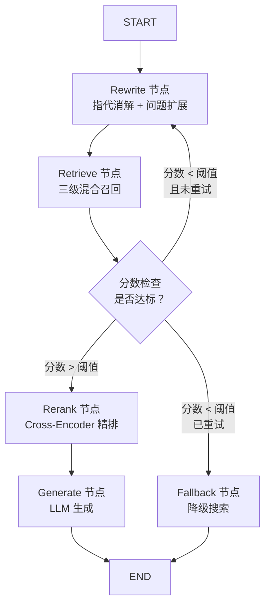

# RAG 系统概要审阅报告

> [!NOTE]
> 本报告从**逻辑合理性、解释清晰度、技术细节完整性、其他修改建议**四个维度，对 [00_RAG系统概要.md](file:///d:/Obsidian_Vault/Obsidian-Notes/RAG%E7%B3%BB%E7%BB%9F/00_RAG%E7%B3%BB%E7%BB%9F%E6%A6%82%E8%A6%81.md) 进行逐项审阅。

---

## 一、逻辑不合理之处

### 1.1 三级召回中第二层的逻辑矛盾 ⚠️

**位置**：[L170-L172](file:///d:/Obsidian_Vault/Obsidian-Notes/RAG%E7%B3%BB%E7%BB%9F/00_RAG%E7%B3%BB%E7%BB%9F%E6%A6%82%E8%A6%81.md#L170-L172)

**问题**：第一层描述为 "BM25 + 384 维向量库检索"，第二层描述为 "BM25 + 768 维向量库检索"。但根据流程图和混合召回章节的描述（L200-L203），第二层实际是对第一层 3000 条结果进行**RSF 归一化融合打分 + 768 维向量库重检索**，筛出 80 条。这里存在以下逻辑疑点：

- **第二层是否真的再次执行了 BM25 检索？** 从 Mermaid 流程图（L40-L53）看，第二层精筛的输入来自第一层的 BM25 和 384 维向量两路结果，经 RSF 融合后送入 768 维 Milvus——**BM25 并没有在第二层被重新执行**，而是复用了第一层 BM25 的分数。但文字描述"BM25 + 768 维向量库检索"容易让人误解为第二层又跑了一遍 BM25。

- **RSF 融合发生在哪一层？** 混合召回章节（L196-L212）明确说 RSF 是"混合召回"的核心策略，属于第二层。但第二层的文字描述又说"基于用户 SAP 画像动态调整两种召回方式的权重配比"。这个 SAP 画像调权到底是 RSF 的 α 参数，还是另一个独立的权重机制？文档没有交代清楚。

**建议修改**：将第二层描述修改为："对第一层 BM25 和 384 维向量两路召回结果，通过 RSF 归一化融合打分（动态权重 α 基于 Query Token 数 + 用户 SAP 画像联合决定），并结合 768 维向量库进行深语义精筛，输出 80 篇文档。"

---

### 1.2 RSF 算法名称疑似错误 ⚠️

**位置**：[L198](file:///d:/Obsidian_Vault/Obsidian-Notes/RAG%E7%B3%BB%E7%BB%9F/00_RAG%E7%B3%BB%E7%BB%9F%E6%A6%82%E8%A6%81.md#L198)

**问题**：文中称使用 **RSF（Rank Score Fusion）** 算法。业界常见的混合检索融合算法为：
- **RRF（Reciprocal Rank Fusion）**：$\text{score} = \sum \frac{1}{k + rank_i}$，基于**排名**进行融合
- **线性加权融合（Linear Score Fusion）**：对归一化分数加权求和

文中描述的操作（"分别归一化 → 加权求和"）实际上是**线性加权分数融合**，而非基于排名的 RRF。**"RSF" 这个缩写在学术界和工业界均不常见**，可能是笔误或内部命名。

**建议**：
1. 如果确实是内部命名，建议在首次出现时加上注释："RSF（Rank Score Fusion，内部命名的线性分数融合方法）"
2. 如果是笔误，应核实：若基于排名融合则改为 RRF；若基于分数加权融合则直接称之为"**加权分数融合（Weighted Score Fusion）**"

---

### 1.3 第二层输入/输出数字不一致 ⚠️

**位置**：[L171](file:///d:/Obsidian_Vault/Obsidian-Notes/RAG%E7%B3%BB%E7%BB%9F/00_RAG%E7%B3%BB%E7%BB%9F%E6%A6%82%E8%A6%81.md#L171) vs [L200-L203](file:///d:/Obsidian_Vault/Obsidian-Notes/RAG%E7%B3%BB%E7%BB%9F/00_RAG%E7%B3%BB%E7%BB%9F%E6%A6%82%E8%A6%81.md#L200-L203)

**问题**：
- 三级召回章节（L171）描述第二层"输入 3000 篇文档"，"输出 80 篇文档"
- 混合召回章节（L200）描述"向量召回 160 篇文档，BM25 召回 160 篇文档"，合并后取 Top 80

这里产生了矛盾：**3000 → 80 是怎样过渡到 160+160 → 80 的？**
- 如果 160+160 是从 3000 中各取 160（共 320），那中间还有一步从 3000 筛到 320 的过程没有说明
- 如果 160+160 就是第二层独立检索的结果，那和第一层的 3000 条输出是什么关系？

**建议**：统一数据流描述。例如："第一层粗筛输出 3000 条候选 → 第二层在这 3000 条候选中分别用 BM25 原始分数和 768 维向量重排各取 Top 160 → RSF 融合后取 Top 80"。

---

### 1.4 Q1 FAQ 中提及 Redis 与正文冲突 ⚠️

**位置**：[L808](file:///d:/Obsidian_Vault/Obsidian-Notes/RAG%E7%B3%BB%E7%BB%9F/00_RAG%E7%B3%BB%E7%BB%9F%E6%A6%82%E8%A6%81.md#L808)

**问题**：Q1 中说 "在线实时并发交由异步事件循环底座 FastAPI 配合 **Redis 多级短平快截流防击穿**"。但正文的核心记忆管理章节（L398-L406）明确指出系统**已经摒弃了 Redis 缓存机制**，转而使用 LangGraph 状态机管理。Q4（L823-L827）中也强调了"斩断 Query 缓存"的设计决策。

FAQ 中 Redis 的出现与正文相矛盾，会导致阅读者产生困惑：到底用没用 Redis？

**建议**：修改 Q1 中的表述，将 "Redis 多级短平快截流防击穿" 改为更准确的描述。如果 Redis 确实还用在某些场景（如 Session 管理、Rate Limiting 等非 Query Cache 的用途），应明确说明其角色。如果完全不用了，则应删除。

---

### 1.5 第一层粗筛"99% 以上准确率"指标定义模糊

**位置**：[L170](file:///d:/Obsidian_Vault/Obsidian-Notes/RAG%E7%B3%BB%E7%BB%9F/00_RAG%E7%B3%BB%E7%BB%9F%E6%A6%82%E8%A6%81.md#L170)

**问题**：声称第一层"准确率达 99% 以上"。在信息检索领域，"准确率（Precision）"和"召回率（Recall）"是完全不同的指标。此处的语境明显指的是**召回率**（即包含正确答案的文档在 3000 条候选中的概率），而非"准确率"（3000 条中有多少条是相关的）。实际上，从千万级文档中粗筛 3000 条，Precision 必然很低（可能不到 1%），而 Recall 可以达到 99%。

**建议**：将"准确率"改为"**包含率/召回率**"，即"实验验证该层召回率达 99% 以上（正确答案被包含在 3000 条候选集中的概率）"。

---

### 1.6 防幻觉章节标题重复字

**位置**：[L568](file:///d:/Obsidian_Vault/Obsidian-Notes/RAG%E7%B3%BB%E7%BB%9F/00_RAG%E7%B3%BB%E7%BB%9F%E6%A6%82%E8%A6%81.md#L568)

**问题**：标题为 "防幻觉与系统**兜底兜底**策略"，"兜底" 二字重复。

**建议**：改为 "防幻觉与系统兜底策略"。

---

## 二、解释不清晰之处

### 2.1 动态权重 α 的物理意义未说明

**位置**：[L205-L211](file:///d:/Obsidian_Vault/Obsidian-Notes/RAG%E7%B3%BB%E7%BB%9F/00_RAG%E7%B3%BB%E7%BB%9F%E6%A6%82%E8%A6%81.md#L205-L211)

**问题**：给出了 Sigmoid 变体公式计算 α，但没有明确说明 **α 到底是谁的权重**。读者无法判断：
- α 是向量检索的权重，还是 BM25 的权重？
- 最终综合得分公式是 `α × 向量分 + (1-α) × BM25 分`，还是反过来？

**建议补充完整公式**：
```
FinalScore = α × VectorScore_normalized + (1 - α) × BM25Score_normalized
```
并补充说明："当 α 趋近 0.7 时（长问题场景），系统更依赖向量语义匹配；当 α 趋近 0.4 时（短问题场景），系统更依赖 BM25 关键字匹配。"

---

### 2.2 1+X+Y 架构与检索隔离的映射关系不清晰

**位置**：[L310-L328](file:///d:/Obsidian_Vault/Obsidian-Notes/RAG%E7%B3%BB%E7%BB%9F/00_RAG%E7%B3%BB%E7%BB%9F%E6%A6%82%E8%A6%81.md#L310-L328)

**问题**：知识集架构的 1+X+Y 描述了分类管理方式，但没有解释：
- 在**检索时**如何利用这个分类？用户发起查询时，是搜索全部知识集，还是根据用户画像自动限定搜索范围？
- RBAC 章节（L596-L616）中的 1+X+Y 与此处的关系是什么？是同一套标签在不同场景下的应用吗？
- "同一份文档允许在多个知识集中出现，但入库时仅保留一条物理记录，同时合并所有知识集的标签"——这个合并后的标签是如何在 Milvus 中存储的？是一个数组字段吗？

**建议**：在 1+X+Y 章节末尾增加一小段，明确说明标签在检索时的过滤机制，以及与 RBAC 的协同关系。例如："检索时，系统根据用户的 SAP 画像自动取出其所属的 PDU（Y维度）和 CQIC 方向（X维度），构造 Milvus 标量过滤表达式，仅在匹配的知识集范围内检索，同时结合 RBAC 的安全级别进行二次过滤。"

---

### 2.3 父子索引与知识切片的关系没有串联

**位置**：[L296-L305](file:///d:/Obsidian_Vault/Obsidian-Notes/RAG%E7%B3%BB%E7%BB%9F/00_RAG%E7%B3%BB%E7%BB%9F%E6%A6%82%E8%A6%81.md#L296-L305) vs [L279-L295](file:///d:/Obsidian_Vault/Obsidian-Notes/RAG%E7%B3%BB%E7%BB%9F/00_RAG%E7%B3%BB%E7%BB%9F%E6%A6%82%E8%A6%81.md#L279-L295)

**问题**：知识切片章节描述了三种节点类型（非叶子、叶子、无标题），紧接着父子索引章节描述了"子切片建索引、命中后回溯父文档"的机制。但文档没有明确说明：
- "子切片" 对应的是哪种节点类型？（从上下文推测是叶子节点）
- "父文档" 对应的是哪种？（推测是非叶子节点或合并后的上层章节）
- 非叶子节点的 LLM 摘要是否也参与向量索引？如果是，它是作为"父"还是"子"？

**建议**：在父子索引章节开头增加一句映射关系说明，例如：
> 在上述切片体系中，**叶子节点和无标题节点**的切片作为"子切片"参与向量索引的精确匹配；**非叶子节点**（含 LLM 摘要的章节概览）作为"父文档"，在子切片命中时被整体召回供大模型使用。

---

### 2.4 "SAP 画像" 概念缺乏解释

**位置**：[L171](file:///d:/Obsidian_Vault/Obsidian-Notes/RAG%E7%B3%BB%E7%BB%9F/00_RAG%E7%B3%BB%E7%BB%9F%E6%A6%82%E8%A6%81.md#L171)、流程图 L48

**问题**："基于用户 SAP 画像动态调整两种召回方式的权重配比" 是整个二级召回的核心差异化策略，但全文对 SAP 画像的定义和具体影响机制**仅一笔带过**：
- SAP 画像包含哪些维度？（职级、部门、技能领域、历史查询偏好？）
- 画像如何**具体**影响权重 α？是硬编码的规则映射（如"软件工程师 → α 偏高"），还是学习到的参数？
- 为什么 SAP 画像要影响 BM25 与向量的权重比，而不是直接作为标量过滤条件？

**建议**：至少增加一个简短的说明段落或表格，例如：
> SAP 画像是基于公司 HR 系统和历史行为日志提取的用户特征，包含 `所属 PDU`、`CQIC 方向`、`技能等级` 等维度。在混合召回中，系统根据用户的专业领域调整语义检索与关键词检索的相对权重：例如研究岗位用户倾向于使用术语精确查询（BM25 权重更高），而项目管理岗位更常提出模糊的语义性问题（向量权重更高）。

---

### 2.5 AutoPhrase 算法缺乏交代

**位置**：[L245-L246](file:///d:/Obsidian_Vault/Obsidian-Notes/RAG%E7%B3%BB%E7%BB%9F/00_RAG%E7%B3%BB%E7%BB%9F%E6%A6%82%E8%A6%81.md#L245-L246)

**问题**：文档提到使用 AutoPhrase 算法发现新词，但没有说明：
- AutoPhrase 的核心工作原理是什么？（基于统计的短语挖掘 + 远距离监督）
- 为什么选择 AutoPhrase 而非其他新词发现工具（如 jieba 的 HMM 新词发现、WordSegment 等）？
- "强制保留'名+名'或'形+名'结构"是如何实现的？（POS Tagging 后过滤？）

**建议补充**：
> **AutoPhrase** 是一种基于远距离监督（Distant Supervision）的短语质量评分算法。其通过利用外部知识库（如维基百科）作为正样本种子集，自动训练一个短语质量分类器，无需人工标注。相比基于 HMM 的新词发现方法（如 jieba），AutoPhrase 的优势在于：(1) 能识别多词短语（如"载波聚合"、"随机接入"），而非仅限于单个新词；(2) 通过迭代 robust positive-only 训练，在领域语料上能达到更高的准确率。词性过滤（POS Filtering）基于 jieba 或 HanLP 的词性标注结果，仅保留"NN+NN"或"JJ+NN"结构的短语候选。

---

## 三、缺少技术细节之处

### 3.1 Embedding 微调的训练超参数和方法论缺失

**位置**：[L219-L231](file:///d:/Obsidian_Vault/Obsidian-Notes/RAG%E7%B3%BB%E7%BB%9F/00_RAG%E7%B3%BB%E7%BB%9F%E6%A6%82%E8%A6%81.md#L219-L231)

**问题**：提到了 "gte-multilingual-base 微调"、"48 万条 QA 对"、"A30 × 2 训练两周"，但以下关键技术细节缺失：

| 缺失项 | 为什么重要 |
|--------|-----------|
| 损失函数 | 对比学习用的是 InfoNCE / MultipleNegativesRankingLoss / CoSENT？这直接影响模型学到的空间分布 |
| 训练框架 | 是用 sentence-transformers 还是自定义训练循环？ |
| 负采样策略 | In-batch negatives？Hard negatives 挖掘？这对 Embedding 质量影响巨大 |
| 学习率 & Batch size | 基本超参 |
| 评估指标 | "Top10 召回率从 62% → 88%"是在什么评测集上、用什么协议评的？ |
| 384 维与 768 维联合微调方式 | 是一个模型输出两种维度（MRL, Matryoshka Representation Learning）？还是两个独立模型？ |

**建议补充**（至少包含以下信息）：

> **训练框架**：基于 `sentence-transformers` 库。
> **损失函数**：采用 `MultipleNegativesRankingLoss`（InfoNCE 变体），配合 `In-batch Negatives` + `Hard Negatives Mining`（基于 BM25 Top-K 高分但不相关的文档作为难负例）。
> **多维度联合微调**：采用 **Matryoshka Representation Learning (MRL)** 策略，在单一模型中同时优化 384 维和 768 维的表征质量，训练时对损失函数在两个截断维度上进行联合求和。
> **超参数**：learning_rate = 2e-5，batch_size = 256，warmup_ratio = 0.1，epochs = 5。
> **评估协议**：基于自有 2034 条评测集，使用 `Recall@K`（K=10, 20, 50）和 `MRR@10` 作为核心指标。

---

### 3.2 Reranker 微调数据量和训练配置缺失

**位置**：[L681-L690](file:///d:/Obsidian_Vault/Obsidian-Notes/RAG%E7%B3%BB%E7%BB%9F/00_RAG%E7%B3%BB%E7%BB%9F%E6%A6%82%E8%A6%81.md#L681-L690)

**问题**：Reranker 微调描述了数据构造策略（三元组、难负例挖掘）和损失函数选择（MarginMSELoss / BCEWithLogitsLoss），但缺乏以下信息：
- 总训练数据量（多少三元组？）
- LoRA 具体配置（rank r = ?，alpha = ?，target modules 是哪些？）
- 训练硬件和时长
- 微调前后的对比实验基线
- "NDCG@10 猛增约 23%"——从多少到多少？在什么评测集上？

**建议补充**：

> **训练数据**：共构造 12 万组三元组对（其中 Hard Negative 占比约 40%）。
> **LoRA 配置**：rank = 8，alpha = 16，target_modules = ["query", "key", "value"]，dropout = 0.05。
> **训练硬件**：A30 × 1，训练约 3 天完成。
> **效果对比**：在自有通信领域评测集（含 500 条长尾词查询）上，NDCG@10 从微调前的 0.62 提升至微调后的 0.76（+23%）。同时在 MTEB Reranking 通用基准上仅下降 1.2%，证明领域适配未显著损害通用能力。

---

### 3.3 LangGraph 状态图的具体节点与边缺失

**位置**：[L396-L406](file:///d:/Obsidian_Vault/Obsidian-Notes/RAG%E7%B3%BB%E7%BB%9F/00_RAG%E7%B3%BB%E7%BB%9F%E6%A6%82%E8%A6%81.md#L396-L406)

**问题**：描述了 LangGraph 作为"有向状态循环图"，提到了 AgentState 包含 `messages`、`retrieved_docs`、`rewrite_queries` 等字段，但缺少：
- 完整的状态图节点枚举（有哪些节点？每个节点的职责？）
- 条件边（Conditional Edge）的判定逻辑（什么条件下走哪条边？）
- 是否有循环/回退边？（Q4 中提到了检索打分极差时回退到 Rewrite，但正文没有体现）

**建议补充一个简化的 LangGraph 节点图**：



---

### 3.4 vLLM 推理部署细节不足

**位置**：[L554-L555](file:///d:/Obsidian_Vault/Obsidian-Notes/RAG%E7%B3%BB%E7%BB%9F/00_RAG%E7%B3%BB%E7%BB%9F%E6%A6%82%E8%A6%81.md#L554-L555)

**问题**：仅提到 "vLLM + PagedAttention 加速"，但缺乏关键的推理部署细节：

**建议补充**：

> **推理引擎部署配置**：
> - **引擎**：vLLM v0.4+，底层利用 PagedAttention v2 实现动态 KV Cache 分页管理
> - **并行策略**：4× A100-80G 上采用 Tensor Parallelism（`--tensor-parallel-size 4`），模型权重均匀切分至 4 张卡
> - **Batch 调度**：启用 Continuous Batching（连续批处理），最大并发请求数 `--max-num-seqs 64`
> - **量化方案（降本路线）**：AWQ 4-bit 量化后，可在 2× A100-80G 上部署，TTFT 增加约 15%，质量损耗 < 3%
> - **关键参数**：`--max-model-len 32768`（限制单次请求最大上下文，防止 OOM），`--gpu-memory-utilization 0.90`

---

### 3.5 评估体系中的指标计算方法缺失

**位置**：[L777-L782](file:///d:/Obsidian_Vault/Obsidian-Notes/RAG%E7%B3%BB%E7%BB%9F/00_RAG%E7%B3%BB%E7%BB%9F%E6%A6%82%E8%A6%81.md#L777-L782)

**问题**：提到了四大评估指标（E2E Accuracy、Context Precision & Recall、Faithfulness、Answer Relevance），但缺乏每一项的**具体计算方法**。既然提到"借鉴了 RAGAS 框架思想并重写"，那应该说明重写后的差异。

**建议补充核心评估算子的计算逻辑**：

> **Faithfulness（事实忠实度）计算流程**：
> 1. 将大模型生成的回答拆分为 N 个原子声明（Claims），使用 LLM 进行 claim extraction
> 2. 对每个声明，使用 NLI（Natural Language Inference）模型判断其是否能被 `<context>` 中的文本蕴含（Entailment）
> 3. Faithfulness Score = 被蕴含的声明数 / 总声明数 N
>
> **Context Recall 计算流程**：
> 1. 将 Ground Truth 答案拆分为 M 个要点
> 2. 判断每个要点是否能在 Top-K 召回的 Context 中找到支持证据
> 3. Context Recall = 有支持证据的要点数 / M

---

## 四、其他需要修改之处

### 4.1 Mermaid 流程图中的 XML/HTML 安全性

**位置**：[L17-L101](file:///d:/Obsidian_Vault/Obsidian-Notes/RAG%E7%B3%BB%E7%BB%9F/00_RAG%E7%B3%BB%E7%BB%9F%E6%A6%82%E8%A6%81.md#L17-L101) 中使用了 `<br/>` 标签

**问题**：Mermaid 节点标签中大量使用了 `<br/>` HTML 标签。在某些 Markdown 渲染器（如 Obsidian 的某些版本或 GitHub）中，这可能导致渲染异常。建议测试确认 Obsidian 环境下是否正常显示。

---

### 4.2 Cross-Encoder 描述中的术语混用

**位置**：[L677](file:///d:/Obsidian_Vault/Obsidian-Notes/RAG%E7%B3%BB%E7%BB%9F/00_RAG%E7%B3%BB%E7%BB%9F%E6%A6%82%E8%A6%81.md#L677)

**问题**：描述 Cross-Encoder 内部注意力时，使用了 **"词级交叉感知（Cross-Attention）"** 这个术语。但实际上，标准的 Cross-Encoder（如 BERT-based）内部使用的是 **Self-Attention**，而非 Cross-Attention。Cross-Attention 是 Encoder-Decoder 架构中的术语（如 Transformer Decoder 中的概念）。

Cross-Encoder 的"交叉"含义是指 Query 和 Document 被**拼接后一起输入** Self-Attention，从而实现了 Token 级的交叉感知——但底层注意力机制仍是 Self-Attention。

**建议修改**：将 "词级交叉感知（Cross-Attention）" 改为 "词级交叉感知（通过 Self-Attention 实现 Query-Document Token 间的密集双向交互）"。

---

### 4.3 打分输出层描述中的术语不精确

**位置**：[L679](file:///d:/Obsidian_Vault/Obsidian-Notes/RAG%E7%B3%BB%E7%BB%9F/00_RAG%E7%B3%BB%E7%BB%9F%E6%A6%82%E8%A6%81.md#L679)

**问题**：将线性层描述为 "反向传播线性特征层"。反向传播（Backpropagation）是训练阶段的优化算法，不是网络层的名称。前向推理时，这一层只做**线性变换（先向前传播）**，不涉及反向传播。

**建议修改**：将 "反向传播线性特征层 (Linear Layer / MLP)" 改为 "线性分类头 (Linear Classification Head)"。

---

### 4.4 模型选型表中 1M 模型型号存疑

**位置**：[L537](file:///d:/Obsidian_Vault/Obsidian-Notes/RAG%E7%B3%BB%E7%BB%9F/00_RAG%E7%B3%BB%E7%BB%9F%E6%A6%82%E8%A6%81.md#L537) & [L564](file:///d:/Obsidian_Vault/Obsidian-Notes/RAG%E7%B3%BB%E7%BB%9F/00_RAG%E7%B3%BB%E7%BB%9F%E6%A6%82%E8%A6%81.md#L564)

**问题**：
- L537 列出了 `Qwen2.5-7B-Instruct-1M`（7B 参数，1M 上下文）
- L564 提到 `Qwen2.5-14B-Instruct-1M`（14B 参数，100 万 token 上下文）

根据阿里开源发布记录，Qwen2.5 的 1M 上下文版本仅发布了 **7B** 和 **14B** 两个版本。请根据你的虚构设定确认这些是否一致——如果两处引用的是不同模型，建议统一说明。

---

### 4.5 语言风格建议

整体文档的写作风格混合了**技术报告**和**文学渲染**两种语态。例如：
- "闲庭信步地交给重型计算节点处理"（L105）
- "安静灌入两座核心大数据库"（L105）
- "魔鬼样本"（L686）
- "拉爆暴露"（L820）
- "炮击冲击"（L826）

如果这份文档是面向**面试/汇报**场景，这种风格可以增加可读性和记忆点。但如果同时作为**技术文档**使用，建议在关键结论处（如数字、公式、算法名称）保持严谨措辞，文学性修饰放在说明段落中。

---

## 五、总结与优先级排序

| 优先级 | 类别 | 问题 | 影响程度 |
|--------|------|------|----------|
| 🔴 P0 | 逻辑 | 1.2 RSF 算法名称与实际操作不匹配 | 面试时被追问会暴露 |
| 🔴 P0 | 逻辑 | 1.3 第二层数据流 3000→160+160→80 不自洽 | 核心架构逻辑漏洞 |
| 🔴 P0 | 逻辑 | 1.5 "准确率"应为"召回率" | 专业术语错误 |
| 🟡 P1 | 逻辑 | 1.1 第二层 BM25 是否重新执行？| 读者理解歧义 |
| 🟡 P1 | 逻辑 | 1.4 FAQ Q1 中 Redis 与正文矛盾 | 自相矛盾，面试追问风险 |
| 🟡 P1 | 清晰度 | 2.1 α 权重物理意义不明 | 公式无法独立理解 |
| 🟡 P1 | 清晰度 | 2.4 SAP 画像缺乏解释 | 核心差异化策略没说清 |
| 🟢 P2 | 技术细节 | 3.1 Embedding 微调超参数 | 深入面试会被追问 |
| 🟢 P2 | 技术细节 | 3.3 LangGraph 节点图 | 增强系统架构可视化 |
| 🟢 P2 | 技术细节 | 3.4 vLLM 部署配置 | 工程落地可信度 |
| 🔵 P3 | 修改 | 4.2/4.3 术语精确性 | 专业性细节 |
| 🔵 P3 | 修改 | 1.6 标题重复字 | 排版问题 |
