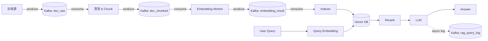

# 常见设计模式
## 单例模式
一般应用在redis连接；kafka consumer；向量库client
## 工厂模式
一般应用在：根据配置切换ebd模型；根据不同数据源，选择retriever
## 策略模式
不同chunk切分、不同召回、重排策略的可插拔实现
## 装饰器模式
原始函数上的日志、缓存、限流、监控实现
## 锁的实现方式
分布式锁
# redis
放在内存中的高并发低延迟的内存型key-value存储数据库
主要作用：挡在慢东西前面，如mysql等数据库

# 常见用途
- 缓存数据库查询结果（最常见）
- 保存临时状态：验证码、请求上下文、登陆态等，利用自动过期特性
- 作为微服务、rag等的状态仓库
- 计数、限流
- 简单的队列：异步任务、日志缓冲等
## 速度快的核心原因
- 数据保存在内存
- 单线程模型，可以避免锁
- 使用简单数据结构
## 注意的要点
- 加入所有的key，一定要设置自动过期时间
- redis并非数据库
- redis是可丢层，挂了整个系统应该还能跑

## RAG中的用途
### ebd缓存
embedding慢、贵，而且query可能高度重复
因此，为query缓存其embedding结果
# 检索缓存
向量库查询及IO成本较高，同时，企业的FAQ重复率极高
可以对检索出来的文档进行缓存
### pipeline状态中枢
rag是多阶段流水线，因此，需要将request的状态存下来，供不同的阶段进行使用
```
req:{request_id} → {
  query,
  embedding_status,
  retrieval_status,
  rerank_status,
  llm_status
}
```
### 权限控制
使用redis进行权限控制，为不同角色展示不同的文档结果
### 语义缓存
当一个新 Query 进来时，先转成向量，去 Redis 里找有没有“长得像”（向量搜索，判断距离）的旧 Query，如果有，返回旧query对应的回答。
、context缓存
## rag中key的设计
### 设计规范
- 工程化，如user:1001；emb:hash
- 结构统一：前缀 + 业务语义 + 标识，如{system}:{module}:{identifier}，rag:req:uuid这种
- 写过期时间
- 存副本、中间态，要求可丢、可重建、可降级
### 设计的key参考表
| 类别           | Key 模板                   | Value       | TTL     |
| ------------ | ------------------------ | ----------- | ------- |
| Embedding 缓存 | `rag:emb:{q_hash}`       | vector      | 1–7 天   |
| 检索结果缓存       | `rag:ret:{emb_hash}`     | doc_id list | 5–30 分  |
| 请求状态         | `rag:req:{uuid}`         | hash        | 10–30 分 |
| 权限映射         | `rag:acl:{doc_id}`       | role set    | 长       |
| 用户角色         | `rag:user:{uid}:role`    | role set    | 长       |
| Prompt 版本    | `rag:prompt:{ver}`       | template    | 长       |
| 答案缓存         | `rag:ans:{q_hash}:{ver}` | answer      | 10–60 分 |
| 限流           | `rag:rate:{ip}`          | counter     | 1 分     |
# kafka
Kafka 是一个高吞吐、可持久化、可横向扩展的“分布式消息日志系统”。
## 核心角色
- producer：只写消息
- broker：kafka节点，是服务器进程，但机器可跑多个，负责存数据
- topic：消息的逻辑分类，类似文件夹
- partition：topic拆为多个分区，是一个**只能追加写**的有序日志文件
- consumer：从kafka拉消息，自己决定读到哪里
- 消费者组：主要用于负载均衡，topic的分区会被均匀分给组内的消费者。**一个 partition 在一个 consumer group 中，只会被一个 consumer 消费**
## 核心数据模型
```
Topic A
 ├── Partition 0: msg0 msg1 msg2 msg3 ...
 ├── Partition 1: msg0 msg1 msg2 ...
 └── Partition 2: msg0 msg1 ...
```
每条消息有一个offset，在partition中唯一递增，仅由消费者记录
## 消息流
```
Producer
   ↓
选择 Topic + Partition
   ↓
Broker 写入 partition log（顺序写）
   ↓
Consumer pull 消息
   ↓
Consumer 提交 offset

```
## 速度快的原理
- 顺序写磁盘
- page cache、零拷贝（少一次用户态拷贝） #question
- 批量处理：批量发、存、拉
## RAG中的应用
kafka适合处理异步的流程（离线链路）。
数据接入 / 更新 / 分析 / 评估 / 监控
一般应用在：异步ebd生成；失败重试；日志采集；文档入库
### 文档接入&增量更新
这是最常见的使用方式
```yaml
数据源
  ↓
Kafka topic: doc_raw
  ↓
清洗 / 解析 / chunk
  ↓
Kafka topic: doc_chunked
  ↓
Embedding
  ↓
向量库
```
主要作用为解耦数据源和embedding；支持重跑embedding、更换embedding模型、回溯doc历史数据等
### embedding异步化
embedding慢、贵，需要异步执行
典型流程为```doc_chunk → Kafka → embedding worker → vector DB```
+ embedding worker可水平扩展
+ 失败重试/DLQ #question 
+ embedding模型升级可重放kafka offset #question 
### query/answer日志（用于评估/追溯）
主要用于离线评估

### 向量入库
1. 削峰填谷，保护向量库 
2. 向量写入易失败，需要可恢复
3. 支持 embedding / 索引重建（replay）
4. 支持多索引并行消费
5. 天然支持批量写入
### 全流程参考

