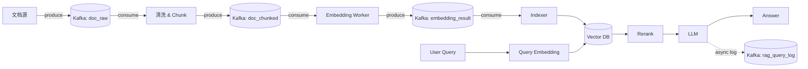

# 常见设计模式
## 单例模式
一般应用在redis连接；kafka consumer；向量库client
## 工厂模式
一般应用在：根据配置切换ebd模型；根据不同数据源，选择retriever
## 策略模式
不同chunk切分、不同召回、重排策略的可插拔实现
## 装饰器模式
原始函数上的日志、缓存、限流、监控实现
## 锁的实现方式
分布式锁
# redis
高并发低延迟的内存型key-value存储
用途：ebd缓存、检索缓存、context缓存
# kafka
Kafka 是一个高吞吐、可持久化、可横向扩展的“分布式消息日志系统”。
## 核心角色
- producer：只写消息
- broker：kafka节点，是服务器进程，但机器可跑多个，负责存数据
- topic：消息的逻辑分类，类似文件夹
- partition：topic拆为多个分区，是一个**只能追加写**的有序日志文件
- consumer：从kafka拉消息，自己决定读到哪里
- 消费者组：主要用于负载均衡，topic的分区会被均匀分给组内的消费者。**一个 partition 在一个 consumer group 中，只会被一个 consumer 消费**
## 核心数据模型
```
Topic A
 ├── Partition 0: msg0 msg1 msg2 msg3 ...
 ├── Partition 1: msg0 msg1 msg2 ...
 └── Partition 2: msg0 msg1 ...
```
每条消息有一个offset，在partition中唯一递增，仅由消费者记录
## 消息流
```
Producer
   ↓
选择 Topic + Partition
   ↓
Broker 写入 partition log（顺序写）
   ↓
Consumer pull 消息
   ↓
Consumer 提交 offset

```
## 速度快的原理
- 顺序写磁盘
- page cache、零拷贝（少一次用户态拷贝） #question
- 批量处理：批量发、存、拉
## RAG中的应用
kafka适合处理异步的流程（离线链路）。
数据接入 / 更新 / 分析 / 评估 / 监控
一般应用在：异步ebd生成；失败重试；日志采集；文档入库
### 文档接入&增量更新
这是最常见的使用方式
```yaml
数据源
  ↓
Kafka topic: doc_raw
  ↓
清洗 / 解析 / chunk
  ↓
Kafka topic: doc_chunked
  ↓
Embedding
  ↓
向量库
```
主要作用为解耦数据源和embedding；支持重跑embedding、更换embedding模型、回溯doc历史数据等
### embedding异步化
embedding慢、贵，需要异步执行
典型流程为```doc_chunk → Kafka → embedding worker → vector DB```
+ embedding worker可水平扩展
+ 失败重试/DLQ #question 
+ embedding模型升级可重放kafka offset #question 
### query/answer日志（用于评估/追溯）
主要用于离线评估

### 向量入库
1. 削峰填谷，保护向量库 
2. 向量写入易失败，需要可恢复
3. 支持 embedding / 索引重建（replay）
4. 支持多索引并行消费
5. 天然支持批量写入
### 全流程参考

