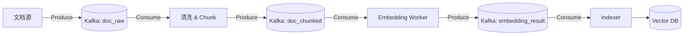

# 常用设计模式 (Design Patterns)

## 1. 单例模式 (Singleton Pattern)

**核心思想**：确保一个类只有一个实例，并提供一个全局访问点。

**RAG 系统中的应用**：
- **Redis 连接池**：避免频繁建立/断开连接产生开销。
- **Kafka Consumer/Producer**：保持单一消息通道实例。
- **向量数据库 Client**：如 Milvus 或 Pinecone 的连接客户端。

---

## 2. 工厂模式 (Factory Pattern)

### 2.1 核心思想
**解耦**对象的**创建**与**使用**。通过一个共同的接口来指向新创建的对象。

### 2.2 具体实现逻辑

```python
from abc import ABC, abstractmethod

class RetrieverFactory(ABC):
    @abstractmethod
    def create_retriever(self) -> BaseRetriever: ...

class FAISSRetrieverFactory(RetrieverFactory):
    def create_retriever(self):
        # 包含复杂的本地加载逻辑、索引路径检查等
        index = load_faiss_index("./data")
        return FAISSRetriever(index)

class ElasticSearchRetrieverFactory(RetrieverFactory):
    def create_retriever(self):
        # 包含复杂的网络连接、鉴权逻辑等
        client = connect_es(host="localhost", port=9200)
        return ESRetriever(client)
```

### 2.3 RAG 中的应用
- **模型切换**：根据配置文件动态切换不同的 Embedding 模型。
- **多源检索**：根据用户选择的不同数据源（如 Wiki、文档库、代码库），工厂自动生成对应的 `Retriever`。

### 2.4 工厂方法模式 vs 简单工厂

| **特性** | **简单工厂** | **工厂方法 (Factory Method)** |
| :--- | :--- | :--- |
| **判断逻辑位置** | 集中在唯一的一个工厂类中 | 分散在各个具体的子类工厂中 |
| **增加新产品** | 需要修改工厂类的逻辑判断（违反开闭原则） | 仅需新增产品类和对应的子工厂类 |
| **符合开闭原则** | 否 | **是** |
| **复杂度** | 低（代码结构简单，易于理解） | 中（类层级较深） |
| **适用场景** | 产品种类较少且相对固定的情况 | 产品种类变动频繁，需要高度解耦的情况 |

---

## 3. 策略模式 (Strategy Pattern)

### 3.1 核心思想
定义一系列算法，将其封装起来并使其可以**相互替换**。其核心作用是消除代码中臃肿的 `if-else` 或 `switch-case` 语句，使系统能在运行时动态选择执行逻辑。

### 3.2 具体的实现逻辑

```python
class Retriever:
    def retrieve(self, query: str): ...

class VectorRetriever(Retriever): ...
class BM25Retriever(Retriever): ...
class HybridRetriever(Retriever): ...
```

### 3.3 RAG 中的应用
- **切分策略**：针对不同文档类型（PDF, Markdown, Table）采用不同的 `Chunking Strategy`。
- **召回与重排策略**：实现不同检索算法（向量检索、关键词检索、混合检索）的可插拔实现。

---

## 4. 观察者模式 (Observer Pattern)

### 4.1 核心思想
定义对象间的一种**一对多**的依赖关系，当一个对象的状态发生改变时，所有依赖于它的对象都得到通知并被自动更新。

### 4.2 实现逻辑

#### 4.2.1 定义抽象层
```python
from abc import ABC, abstractmethod

# 观察者接口
class Observer(ABC):
    @abstractmethod
    def update(self, data): pass

# 主体接口 (Subject)
class Subject(ABC):
    def __init__(self):
        self._observers = []

    def attach(self, observer: Observer):
        self._observers.append(observer)

    def notify(self, data):
        for observer in self._observers:
            observer.update(data)
```

#### 4.2.2 具体实现
```python
class DocumentManager(Subject):
    """主体：负责文档的增删改"""
    def add_document(self, doc_name):
        print(f"--- 系统：上传了新文档 {doc_name} ---")
        self.notify(doc_name)

class Indexer(Observer):
    """观察者 1：负责更新向量索引"""
    def update(self, data):
        print(f"[索引模块] 正在为 {data} 生成 Embedding 并存入向量库...")

class Logger(Observer):
    """观察者 2：负责记录日志"""
    def update(self, data):
        print(f"[日志模块] 记录操作：上传了 {data}")
```

### 4.3 RAG 中的应用
- **监控指标统计**：命中率、Token 消耗、响应延迟、失败率等指标的解耦统计。
- **异步链路触发**：文档上传完成后，自动通知索引器、摘要器和审计系统。

---

## 5. 装饰器模式 (Decorator Pattern)

### 5.1 核心思想
**动态**地给一个对象添加额外的职责，且不影响其原始功能。在 Python 中通常表现为 `@decorator` 语法。

### 5.2 实现逻辑

```python
from abc import ABC, abstractmethod

class ChatBot(ABC):
    @abstractmethod
    def response(self, prompt: str) -> str: pass

class BasicChatBot(ChatBot):
    def response(self, prompt: str) -> str:
        return f"这是对 '{prompt}' 的基础回答"

class BotDecorator(ChatBot):
    """装饰器基类：内部必须持有一个 ChatBot 对象的引用"""
    def __init__(self, bot: ChatBot):
        self._bot = bot

    def response(self, prompt: str) -> str:
        return self._bot.response(prompt)

class LoggingDecorator(BotDecorator):
    def response(self, prompt: str) -> str:
        print(f"[日志] 收到提问: {prompt}")
        result = self._bot.response(prompt)
        print(f"[日志] 回答完成")
        return result
```

### 5.3 RAG 中的应用
- **中间件扩展**：权限验证、限流控制、敏感词过滤。
- **性能/可观测性**：耗时统计、Debug Trace、LLM 结果缓存（命中则直接返回）。

---

## 6. 锁的实现方式

> [!warning] 逻辑检查
> 此处原文描述缺失。
> 在分布式 RAG 系统中，通常使用 **Redis 分布式锁** (如 Redlock 算法) 来确保并发环境下的资源一致性，例如：防止同一文档被多个 Worker 重复解析。

---

# Redis：高性能内存组件

**定义**：基于内存的、高并发、低延迟的键值对 (Key-Value) 存储数据库。

## 1. 核心优势与原理
- **全内存操作**：存取速度极快。
- **单线程模型**：基于 I/O 多路复用，避免了多线程环境下的上下文切换和锁竞争。
- **简单高效的数据结构**：如跳跃表 (Skiplist)、压缩列表 (Ziplist) 等。

## 2. RAG 中的核心用途
- **结果缓存**：缓存 Embedding 结果（因其昂贵且耗时）和 FAQ 检索结果（提高响应速度）。
- **状态中枢**：存储 `request_id` 对应的各阶段状态（Retrieval -> Rerank -> LLM）。
- **语义缓存 (Semantic Cache)**：通过向量检索相似旧 Query，直接复用答案。

## 3. Key 设计参考

| 类别 | Key 模板 | Value | TTL (过期时间) |
| :--- | :--- | :--- | :--- |
| **Embedding 缓存** | `rag:emb:{q_hash}` | vector | 1–7 天 |
| **检索结果缓存** | `rag:ret:{emb_hash}` | doc_id list | 5–30 分 |
| **请求状态** | `rag:req:{uuid}` | hash | 10–30 分 |
| **答案缓存** | `rag:ans:{q_hash}:{ver}` | answer | 10–60 分 |

---

# Kafka：分布式流处理平台

## 1. 核心架构

- **Producer/Consumer**：消息的生产者与消费者。
- **Topic/Partition**：消息逻辑分类为 Topic，Topic 物理划分为多个 Partition。
- **消费者组 (Consumer Group)**：实现负载均衡。**一个 Partition 在同一组内只能被一个 Consumer 消费**。

> [!info] 性能秘密：零拷贝 (Zero-Copy) 与 Page Cache
> Kafka 速度极快的原因之一是利用了操作系统的 **Page Cache**。数据写入时先进入缓存，读取时通过 `sendfile` 系统调用实现**零拷贝**：数据直接从内核缓冲区发送到网关设备，无需经过用户态拷贝，极大减少了 CPU 开销。

## 2. RAG 中的离线链路应用



### 2.1 关键概念说明

> [!info] 进阶技术点
> - **DLQ (死信队列)**：当 Embedding 失败或数据库写入异常且重试多次无效后，消息被转入死信队列，供后续人工排查。
> - **Offset 重放 (Replay)**：当 Embedding 模型升级时，可以通过重置消费者 Offset，让 Worker 从头开始重新处理 Kafka 中的历史数据，实现索引全量重建。

---
